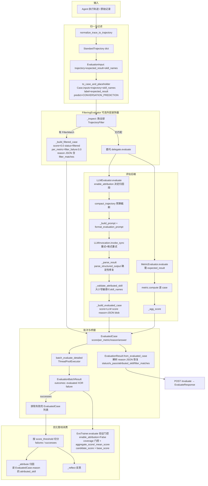
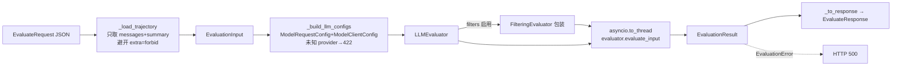

# EvoAgent 代码导读（评估器模块为重点）

> 本导读面向需要在 EvoAgent 仓库中开发新需求、扩展评估能力或排查评估链路问题的工程师。第 5 章为重点，展开到关键方法与数据流；其余章节给出结构地图与决策指引。所有具体断言均可在源码中找到依据，关键结论后以 `文件` 或 `文件:行号` 标注出处。

---

## 1. 项目定位与核心闭环

EvoAgent 是基于 agent-core（`openjiuwen` 包）构建的**自进化元 Agent**，封装 skill 文档自动优化能力。核心闭环为：

```
用户下达指令 → Agent 识别意图 → 编排优化 Pipeline（Adapter rollout + skill 同步）→ 输出优化报告
```

对外它是一个对话式入口（CLI / API 双模式）；对内它是 SkillOpt 合入方案的使用层：

- **Agent 运行时**：agent-core 的 `ReActAgent`
- **优化引擎**：agent_evolving 的 `SkillDocumentOptimizer`（场景子类化）
- **通信方式**：Adapter sidecar HTTP 通信（skill 操作 + 对话触发 + 轨迹收集）
- **评估能力**：本导读重点——`evaluator/` 子包提供 LLM 评估器、指标评估器、确定性过滤器、离线数据集评估管线与 Golden Data 生成

评估器在整个闭环中承担"轨迹评估"环节：把 Agent 真实运行轨迹判定为通过/失败、打分、归因到具体 skill，为优化引擎的反思（reflect）与归因（attribute）阶段提供信号。详见 `docs/README.md` 与 `README.md`。

---

## 2. 仓库结构总览

### 2.1 顶层目录树

```
common/agent-evolve/evoagent/
├── skills/optimize_skill/     # Agent Skill（SKILL.md + scripts）
├── examples/scenarios/        # 场景配置（edp_agent / skillopt / tf_grpo）
│   └── <name>/                #   scenario.yaml + optimizer.py + prompts/ + skills/
├── src/evo_agent/             # Python 包
│   ├── evaluator/             # 评估器（本导读重点，~6467 行）
│   ├── optimizer/             # 优化引擎（skill_document / tf_grpo / 共享）
│   ├── operator/              # SkillDocumentOperator 工厂
│   ├── adapter_client/        # Adapter sidecar 通信层
│   ├── callbacks/             # Callback 组合
│   ├── api/                   # FastAPI 服务端
│   ├── dataset/               # manifest 解析 + API 模式构建
│   ├── scenario/              # ScenarioRegistry + 两级 prompts 查找
│   ├── llm/                   # LLM provider 扩展
│   ├── reporter/              # 报告生成
│   ├── optimizer_runner.py    # 唯一编排入口
│   ├── trainer.py             # EvoTrainer
│   ├── runtime_config.py      # 三层配置合并
│   └── ...叶子模块
├── tests/                     # unit / integration / e2e
└── docs/                      # 文档（01~04 目录）
```

### 2.2 `src/evo_agent` 模块清单（一句话职责）

| 模块 | 行数 | 职责 |
|------|------|------|
| `optimizer_runner.py` | 1079 | 唯一编排入口，双轨分支（manifest vs build_dataset），注入 phase_callback |
| `trainer.py` | 723 | `EvoTrainer`，sidecar-aware + 轨迹注入 + 验证门控 |
| `runtime_config.py` | 430 | `OptimizationConfigResolver`，三层合并 request/scenario/env → `ResolvedOptimizationConfig` |
| `control_store.py` | 218 | 控制存储 |
| `types.py` | 213 | 叶子类型（frozen dataclass） |
| `config.py` | 179 | 配置管理（pydantic-settings） |
| `errors.py` | 177 | 错误类型（`ValidationCoverageError` 等） |
| `protocols.py` | 63 | 内部 Protocol 约定 |
| `paths.py` / `skill_loader.py` / `conversation.py` / `cancellation.py` / `rollout_invoke.py` / `stdio_utf8.py` | 10~61 | 路径/技能加载/会话ID/取消/rollout调用/UTF-8 工具 |
| `evaluator/` | ~6467 | **评估器，本导读重点** |
| `optimizer/skill_document/` | — | ReflACT 管线本地实现 |
| `optimizer/tf_grpo/` | — | TF-GRPO 变体优化器 |
| `operator/` | — | `SkillDocumentOperator` 基类 |
| `adapter_client/` | — | Adapter sidecar 通信（`operator.py` 含 `build_skill_document_operator` 工厂 + `FrontmatterPreservingSkillDocumentOperator`） |
| `callbacks/` | — | Callback 组合 |
| `api/` | — | FastAPI（app/jobs/progress/events/sse + routes/） |
| `dataset/` | — | manifest 解析 + API 模式构建 |
| `scenario/` | — | `ScenarioRegistry` + 两级 prompts 查找 |
| `llm/` | — | LLM provider 扩展 |
| `reporter/` | — | 报告生成 |

`evaluator/` 子包内部结构详见第 5 章。

---

## 3. 技术栈与开发命令

| 维度 | 选型 |
|------|------|
| 语言 | Python 3.12+ |
| 包管理 | uv |
| 构建 | hatchling |
| Lint / Format | Ruff（`line-length=100`） |
| 类型检查 | mypy strict |
| 测试 | pytest + pytest-asyncio |
| 服务端 | FastAPI |

开发命令（见 `CLAUDE.md`、`README.md`）：

```bash
make install    # 安装依赖
make lint       # 代码检查
make fix        # 自动修复
make test       # 运行测试
make test-unit  # 仅单元测试
make serve      # 启动 API 服务（uvicorn evo_agent.api.app:app --port 8001）
```

关键外部依赖：

- agent-core（`openjiuwen` 包）：`ReActAgent`、`SkillManager`
- agent_evolving（`openjiuwen` 包）：`SkillDocumentOptimizer`、`Trainer`、`SingleDimUpdater`、Callbacks、`BaseEvaluator`、`_agg_score`、`Case`、`EvaluatedCase`、`TracerTrajectoryExtractor`（`MetricEvaluator` 是 evo_agent 本地子类，继承上游 `agent_evolving` 的 `MetricEvaluator`，非外部符号本身）

---

## 4. 架构总览

### 4.1 场景子类化定制

EvoAgent 通过 **optimizer 子类化** 实现场景定制，不使用策略协议或组合容器。每个场景继承本地 `SkillDocumentOptimizer`（evo_agent 实现，基类为 agent_evolving 的 `BaseOptimizer`，模块 docstring 明确"local implementation ... not available in PyPI 0.1.13"，**非** agent-core 也非 published agent_evolving），通常经 `DictSkillDocumentOptimizer`（`optimizer/dict_optimizer.py`）dict 兼容中间层，覆写需要的方法：

```text
SkillDocumentOptimizer (evo_agent 本地, 基类 agent_evolving BaseOptimizer)
    └── DictSkillDocumentOptimizer (dict 兼容中间层, optimizer/dict_optimizer.py)
         ├── EDPAgentOptimizer (examples/scenarios/edp_agent/optimizer.py, =SkillOptOptimizer 别名)
         ├── SkillOptOptimizer (examples/scenarios/skillopt/optimizer.py, 继承 EDPAgentOptimizer)
         └── TfGrpoOptimizer (src/evo_agent/optimizer/tf_grpo/..., 继承 DictSkillDocumentOptimizer)
              覆写 _rollout / _format_single / _reflect / _attribute / ...
```

> 注：`FundAdvisorOptimizer` / `fund_advisor` 仅出现在 `CONTEXT.md`/`CODEGUIDE`，仓库中不存在对应场景；真实场景类为 `EDPAgentOptimizer`/`SkillOptOptimizer`/`TfGrpoOptimizer`。

场景可覆写的阶段（见 `CONTEXT.md`）：

| 阶段 | 方法 | 说明 |
|------|------|------|
| Rollout | `_rollout` | 执行 case + 收集轨迹 |
| Format | `_format_single` | 清洗 + 格式化 trajectory |
| Attribute | `_attribute` | 多 skill 归因 |
| Reflect | `_reflect` | 分析轨迹，生成 patches |
| Aggregate | `_aggregate` | 合并 patches |
| Select | `_select` | 排序 + 预算裁剪 |
| Apply | `_backward` | apply patch（编排，多步编辑每步推送 apply 事件） |
| Prompt | `_build_analyst_prompt` | analyst prompt 构造 |

不可覆写的阶段（`Trainer`/`Updater` 管理）：`backward`（编排）、`step`（validation gate）。

### 4.2 ReflACT 管线阶段表

`SkillDocumentOptimizer` 内部的优化循环（见 `CONTEXT.md`）：

```
Rollout → Format → Split(failures/successes) → Attribute → Reflect → Aggregate → Select → Backward(apply patch)
```

- 多 skill 场景下 Attribute 为独立步骤；单 skill 场景下自动短路，无需 LLM 调用。
- 各阶段通过注入的 `phase_callback(event, data)` 推送 `log` 事件以保持可观测性。

### 4.3 配置三层合并

`OptimizationConfigResolver`（`runtime_config.py`）按 **request 字段 > scenario preset（`scenario.yaml` hyperparams）> env 默认值（`EvolveConfig`）** 三层合并产出 `ResolvedOptimizationConfig`（`runtime_config.py:107-340`）。

合并机制（`runtime_config.py:123-127`）：

- 先将 scenario 超参与 request 超参合并：`merged_hp = {**scenario_hp, **request_hp}`（request 超参覆盖 scenario 超参）。
- 对每个 typed 字段，优先级为 `request_value`（直接字段，若非 None）→ `merged_hp.get(name)` → env `config_value`。
- 验证型强制函数 `_resolve_int` / `_resolve_float` / `_resolve_bool` / `_resolve_int_mapping` 带 min/max、NaN/finite、bool 排除等守护（`runtime_config.py:350-430`）。

runner 不再自行拼装超参，所有 typed 字段（`num_epochs`/`batch_size`/`parallelism`/`score_threshold` 等）与 `extra_hyperparams` 在此定型。`evaluator_config` 默认 `{"type": "metric"}`（`runtime_config.py:204`）。

### 4.4 并发闸门

所有 LLM 调用受单一 `semaphore`（`parallelism`）封顶。跨 operator 的 reflect / aggregate / select 通过 `asyncio.gather` 并行（协程内部已 acquire semaphore）；`slow_update` **不**在此列——`_run_slow_update`（`skill_document_optimizer.py:2261`）用 `for op_id ... in ...items()` 顺序 `await run_slow_update`（串行，无 gather），`concurrency.py` docstring 也只把 naked `asyncio.gather` 归于 cross-operator reflect/aggregate/select（C2/C3/C4）。无内部 acquire 的并发用 `gather_with_semaphore`。两种 sanctioned 模式定义在 `optimizer/concurrency.py`，禁止引入第三种（详见 ADR-0006）。

### 4.5 SSE 事件体系

optimizer 各阶段通过注入的 `phase_callback` 推送 `log` 事件，经 `GET /optimize/{job_id}/stream` 实时下发。`api/events.py` 集中管理 `EventType`（progress/log/completed/error）与 `PipelinePhase`（rollout/attribute/reflect/aggregate/select/apply/validation/...）常量。

### 4.6 双轨入口

`optimizer_runner.py` 是唯一编排入口，支持双轨分支：

- **CLI 模式**：`load_dataset_manifest(dataset.yaml)` 构建 CaseLoader + evaluator
- **API 模式**：`build_dataset_from_request(raw 数据 + train/val split + evaluator_config)` 构建 `DatasetSpec`

两轨均最终把同一个 evaluator 实例注入 `dependencies["evaluator"]`，同时传给 `EvoTrainer(evaluator=...)`，但 evaluator type 分发范围不同：CLI 轨按 `llm` / `metric` / `custom`（dotted_path 逃生舱，+无 type 向后兼容）分发；API 轨仅支持 `llm` / `metric`，`custom` 被拒（`build_dataset_from_request` 对 `eval_type not in {"llm","metric"}` 直接 raise `ValueError`，`manifest.py:302-306`）。

---

## 5. 评估器模块深入（重点）

### 5.0 评估器在闭环中的位置

评估器在两个截然不同的消费点被同一 evaluator 实例使用：

| 消费点 | 调用者 | `enable_attribution` | 产出 |
|--------|--------|---------------------|------|
| 训练阶段 rollout | `SkillDocumentOptimizer._rollout → _evaluate_training_batch` | 默认 `True`（bad-case 归因需要） | `EvaluationBatchResult`，`EvaluatedCase.score` 按 `score_threshold` 切分 failures/successes 喂给 reflect/attribute |
| 验证阶段门控 | `EvoTrainer.evaluate`（由 `Trainer.train → _select_best_candidate_on_val` 调用） | `False`（缩 prompt，验证不做归因） | `EvaluationBatchResult`，coverage 门控 + `aggregate_score`/`_mean_score` 选分，base/candidate 比较 |

关键区分：

- **`score_threshold`（`ResolvedOptimizationConfig`，范围 `[0,1]`）门控的是训练批次的 failure/success 切分**（喂给 reflect/attribute），**不是验证门控**。验证门控是 `candidate_score > base_score`（严格大于）。两个阈值容易混淆（`runtime_config.py:234-240`）。
- 训练阶段与验证阶段是**同一个 evaluator 实例的两个不同消费者**。
- 优化管线消费的实际货币是 openjiuwen 的 `EvaluatedCase`（`.score` / `.per_metric` / `.reason`），**不是** domain 的 `EvaluationResult`。`EvaluationResult.from_evaluated_case` 是离线/会话路径的桥接（见 5.1）。

### 5.1 领域类型层 `domain/`

领域类型层定义评估器的"叶子契约"——所有 evaluator 实现、factory、filters、metrics、optimizer 管线交换的不可变类型。

#### 5.1.1 输入/轨迹模型 `domain/models.py`

| 模型 | 职责 | 关键约束 |
|------|------|----------|
| `TrajectoryMessage` | 单条消息，保留原始 dict 结构（`role`/`content`/`name`/`tool_calls`/`tool_call_id`/`reasoning_content`/`metadata`） | 字段宽松 |
| `TrajectorySummary` | 快速执行概览（`total_messages`/`tool_calls_used`/`summary`/`total_steps`/`tool_calls_count`/`tokens_used`/`metadata`） | — |
| `StandardTrajectory` | 完整会话轨迹（`summary` + `messages`），评估的事实来源 | `extra="forbid"`（多余键触发校验错误） |
| `EvaluationInput` | 会话级输入（`trajectory` + `expected_result` + `skill_names`） | `extra="forbid"`；`skill_names` 必填，仅用于事后归因校验，**绝不注入 LLM prompt** |
| `GoalGenerationInput` / `GoalGenerationOutput` | 目标生成的输入/输出 | — |
| `LLMEvaluationOutput` | LLM 扁平结构化输出（三维度 + `is_pass`/`score`/`attributed_skill`/`reason`） | 作为 `_parse_result` 的优雅降级 fallback |

#### 5.1.2 结果模型 `domain/result.py`

`EvaluationResult` 是 framework-independent 的 domain 结果，通过 `from_evaluated_case` 从 openjiuwen `EvaluatedCase` 桥接（`domain/result.py:37-91`）：

```python
@classmethod
def from_evaluated_case(cls, evaluated: Any) -> EvaluationResult:
    # score / per_metric 直接来自 EvaluatedCase 属性（不在 reason JSON 里）
    # 解析 evaluated.reason（JSON 字符串）恢复：
    #   attributed_skill / is_pass / repaired / parse_mode / repair_operations / filter_matches / status
    # 解析失败 → status='evaluated', filter_matches=[]（静默兜底，不抛异常）
```

字段语义（`domain/result.py:26-35`）：

| 字段 | 默认 | 语义 |
|------|------|------|
| `status` | `"evaluated"` | `evaluated` 正常评估；`filtered` 被确定性过滤器拦截 |
| `score` | `0.0` | 综合分 `[0,1]`，直接来自 LLM（非维度聚合） |
| `is_pass` | `True` | 是否通过；解析失败时保持 `True`（默认通过偏见） |
| `per_metric` | `None` | 分维度得分 |
| `reason` | `""` | 自由文本**或**结构化 JSON（承载富信息） |
| `attributed_skill` | `""` | 失败归因 skill |
| `repaired` | `False` | JSON 是否被确定性修复 |
| `parse_mode` | `"exact"` | `exact`/`deterministic_repair`/`deterministic_comma_repair`/`failed` |
| `repair_operations` | `[]` | 确定性修复操作序列 |
| `filter_matches` | `[]` | 确定性过滤器命中记录 |

#### 5.1.3 评分原语 `domain/scoring.py`

- `EvaluationError`：基础设施失败异常（区别于合法低分）。携带 `category`/`safe_message`/`invocation_id`/`response_sha256`/`response_chars`/`raw_response`/`invocation_diagnostics`/`logged`。`logged` 默认 `False`，用作去重标志避免重复日志。
- `EvaluationScores`：`dict[str, float]` 子类，**混合两种关注点**——维度得分作为 dict 键（`scores['task_completion']`），标量诊断作为属性（`scores.score`）。调用方不可混淆。

#### 5.1.4 批次结果 `batch_result.py`

| dataclass | 职责 | 关键不变量 |
|-----------|------|-----------|
| `EvaluationFailure` | artifact-safe 的单 case 失败诊断（`category`/`safe_message`/`invocation_id`/`response_sha256`/`response_chars`） | **故意省略** `raw_response` 与 `invocation_diagnostics`（可序列化/共享而不泄露原始 LLM 输出） |
| `EvaluationOutcome` | 单个稳定身份的成功/失败结果（`index`/`case_id`/`case`/`trajectory`/`evaluated`/`failure`） | `__post_init__` 强制 XOR：`evaluated` 与 `failure` 恰一非空，否则 `ValueError`（`batch_result.py:33-35`） |
| `EvaluationBatchResult` | 有序 outcomes 元组 | `successes` 只含 `evaluated`（排除失败）；`coverage = evaluated_count / attempted_count`，空批次返回 `1.0`（非 `0.0`，避免误报零覆盖，`batch_result.py:62-64`） |

#### 5.1.5 过滤器模型 `filters/models.py`

- `FilterType`：`Literal['tool_failure','user_feedback']`
- `EvaluationStatus`：`Literal['evaluated','filtered']`（`EvaluationResult.status` 的类型）
- `FilterMatch`：一条确定性坏 case 信号（`filter_type`/`rule_id`/`message_index`/`evidence`/`pattern`/`metadata`）

#### 5.1.6 JSON 工具 `json_util.py`（已废弃）

`json_util.py` 是 deprecated 兼容 shim，仅 re-export `evo_agent.llm.structured_output` 下的解析助手：`JsonRepairPolicy=StructuredOutputPolicy`、`JsonExtractionResult=StructuredOutputResult`、`extract_json`/`extract_json_data`/`fix_json_text`。**新代码应直接从 `evo_agent.llm.structured_output` 导入**。

#### 5.1.7 公共 facade `evaluator/__init__.py`

`evaluator/__init__.py` 是整个 evaluator 模块的公共 facade，re-export domain 类型、evaluator 实现、factory、filters、metrics 与 prompt formatting。

### 5.2 评估器抽象层 `evaluators/`

`evaluators/` 提供评估后端，由一个共享 mixin 与三个具体实现组成。

#### 5.2.1 `EvaluateInputMixin`（`evaluators/base.py`）

`EvaluateInputMixin` 是唯一的 domain↔openjiuwen 适配器，提供统一入口 `evaluate_input`（`base.py:19-30`）：

```python
def evaluate_input(self, value: EvaluationInput) -> EvaluationResult:
    case, placeholder = to_case_and_placeholder(value)   # domain → openjiuwen Case/predict
    evaluated = self.evaluate(case, placeholder)         # 调用具体 evaluate()
    return EvaluationResult.from_evaluated_case(evaluated)  # 桥接回 domain
```

继承关系（**关键**，已核对源码）：

| 类 | 继承 | 是否有 `evaluate_input` |
|----|------|----------------------|
| `LLMEvaluator` | `EvaluateInputMixin, BaseEvaluator`（`llm.py:82`） | 有 |
| `FilteringEvaluator` | `EvaluateInputMixin, BaseEvaluator`（`filtering.py:29`） | 有 |
| `MetricEvaluator` | `_UpstreamMetricEvaluator`（openjiuwen，`metric.py:22`） | **无**——直接扩展上游，用 openjiuwen 显式 case/predict 接口，要求 `case.label['expected_result']` |

> 这是常见陷阱：`MetricEvaluator` **不继承** `EvaluateInputMixin`。会话级 `EvaluationInput`（无独立 prediction）由 `LLMEvaluator` 评估，而非 `MetricEvaluator`（`metric.py` docstring 明确说明）。

#### 5.2.2 `FilteringEvaluator`（`evaluators/filtering.py`）

装饰器评估器，在委托评估器（`MetricEvaluator` 或 `LLMEvaluator`）之前先跑确定性 `TrajectoryFilter`（`filtering.py:46-64`）：

```python
def evaluate(self, case, predict, *, enable_attribution=None):
    trajectory = _trajectory_from_case(case)          # StandardTrajectory.model_validate
    matches = self._inspect(trajectory, case)         # 跑全部过滤器，异常包装为 EvaluationError
    if matches:
        return _build_filtered_case(case, matches)     # 零分短路
    # 否则委托，仅当 delegate 签名接受时才透传 enable_attribution
    ...
```

`_build_filtered_case` 构造零分 `EvaluatedCase`（`filtering.py:184-199`）：`score=0.0`、`per_metric={"filter_failure":0.0}`、`reason` 为 JSON（`status="filtered"`、`is_pass=False`、`filter_matches=[...]`）。

批次行为（`filtering.py:88-149`）：`batch_evaluate_detailed` 用 `ThreadPoolExecutor` 并行，捕获 `EvaluationError` → `EvaluationOutcome(failure=...)`。**被过滤的 case 永远保留**（它们是成功的零分 `EvaluatedCase`），只有委托的 `EvaluationError` 才成为 failure 并从 `successes` 中剔除——这区分了基础设施失败与合法低分，避免污染优化信号。

`_accepts_keyword`（`filtering.py:172-181`）在 init 时一次性内省委托的 `evaluate` 签名，判断是否接受 `enable_attribution` 关键字。

#### 5.2.3 `MetricEvaluator`（`evaluators/metric.py`）

扩展上游 openjiuwen `MetricEvaluator`，复用 `_agg_score` 与 `per_metric` 输出做逐 case 评分，**额外**增加批次级 `aggregate_score`（`metric.py:61-82`）：

```python
def evaluate(self, case, predict):
    expected_result = case.label.get("expected_result")
    if expected_result is None:
        raise ValueError("MetricEvaluator requires expected_result")   # 逐 case 硬要求
    ...
    for metric in self._metrics:
        out = metric.compute(predict, expected_result, question=case.inputs, case=case)
        # dict 结果 → 解包 reason/is_pass/attributed_skill + 每个 k/v 进 per_metric
        # 标量结果 → per_metric[metric.name] = score
    evaluated.score = _agg_score(scores, self._aggregate)
```

两条**共存**的评分路径（`metric.py:61-87`）：

| 路径 | 方法 | 语义 | 触发条件 |
|------|------|------|----------|
| 逐 case 均值 | `_mean_score`（LLMEvaluator 也有） | 逐 case 得分均值（默认） | 默认 |
| 批次微聚合 | `aggregate_score(evaluated)` | 微观 F1/ACC（经 `BatchMetricAggregator`） | `batch_score` 为非空字符串 |

`aggregate_score` 未配置时 raise `ValueError`，`batch_score` 命名缺失的聚合键时 raise `KeyError`（fail-fast，不静默回退）。`batch_evaluate` 弹出并忽略 `enable_attribution`（API parity，`metric.py:89-103`）。

### 5.3 LLMEvaluator 详解

`LLMEvaluator`（`evaluators/llm.py`）是唯一用 LLM 评分轨迹的路径，端到端拥有 `evaluate()` 管线。本节展开到关键方法。

#### 5.3.1 输入校验（pre-flight）

`evaluate()` 开头四道校验（`llm.py:134-160`）：

1. `predict.get("error")` → `EvaluationError(category="rollout_error")`
2. `case.inputs` 必须是 dict 且含 `trajectory`，否则抛 **`ValueError`**（`llm.py:142-143`）——注意是 `ValueError` 非 `EvaluationError`，`batch_evaluate_detailed` 的 `except EvaluationError`（`llm.py:363`）**不**捕获它，会冒泡中断整批评估而非产生 `EvaluationOutcome(failure)`
3. `trajectory` 是 dict 但 `messages` 为空 → `EvaluationError(category="trace_unavailable")`（`llm.py:149-155`）
4. `skill_names` 必须是非空 list → 否则 `EvaluationError`

#### 5.3.2 Prompt 预算

先构造一次 `trajectory=""` 的 prompt 测量静态开销，再算预算（`llm.py:166-188`）：

```python
trajectory_budget = self._invocation.input_token_budget("evaluator", 1200)  # 阶段+输出预留
trajectory_budget -= self._invocation.estimate_messages((UserMessage(content=prompt_without_trajectory),))
compacted = compact_trajectory(trajectory_data,
    policy=TrajectoryCompactionPolicy(stage="evaluator"),
    context=TrajectoryCompactionContext(),
    token_budget=trajectory_budget)   # 确定性截断 tool 结果体（头/尾+marker），省略非错误/非最终 tool 结果
```

`compact_trajectory` 失败 → `EvaluationError(category="prompt_budget_exceeded")`。

默认 invocation 能力（`llm.py:106-120`）：`context_window_tokens=32768`、`supports_json_mode=True`、`completion_signal="either"`、`parallelism=4`、`safety_margin_tokens=512`、`chars_per_token=2.0`、`default_output_reserve_tokens=1200`。

#### 5.3.3 Prompt 组装

`_build_prompt`（`llm.py:397-429`）选模板：

- 若传入 `prompt_template` 且含 `{messages}` → 用自定义模板
- 若自定义模板**不含** `{messages}` → 视为裸指令，经 `_inject_custom_instruction` 注入 `DEFAULT_PROMPT_TEMPLATE` 的角色指令位（并 warning），避免静默丢数据
- 否则用 `DEFAULT_PROMPT_TEMPLATE`（`prompts/policy_v1.py`）

`format_evaluation_prompt` 用**顺序 `str.replace`**（非 `str.format`，因模板含字面 JSON 花括号）填 5 个占位符：`{expected_section}`、`{messages}`、`{skill_names_section}`、`{skill_names}`、`{diagnostic_rules}`。

`enable_attribution=False` 时，`_strip_attribution` 删除归因章节（第六节）与 `attributed_skill` 输出字段以省 token；**fail-fast**：若 strip 后归因章节仍残留（即模板结构变了），`format_evaluation_prompt` raise `ValueError`——改 `DEFAULT_PROMPT_TEMPLATE` 归因段需同步更新 `formatter.py` 的 `_ATTRIBUTION_SECTION_RE`/`_ATTRIBUTED_SKILL_FIELD_RE`。

#### 5.3.4 LLM 调用与重试

`LLMInvocation.invoke_sync` 调用（`llm.py:241-253`）：

- `result_validator=_result_is_valid`：解析 + 归因校验，失败返回 `False` 触发重试
- `result_error_classifier=_result_error_category`：返回 `EvaluationError.category`
- `retry_messages` = 格式重试 prompt（`_build_format_retry_prompt`）
- 重试策略 `LLMRetryPolicy(2, 120.0, 300.0, 1.0, 0.0)`：2 次、单次 120s、总 300s、backoff 1.0、jitter 0.0
- `reserved_output_tokens=1200`

`unusable_response` 仅因提供了 `retry_messages` 才可重试；无 `retry_messages` 时 `unusable_response` 是终止态。

#### 5.3.5 JSON 解析修复

`_parse_result`（`llm.py:460-543`）委托 `parse_structured_output`，用 per-call `StructuredOutputPolicy`：

- `required_keys` = `{reason, attributed_skill}`（`enable_attribution=True`）或 `{reason}`（`enable_attribution=False`）
- `validator=_validate_evaluator_output`：业务校验器
- 解析器先精确解析，再做确定性修复（去 code fence、规范单引号、删 `//` 注释、转义控制字符、删尾逗号、补闭合分隔符、插一个允许的缺失逗号），记录 `parse_mode` 与 `repair_operations`

字段规范化（`llm.py:497-529`）：

- `score`：必须 number（`bool` 排除），clamp 到 `[0,1]`
- `is_pass`：必须 `bool`（否则 `TypeError`）
- `attributed_skill`/`reason`：强制 `str`
- 维度（`task_completion`/`trajectory_quality`/`safety`）：best-effort，缺失/无效静默跳过
- `LLMEvaluationOutput.model_validate` 作为 `reason`/`attributed_skill` 的优雅降级 fallback（**仅**这两个字段；`score`/`is_pass` 在其之前已严格校验）
- `repaired = parse_mode not in {"exact", "failed"}`（`deterministic_repair`/`deterministic_comma_repair` → `repaired=True`；`failed` 在设 `repaired` 前就抛了）

#### 5.3.6 归因校验

`_validate_attributed_skill`（`llm.py:684-703`，模块级函数）：

```python
def _validate_attributed_skill(attributed_skill, skills_list):
    if not attributed_skill:
        return                          # 空字符串总是通过（无归因）
    if attributed_skill not in set(skills_list):
        raise EvaluationError(...)      # 大小写敏感精确匹配，未知 → EvaluationError（默认 category）
```

> 注意：这与设计 spec（subsystem [11]）规划的"metric 归因降级到 `attribution_status='failed'`"语义**相反**——当前 LLM 路径是 fail（抛异常），不是降级。

#### 5.3.7 输出构造

`_build_evaluated_case`（`llm.py:431-458`）：

```python
evaluated.per_metric = dict(scores) if per_metric else None
evaluated.score = scores.score                # 直接来自 LLM，非维度聚合
evaluated.reason = json.dumps({                # JSON 诊断 blob
    "reason": scores.reason, "is_pass": scores.is_pass,
    "attributed_skill": scores.attributed_skill, "repaired": scores.repaired,
    "parse_mode": scores.parse_mode, "repair_operations": list(scores.repair_operations),
}, ensure_ascii=False)
```

`aggregate` 参数已废弃（`llm.py:99, 104`，`noqa F841`），仅为 factory 签名兼容保留。

#### 5.3.8 批处理

- `batch_evaluate`（`llm.py:290-317`）：返回 `batch_evaluate_detailed(...).successes`，**排除失败 case**（不零分污染）
- `batch_evaluate_detailed`（`llm.py:319-382`）：`ThreadPoolExecutor`（`num_workers=min(max(num_parallel,1), len(cases))`），逐 case 捕获 `EvaluationError` → `EvaluationOutcome(failure=EvaluationFailure(category, safe_message, invocation_id, response_sha256, response_chars))`，有序组成 `EvaluationBatchResult`
- `_mean_score`（`llm.py:384-395`）：NaN 过滤后的均值，空集返回 `0.0`（防御性）

#### 5.3.9 诊断

`_log_evaluation_error` / `_attach_invocation_diagnostics` / `_log_json_repair` 输出结构化 WARNING 日志，把 log-only 证据（`raw_response`/`response_sha256`/`invocation_diagnostics`）附加到 `EvaluationError`，**不改变** artifact-safe 的 `safe_message`。`EVO_DEBUG_EVAL_PROMPT=1` 仅在首次评估时记录占位符填充状态（`_debug_prompt_logged` 守护）。

### 5.4 指标框架 `metrics/`

#### 5.4.1 两种指标契约

| 契约 | 文件 | 语义 |
|------|------|------|
| `Metric`（逐 case） | `metrics/base.py`（re-export 上游 ABC） | `compute(predict, expected_result, question=, case=)` → `float` 或 `dict[str,float]` |
| `BatchMetric`（集合级） | `metrics/base.py`（`runtime_checkable` Protocol） | `reset` → `accumulate`（逐 case）→ `aggregate` → `BatchMetricResult`（`dict[str,float]`，主分约定在 `'score'` 键） |

> **关键区分**：逐 case 指标每 case 返回一个 float/dict；批次指标跨全部 case 累加混淆计数（TP/FP/FN）后微观聚合。批次聚合在 `batch_evaluate` 完成**之后**串行运行（`BatchMetricAggregator`），实现不得依赖跨 worker 合并的线程局部状态。

#### 5.4.2 注册表 `metrics/registry.py`

- `register_metric(name, factory)` / `register_batch_metric(name, factory)`：注册**零参工厂**（`Callable[[], Metric]` / `[BatchMetric]`）。重注册同名覆盖前一个并 WARNING。
- `get_metric(name)` / `get_batch_metric(name)`：查找，未知 raise `ValueError`（列出已注册名）。
- `_register_defaults()`：幂等地注册所有内置指标，在首次 import `metrics` 包时触发。

#### 5.4.3 内置逐 case 指标 `metrics/per_case.py`

| 类 | name | 规则 |
|----|------|------|
| `ContainsMetric` | `contains` | 预测包含 label 子串 → 1.0（空 label → 0.0，避免掩盖错误配置） |
| `KeywordHitMetric` | `keyword_hit` | 命中任意关键词 → 1.0（OR） |
| `KeywordRecallMetric` | `keyword_recall` | 命中关键词占比 |
| `RegexMatchMetric` | `regex` | 正则匹配（fullmatch vs search） |
| `NumericToleranceMetric` | `numeric_tolerance` | 首个数字在 abs/rel tol 内 → 1.0 |
| `LLMJudgeMetric` | `llm_judge` | 注入的 `judged_label==str(label)` → 1.0 |

注册名：`exact_match`（`normalize=False`，大小写敏感）、`normalized_exact_match`（`normalize=True`）。

#### 5.4.4 内置批次指标 `metrics/batch.py`

- `SetOverlapBatchMetric`（`name='set_overlap'`，`score=f1`）：微观集合重叠 F1/ACC/precision/recall。`TP=|pred∩label|`、`FP=|pred−label|`、`FN=|label−pred|` 跨批次求和；accuracy 为 Jaccard/IoU（集合无 TN）；全零计数 → `0.0`（永不除零）。
- `BatchMetricAggregator`：串行运行 `BatchMetric` 列表（`reset` → 逐 case `accumulate` → `aggregate`），合并聚合 dict（key 碰撞 last-wins + WARNING）。

#### 5.4.5 字段抽取 `metrics/extract.py` 与 `metrics/field_exact_match.py`

- `AnswerFieldExtractConfig`（frozen dataclass：`strategy`/`source`/`fields`/`prefer_values`）+ `parse_extract_config`：校验/规范化 raw dict。
- `extract_prediction_field`：**正则搜索** `"field": "value"` 模式（双引号），从原始答案文本抽取可比对标量。**故意不做 JSON 解析、不剥 `<answer>` 标签、不处理 code fence**；`prefer_values` 消歧多字段/多匹配。
- `FieldExtractExactMatchMetric`：先抽取 JSON 字段再委托 `ExactMatchMetric`；name 镜像 `exact_match`/`normalized_exact_match`。
- `extract_config_from_evaluator` / `is_extracted_field_missing`：供 trainer 空-extract 重试使用。

#### 5.4.6 factory 中的指标装配

`_create_metric_evaluator`（`factory.py:83-125`）：

- `metric` 接受 `str` 或非空 `list[str]`（空 list raise，元素 `str()` 强制），默认 `"exact_match"`
- 解析 `extract` 配置；仅 `exact_match`/`normalized_exact_match` 支持 `extract`，否则 `ValueError`（`factory.py:128-140`）
- `batch_metrics` + `batch_score` 必须同时配置或同时为空（`factory.py:113-116`，`MetricEvaluator.__init__` 再守一次）

### 5.5 确定性过滤器 `filters/`

#### 5.5.1 契约与助手 `filters/base.py`

- `TrajectoryFilter`（Protocol，**非** `runtime_checkable`——`base.py` 未加 `@runtime_checkable` 装饰器，故 `isinstance(f, TrajectoryFilter)` 会抛 `TypeError`；对比 `metrics/base.py` 的 `BatchMetric` 与 `skill_provider.py` 的 `SkillProvider` 才有该装饰器）：`name: str` 属性 + `inspect(trajectory: StandardTrajectory) -> list[FilterMatch]`。两个具体过滤器用普通 class（非 Protocol 继承）+ `name` class 属性。
- `build_patterns(defaults, custom_patterns, *, replace_defaults)`：合并默认（命名 `rule_id -> regex`）+ 自定义（命名 `custom_1..custom_N`），`replace_defaults` 丢弃默认，全部 `re.IGNORECASE` 编译。
- `bounded_evidence(value, limit=500)`：strip + 截断到 500 字符，**在 regex 搜索之前**做。

#### 5.5.2 `ToolFailureFilter`（`filters/tool_failure.py`）

检查 `role=="tool"` 消息（`filters/tool_failure.py`）：

1. `_parse_structured` 得到 dict/list（或解析 JSON 字符串，或 `None`）
2. `_structured_failure_state` 分类 `True`/`False`/`None`：
   - `True` → 发 `structured_failure` 匹配（`metadata`=dict），`continue`，**regex 不跑**
   - `False` → `continue`，regex 跳过（结构化确认成功，抑制关键词命中）
   - `None` → 落到 regex 关键词回退（`build_patterns` 编译的 `re.IGNORECASE`，首个命中 `break`）
3. 检测优先级链：数值 `code`（`!=0` fail，`0` success，且显式排除 `bool` 因 Python 中 `True/False` 是 int）> `status` > bool `success` > 非空 `error`/`exception`

默认 patterns：`timeout`/`failure`/`exception`/`error` 正则（含中文）。

> 陷阱：`{"status":"ok"}` 但 prose 含 "error" 的 tool 消息**不会**被标记（结构化成功抑制关键词命中）。每条消息只记第一个命中 `rule_id`（`break`）。500 字符后的失败关键词被 regex 路径漏掉。

#### 5.5.3 `UserFeedbackFilter`（`filters/user_feedback.py`）

检查 `role=="user"` 消息，跳过前 `skip_initial_user_messages`（默认 1，因为首条 user 消息是任务而非反馈）条 user 消息，再搜编译 patterns（首个命中 `break`）。默认 patterns：`explicit_rejection`/`correction_instruction`/`unresolved_outcome` 正则（中文）。

> `skip_initial_user_messages` 计的是 **user 角色消息数**，不是数组下标——多轮任务设定消息可通过调大 N 跳过。

#### 5.5.4 短路语义

`FilteringEvaluator._inspect` 跑全部过滤器累加 `FilterMatch`，**任何**非空匹配列表即短路（并集，不加权不排序）。过滤器异常被包装为 `EvaluationError`（`filtering.py:151-161`）——**有 bug 的过滤器不能静默误标 case 为坏 case**，而是把 case 标记为 failure 跳过。

### 5.6 离线数据集评估管线 `offline/`

`offline/` 是 `POST /evaluate/dataset` 背后的异步多组离线评估管线（ingest → judge → scoring → aggregate）。

#### 5.6.1 数据模型 `offline/models.py`

| dataclass | 冻结? | 字段 |
|-----------|-------|------|
| `GroupConfig` | frozen | `name`/`kind`/`pred_field`/`gold_field`/`keywords`/`json_key`/`labels`/`extract_key`/`batch_metrics` |
| `MaterializedCase` | frozen | `case_id`/`group`/`gold`/`extracted`/`extraction_method`/`judged_label=""` |
| `CaseScore` | mutable | `case_id`/`group`/`per_metric`/`score` |
| `EvalSummary` | mutable | `per_case`/`aggregate`/`overall`/`extraction_summary` |

`MaterializedCase` 冻结，故 judge 标签写回用 `dataclasses.replace`（重建整个 list）。

#### 5.6.2 管线 `offline/pipeline.py`

`run_offline_eval(job, request)` 三阶段编排，通过 `job.push_event` 推进度（`offline/pipeline.py`）：

1. `ingest(records×groups, id_field, on_progress)`：每 (record×group) 物化为 `MaterializedCase`，fail-fast 字段存在性 + `json_key` 校验（仅首条记录）。`_parse_json_cell` 三级 fallback（`json.loads` → ```` ```json ```` fence → first`{`..last`}`）；`_resolve_key_path` 点号路径。
2. `_judge(job, materialized, groups, model)`：仅 `llm_judge` 组，`sem=8` 并发调 LLM 把每个 pred 分类进声明标签（**永不读 gold**，防泄漏），返回 `{materialized_index: label}` 侧信道；单次失败降级 `"其他"`。
3. `_score_and_summarize`：写回 `judged_label`（`llm_judge` 缺失 → `"其他"`，其他 → `""`），逐 case `scorer.score_case` → `CaseScore`，`scorer.summarize` → `EvalSummary`。
4. `summary_to_dict` → `job.result`（`per_case` 按 `case_id` 嵌套）+ COMPLETED。

进度事件每 `_PROGRESS_EVERY=10` 条批量推送（pipeline 与 judge 各有此常量）。`CancelledError` 重抛，其他异常吞入 FAILED + `job.error` + "error" 事件。

#### 5.6.3 评分器 `offline/scorer.py`

`OfflineMetricScorer` 绕过 `MetricEvaluator`（避免 dict→stringify 阻抗），直接把裸标量传给 `metric.compute`：

- `score_case(group_name, extracted, gold, **kwargs)` → `{metric_name: float}`（`kwargs` 透传 `judged_label` 给 `llm_judge`）
- `composite`（静态方法）：`_agg_score(per_metric values, 'mean')`
- `aggregate_group`：按 `batch_metrics` 过滤输出
- `summarize`：组装 `EvalSummary`（per_case + 过滤后 aggregate + 跨组 overall + extraction_summary）

`VALID_BATCH_METRICS = ("mean","precision","recall","f1","accuracy")`（route 422 校验）。`_KIND_PER_CASE_METRIC`（kind→逐 case 指标名映射）、`_CONFUSION_METRICS`（稳定输出顺序 tuple）。

**混淆矩阵始终全算**（P/R/F1/accuracy 四键），`batch_metrics` 只过滤输出键、不影响计算。跨组 `overall` 是独立的"全集"宏平均，忽略 `batch_metrics` 选择。

#### 5.6.4 judge `offline/judge.py`

- `judge`（async）：`sem=8` 并发分类，返回 `{materialized_index: label}` 侧信道
- `build_judge_prompt`：固定 `_DEFAULT_JUDGE_PROMPT` 填 `{extract_key}`/`{pred}`/`{labels}`，**无 `{gold}`**
- `parse_label`：LLM 文本 → 声明标签；精确 → 子串包含 → `"其他"`
- `_OTHER_LABEL = "其他"`：保留 fallback 桶，禁止在声明标签中出现（422）

#### 5.6.5 提取器 `offline/extractor.py`（休眠）

`AnswerExtractor`（regex → json_path → LLM → empty）是独立、可组合的 auto-degrade 提取器，**已导出且有单测，但未被多组管线调用**——`ingest` 自带内联提取。`ExtractionConfig`（`regex`/`json_path`/`model`/`prompt`）、`ExtractionResult`（`extracted`/`method`）。

### 5.7 Golden Data 生成 `golden_data/`

`golden_data/` 是离线两阶段 LLM 管线：先用轨迹 batch 归纳持久化的全局理解（GU）知识库，再用 GU 为每条轨迹生成期望行为（EB）golden case 喂给评估器/优化器。

#### 5.7.1 Phase 1：GU 构建 `golden_data/builder.py`（离线异步 job）

`GlobalUnderstandingBuilder.build(traces, skill_names, batch_size)`：

- 生成 `run_id` → 建 `artifact_dir/gu_<run_id>/` 工作区
- `_load_skills`（`provider.get_skill_content` 每 skill，失败跳过）
- 按 `len(skill_names) <= flat_threshold`（默认 30）选布局：`flat`（单 `global_understanding.md`）vs `progressive`（`per_skill/<skill>.md` × N + `system_wide.md` + `__out_of_scope__.md` + `index.md`）
- flat：`_generate_global_understanding` 批次化 → induct（batch 1，`SYSTEM_PROMPT_GLOBAL`）→ refine（后续 batch，输出**完整**更新后 GU，非增量）
- progressive：`_build_grouped` → `_group_traces_by_skill`（`route_skill` 每条轨迹，longest-name-first 文本扫描，未知 → `__out_of_scope__`）→ 每 skill `_generate_global_understanding` → `_build_system_wide`（`SYSTEM_PROMPT_SYSTEM_WIDE` 合并 subs 为跨 skill 涌现模式）
- 最终产品提交到持久 KB：`golden_data_dir/global_understanding/`（经 `gu_store`）

#### 5.7.2 Phase 2：EB 生成 `golden_data/generator.py`（在线同步）

`ExpectedBehaviorGenerator.generate(EBInput{trajectory, gu_slice=GUSlice(), attributed_skill})`：

1. slice 空 → `_load_slice`（`load_index` → flat: `load_flat` 进 `system_wide`；progressive: `route_skill` → `load_system_wide` + `load_skill_doc` 或 `load_out_of_scope`）
2. `_extract_customer_inputs` + `_build_context_block` + `_format_history_rich`（**全量不截断**，`content_cap=0`）
3. LLM invoke `SYSTEM_PROMPT_PHASE2`（重试 3×）
4. `_parse_eb`（`_strip_field` CN/EN 冒号 + cut markers，`_normalize_result` fallback）→ `ExpectedBehaviorItem`

输出 `ExpectedBehaviorOutput.to_external()` 裁剪到 `{id, inputs, expected_behavior}`（防优化器 reflect 误归因）。下游：外部记录 → `dataset/case.py parse_evo_cases` → `EvoCase(expected_behavior)` → `evo_case_to_case` → agent-core `Case(label={expected_result: expected_behavior})`；优化器 `tf_grpo/semantic_advantage.py` 读 `expected_result`/`expected_behavior`/`label` 作为演进信号。

#### 5.7.3 持久化 `golden_data/gu_store.py`

`gu_store` 只管最终持久 KB 目录（手写 YAML frontmatter `index.md` + md 文本载体）+ `route_skill` 渐进暴露路由。`OUT_OF_SCOPE_SKILL="__out_of_scope__"`。`save_index`/`load_index`、`save_system_wide`/`load_system_wide`、`save_skill_doc`/`load_skill_doc`、`save_out_of_scope`/`load_out_of_scope`、`save_flat`/`load_flat`、`ensure_layout`、`route_skill`。

#### 5.7.4 模型与 Skill 来源

- `golden_data/models.py`：`GUMode`（`Literal["flat","progressive"]`）、`EBResult`（`Literal["通过","部分通过","失败","NA"]`）、`ExpectedBehaviorItem`（内部全量）/`ExpectedBehaviorOutput`（外部裁剪）、`GUSlice`/`EBInput`/`GUIndex`/`GUSkillDoc`/`GUSystemWide`/`GUOutScope`。全部 `extra="forbid"`。
- `golden_data/skill_provider.py`：`SkillProvider` Protocol（`list_skills`/`get_skill_content`）+ `LocalSkillProvider`（读 `<skill_root>/<name>/SKILL.md`）+ `AdapterSkillProvider`（包装 async `adapter_client`）+ `make_skill_provider(source="local"|"adapter")`。
- `golden_data/trajectory_format.py`：两阶段共享的富文本轨迹格式化（角色映射 顾客/Agent/工具结果、tool-call 格式、去重 tool 报告、截断）。Phase1 snippet 截断（`_CONTENT_CAP=500`/`_REPORT_CAP=500`/`_MAX_TURNS=4`），Phase2 全量（`content_cap=0`）——两阶段**故意**用不同截断策略。
- `golden_data/prompts/`：`phase1_gu.py`（`SYSTEM_PROMPT_GLOBAL`/`SYSTEM_PROMPT_SYSTEM_WIDE`）、`phase2_eb.py`（`SYSTEM_PROMPT_PHASE2`）。

> 关键约束：`SYSTEM_PROMPT_SYSTEM_WIDE` 显式禁止重述 `SYSTEM_PROMPT_PHASE2` 已硬编码的规则（anti 双注入）。`route_skill` 按 skill 名长度**降序**排序避免短名先匹配（如 `send` 先于 `send_email`）。LLM 调用重试 3 次后 raise `EvaluationError`，**不降级**——任一 batch 失败则整个构建失败。

### 5.8 Prompt / 轨迹归一 / Adapter

#### 5.8.1 评分 policy `prompts/policy_v1.py`

`DEFAULT_PROMPT_TEMPLATE` 是会话级 3 维评分 policy 模板，5 个占位符：`{expected_section}`、`{skill_names_section}`、`{skill_names}`、`{messages}`、`{diagnostic_rules}`。`_DIAGNOSTIC_RULES_TEXT` 是注入 `{diagnostic_rules}` 的 4 条评估准则（轨迹为唯一事实来源、综合用户消息理解目标、证据不足≠差、三维度独立评分禁重复扣分）。

模板中给出的 score 计算建议（`policy_v1.py:140`）：

```
score = task_completion × 0.5 + trajectory_quality × 0.3 + safety × 0.2
```

> **重要**：这是 **prompt 中给 LLM 的加权建议**，不是代码聚合。代码侧（`llm.py:444`）直接取 LLM 输出的 `score` 字段，维度得分只是 best-effort 的 `per_metric`。离散等级固定为 `1.0/0.75/0.5/0.25/0.0`。

#### 5.8.2 格式化 `prompts/formatter.py`

- `format_evaluation_prompt(template, *, trajectory, expected_result, skill_names, enable_attribution)`：顺序 `str.replace` 填占位符
- `build_dimension_keys()`：返回 3 个固定维度键（`task_completion`/`trajectory_quality`/`safety`）
- `_strip_attribution(template)`：fail-fast，strip 失败 raise `ValueError`
- `extract_dimension_keys_from_prompt`：从任意模板 regex 解析维度键（前向工具，当前未用）

#### 5.8.3 目标生成 `prompts/goal_generation.py`

`GOAL_GENERATION_PROMPT_TEMPLATE`：固定 domain-agnostic prompt，单 `{messages}` 占位符，输出 JSON `{goal, reason, confidence}`。

#### 5.8.4 轨迹归一 `trajectory/normalize.py`

`normalize_trace_to_trajectory` 把 Adapter sidecar 的异构 cleaned-trace dict 归一为 `StandardTrajectory.model_validate` 接受的 dict 形状：

- `_build_summary`：string → 合成 `TrajectorySummary` dict（`tokens_used=0`，`total_steps=len(messages)`，启发式）；dict → 直通；否则 `None`
- `_extract_tool_names`：从 assistant `tool_calls` 去重提取 tool 名（保序）
- `_normalize_tool_call`：flat `{name, arguments}` → OpenAI `{id, function: {name, arguments}}`（用 `function` 是否为 dict 判断两种格式；flat 补空串 `id`）
- `_normalize_message`：消息 → `TrajectoryMessage` 兼容 dict，仅非 None 时含可选键

被两处 rollout 调用：`trainer.py`（验证 rollout）与 `optimizer/tf_grpo/tf_grpo_optimizer.py`（训练 rollout），结果注入 `Case.inputs['trajectory']`。

> 陷阱：`normalize_trace_to_trajectory` 返回**普通 dict** 而非 `StandardTrajectory`；`pydantic model_validate` 仅在 API/过滤边界显式做，LLMEvaluator.evaluate 路径只做 `isinstance(trajectory_data, dict) + .get('messages')` 检查，畸形但仍是 dict 的轨迹在那里不会被 pydantic 捕获。

#### 5.8.5 OpenJiuwen adapter `adapters/openjiuwen.py`

```python
CONVERSATION_PREDICTION = {"evaluation_source": "conversation_trajectory"}

def to_case_and_placeholder(value: EvaluationInput) -> tuple[Case, dict]:
    inputs = {"trajectory": value.trajectory.model_dump()}
    if value.skill_names:
        inputs["skill_names"] = value.skill_names
    label = {"expected_result": value.expected_result}
    return Case(inputs=inputs, label=label), dict(CONVERSATION_PREDICTION)
```

`CONVERSATION_PREDICTION` 是稳定的占位 predict（会话评估无真实 prediction）；所有调用点用 `dict(CONVERSATION_PREDICTION)` 复制以避免共享可变状态。它也被 `_build_filtered_case`（`filtering.py:186`）与 `_build_evaluated_case`（`llm.py:288`）复用为 `EvaluatedCase.answer`。

### 5.9 工厂与入口 `factory.py` / `goal_generator.py`

#### 5.9.1 `create_evaluator`（`factory.py`）

config-dict 派发（`factory.py:68-80`）：

| `type` | builder | 产出 |
|--------|---------|------|
| `"metric"` | `_create_metric_evaluator` | `MetricEvaluator`（逐 case + 可选批次聚合） |
| `"llm"` | `_create_llm_evaluator` | `LLMEvaluator`（`model_config`/`model_client_config` 须为 openjiuwen 精确类型） |
| `"filtered"` | `_create_filtering_evaluator` | `FilteringEvaluator(delegate, filters)`（递归建 delegate，禁止嵌套 filtered，需 ≥1 启用过滤器） |
| 其他 | — | `ValueError` |

`filtered` 递归调 `create_evaluator(delegate_config)`，故 delegate 继承同样的类型/配置校验。

#### 5.9.2 `TrajectoryGoalGenerator`（`goal_generator.py`）

把完整会话轨迹蒸馏为单个中文自然语言目标（+ reason/confidence metadata）：

- `generate(value: GoalGenerationInput)`：空轨迹 → `EvaluationError`；预算 `input_token_budget("goal_generator", 1200)` 减 prompt 自身 token；`compact_trajectory` 失败 → `EvaluationError("prompt_budget_exceeded")`
- `LLMInvocation.invoke_sync` + `_GOAL_POLICY`（`schema_name='goal_generation'`，`required_keys={'goal'}`，`allowed_comma_next_keys={'goal','reason','confidence'}`）
- `LLMInvocationError("unusable_response")` → `EvaluationError`（`required_key` → "missing goal field"，否则 `"json_parse_error"`）
- `_parse_goal_response`：`goal` strip 必 str；`confidence` clamp `[0,1]`，`bool`/非有限值拒绝
- 默认 invocation 硬编码 `LLMProviderCapabilities(32768, False, True, True, True, "either")`、`parallelism=4`、`safety_margin=512`、`chars_per_token=2.0`、`default_output_reserve=1200`

> 模块头注：golden_data "replaces (deprecates but does not delete) goal_generator"——优化器需要 agent 侧 EB（should/should-not + result/reason/scenario），而非 user 侧 goal。

### 5.10 评估端到端数据流



要点：

- **过滤在 LLM 之前**：`FilteringEvaluator` 命中即零分短路，不调 LLM。
- **基础设施失败不零分污染**：`EvaluationError` 的 case 进 `EvaluationOutcome(failure)`，从 `successes` 剔除（过滤的零分 case 是成功的 `EvaluatedCase`，保留）。
- **reason JSON 是富信息载体**：`EvaluatedCase.reason` 是 JSON 字符串，承载 `is_pass`/`attributed_skill`/`repaired`/`parse_mode`/`repair_operations`/`filter_matches`/`status`——这是富 domain 字段穿越 openjiuwen 边界的唯一方式。
- **两套结果层**：优化管线消费 `EvaluatedCase`（openjiuwen）；离线/会话路径用 `EvaluationResult.from_evaluated_case` 桥接回 domain。

### 5.11 扩展点速查

| 新增能力 | 扩展点 | 步骤 | 影响文件 |
|----------|--------|------|----------|
| 新增 LLM 评估器 | 子类化 | 继承 `EvaluateInputMixin + BaseEvaluator`，实现 `evaluate(case, predict) -> EvaluatedCase` | 新文件 `evaluators/evaluators/xxx.py` |
| 新增逐 case 指标 | 注册表 | 子类 `Metric`，实现 `compute()` + `name`，`register_metric('name', Factory)` | `metrics/per_case.py` + `registry._register_defaults` |
| 新增批次指标 | 注册表 | 实现 `BatchMetric` Protocol（`reset/accumulate/aggregate`），`register_batch_metric('name', Factory)`，经 `batch_score` 选键 | `metrics/batch.py` + `registry` |
| 新增确定性过滤器 | 协议 | 实现 `TrajectoryFilter`（`name` + `inspect`），扩展 `FilterType` Literal，在 `factory._create_filtering_evaluator` 加分支 | `filters/` 新文件 + `filters/models.py` |
| 自定义 prompt | 配置 | `prompt_template` 传 `LLMEvaluator.__init__`；含 `{messages}` 用原样，否则注入默认模板 | 无（运行时） |
| 自定义 LLM provider | 注册 | 注册 `ModelClient` 子类，用 `client_provider` 字符串引用 | `llm/` |
| 新增离线 group kind | 多处 | 扩展 `_KIND_PER_CASE_METRIC` + 注册逐 case Metric + 加混淆聚合分支 + route 校验 | `offline/scorer.py` + `registry` + `offline/models.py` + route |
| 新增 EB/GU 管线阶段 | 子类化 | 覆写 `builder`/`generator` 的 `_generate_global_understanding`/`_build_system_wide`/`_parse_eb`/`_load_slice` | `golden_data/builder.py` / `generator.py` |
| 新增 Skill 来源 | Protocol | 实现 `SkillProvider`（`list_skills`/`get_skill_content`） | `golden_data/skill_provider.py` |
| 自定义场景 | 子类化 | 继承 `SkillDocumentOptimizer` 覆写 `_rollout`/`_reflect`/`_attribute` 等，`scenario.yaml` 注册 `optimizer_class` | `examples/scenarios/<name>/` |

### 5.12 关键不变量与陷阱汇总

| # | 不变量/陷阱 | 出处 |
|---|------------|------|
| 1 | `MetricEvaluator` **不继承** `EvaluateInputMixin`（直接扩展上游），要求 `case.label['expected_result']` 非 None；会话级 `EvaluationInput` 由 `LLMEvaluator` 评估 | `metric.py:22,114-117` |
| 2 | `EvaluationResult.from_evaluated_case` **静默吞** reason 解析失败：任何 `JSONDecodeError`/`TypeError`/`AttributeError`/`ValidationError` → `status='evaluated'`, `filter_matches=[]`，畸形 reason 与干净 evaluated case 不可区分 | `result.py:76-78` |
| 3 | `is_pass` 全局默认 `True`（`LLMEvaluationOutput`/`EvaluationResult`/`EvaluationScores`）；`from_evaluated_case` 仅在 reason JSON 显式含 bool `is_pass` 时覆盖，缺失/非 bool 视为通过 | `result.py:28,59` |
| 4 | `reason` 字段重载：名义自由文本，但有效 JSON 时是 `is_pass`/`attributed_skill`/`repaired`/`parse_mode`/`repair_operations`/`filter_matches`/`status` 的唯一载体；未序列化进该 JSON 的字段在 `EvaluatedCase→EvaluationResult` 桥接中丢失 | `result.py:51-75` |
| 5 | `per_metric` 与 `score` 在 `EvaluationResult` 直接来自 `EvaluatedCase` 属性，**不在** reason JSON 里 | `result.py:40-42,82-84` |
| 6 | `EvaluationScores` 是 dict 子类：维度得分是 dict 键，标量诊断是属性，不可混用 | `scoring.py` |
| 7 | `EvaluationOutcome.__post_init__` 强制 `evaluated`/`failure` 恰一非空，否则 `ValueError` | `batch_result.py:33-35` |
| 8 | `StandardTrajectory`/`EvaluationInput` 用 `extra='forbid'`，多余键触发校验错误 | `models.py` |
| 9 | `EvaluationInput.skill_names` 必填，**绝不**注入 LLM prompt，仅用于事后归因校验 | `models.py` |
| 10 | `EvaluationFailure`（batch）故意 artifact-safe：省略 `raw_response`/`invocation_diagnostics`，可序列化/共享不泄露原始 LLM 输出 | `batch_result.py:11-19` |
| 11 | `EvaluationError.logged` 默认 `False`，去重标志避免重复日志 | `scoring.py` |
| 12 | `EvaluationBatchResult.coverage` 空批次返回 `1.0`（非 `0.0`），避免空输入误报零覆盖 | `batch_result.py:62-64` |
| 13 | `enable_attribution` 默认值不同：`evaluate()` 默认 `True`，`_parse_result()` 默认 `False`——`evaluate()` 显式透传，直接调 `_parse_result` 不带 flag 会用宽松 `required_keys={reason}` | `llm.py:127,460` |
| 14 | `aggregate` 参数是 no-op（`noqa F841`）；score 直接取 LLM `score` 字段，非维度聚合；`_mean_score` 仅防御性 | `llm.py:99,104,444` |
| 15 | 自定义 `prompt_template` 缺 `{messages}` 被**静默注入**默认模板（warning），不拒绝 | `llm.py:415-420` |
| 16 | `_strip_attribution` fail-fast：归因段结构变了不更新 regex 会 raise `ValueError` | `formatter.py` |
| 17 | `_validate_attributed_skill`：空串总通过，非空须大小写敏感精确 ∈ `skill_names`，未知 raise `EvaluationError`（默认 `schema_validation_error`），不降级 | `llm.py:684-703` |
| 18 | 批评估**排除**失败 case（不零分污染）；`_mean_score` 额外过滤 NaN | `llm.py:310-317,384-395` |
| 19 | `repaired = parse_mode not in {"exact","failed"}`；`deterministic_repair`/`deterministic_comma_repair` → True；`failed` 在设 repaired 前就抛 | `llm.py:537` |
| 20 | `score` clamp `[0,1]`；`is_pass` 必须 `bool`；维度 best-effort 静默跳过 | `llm.py:498-520` |
| 21 | `LLMEvaluationOutput.model_validate` 是 `reason`/`attributed_skill` **仅此二字段**的优雅降级，`score`/`is_pass` 在其之前已严格校验 | `llm.py:523-529` |
| 22 | `LLMInvocation` 跑在进程级专用 event loop（`_InvocationEventLoop`），`invoke_sync` 从该 loop 调用会 raise `RuntimeError`，故 batch worker 须跑在独立线程 | `llm/invocation.py` |
| 23 | `CONVERSATION_PREDICTION` 是模块级可变 dict，所有调用点 `dict(...)` 复制 | `adapters/openjiuwen.py:11` |
| 24 | `batch_metrics` + `batch_score` 必须同时配置或同时为空（factory + `MetricEvaluator.__init__` + `aggregate_score` 三重守） | `factory.py:113-116`, `metric.py:53-57` |
| 25 | `extract` 仅支持 `exact_match`/`normalized_exact_match`，其他名 raise `ValueError` | `factory.py:133-140` |
| 26 | `filtered` delegate 不能是 `"filtered"`（禁嵌套），需 ≥1 启用过滤器 | `factory.py:177-178,209-210` |
| 27 | `aggregate_score` 未配置 raise `ValueError`，`batch_score` 键缺失 raise `KeyError`（fail-fast 不回退） | `metric.py:71-82` |
| 28 | `_mean_score` 与 `aggregate_score` **共存**不替代；trainer 按 `evaluator.batch_score` 是否非空 str 选分，`isinstance` 守护让 mock/非 metric evaluator 走均值 | `metric.py`, `trainer.py` |
| 29 | `BatchMetricAggregator` 串行运行，累加不得依赖跨 worker 合并的线程局部状态；key 碰撞 last-wins + WARNING | `metrics/batch.py` |
| 30 | `ToolFailureFilter` 结构化先于 regex：`{"status":"ok"}` 但含 "error" prose 的 tool 消息**不**被标记 | `filters/tool_failure.py` |
| 31 | `_structured_failure_state` 中 int `code` 检查显式排除 `bool`（Python `True/False` 是 int） | `filters/tool_failure.py` |
| 32 | `bounded_evidence` 截断在 regex 搜索**之前**做，500 字符后的失败关键词被 regex 漏掉 | `filters/base.py` |
| 33 | `_inspect` 包装任何过滤器异常为 `EvaluationError`：有 bug 的过滤器把 case 标 failure 跳过，不静默误标为坏 case | `filtering.py:151-161` |
| 34 | `_build_filtered_case` 硬编码 `per_metric={"filter_failure":0.0}`，用 `CONVERSATION_PREDICTION` 作占位 answer | `filtering.py:184-199` |
| 35 | 离线 `scorer` 绕过 `MetricEvaluator`（避免 dict→stringify 阻抗），直接传裸标量 | `offline/scorer.py` |
| 36 | 离线混淆矩阵**始终全算**，`batch_metrics` 只过滤输出；`overall` 是独立全集宏平均，忽略 `batch_metrics` | `offline/scorer.py` |
| 37 | `"其他"` 是保留 fallback 标签：禁止声明（422），LLM 失败/不可解析时降级，排除出宏平均 P/R/F1，但始终输出 `其他_count`/`其他_rate` | `offline/judge.py`, `offline/scorer.py` |
| 38 | `keyword` 组 confusion 退化：precision 恒 1.0（无负例），混入 `exact_match`/`llm_judge` 组会**膨胀** `overall.precision` | `offline/scorer.py` |
| 39 | 离线 `json_key` fail-fast：首条记录 pred cell 须解析为 JSON 对象；字段存在性也仅首条校验（不捕获异构 schema） | `offline/pipeline.py` |
| 40 | 离线 `llm_judge` 的 gold 列去重值须 ⊆ 声明 labels（route 422），保证混淆矩阵无未见 gold 类 | `api/routes/evaluate_dataset.py` |
| 41 | `score_threshold` 门控**训练批次**切分（喂 reflect/attribute），**不是**验证门控（后者是 `candidate_score > base_score`） | `runtime_config.py:234-240`, `trainer.py` |
| 42 | 训练 `enable_attribution` 默认 ON（归因），验证 OFF（缩 prompt） | `llm.py:127`, `trainer.py` |
| 43 | `EvaluationBatchResult` lossless：优化器 `_last_training_batch` 保留全量（含失败）供诊断，但只把 `successes` 喂 reflect | `trainer.py`, `skill_document_optimizer.py` |
| 44 | `ValidationCoverageError` fail-closed：`coverage < validation_min_success_ratio` 或 case-set 不一致时抛，不可捕获跳过 | `trainer.py`, `errors.py` |
| 45 | `record_validation_baseline` 在 3 处调用（baseline eval / no-op epoch / gate winner），缓存是**上一 epoch winner** 非真 baseline；runner 在内存捕获真 baseline 逐 case 分数（`val_baseline_case_scores`）避免 `_artifact_epoch` 偏一 | `trainer.py` |
| 46 | `early_stop_score=1.01` 故意阻止完美 1.0 早停 | `optimizer_runner.py:663`（runner 配置 `EvoTrainer` 时传入，非定义于 `trainer.py`） |
| 47 | async HTTP 生命周期：每个 `asyncio.run` 新建 loop；`httpx.AsyncClient.is_closed` 在 loop 关闭后仍 False，须在 `asyncio.run` 调用间调 `adapter_client.clear_async_http()`/`reset_async_http()`，否则报 "Event loop is closed" | `optimizer_runner.py` |
| 48 | `_bind_evaluator_invocation` 遍历装饰器 `_delegate` 链设 `_invocation`，带 seen-set 守护（`MagicMock` 制造无限子 mock） | `optimizer_runner.py` |
| 49 | `gate_epoch_scores` 索引 i 对应 Trainer epoch i+1 | `trainer.py` |
| 50 | `LLMConfig` 在 `evaluate.py` 与 `evaluate_dataset.py` 各定义一份（故意不共享，避免跨 route import 拉 evaluator-domain 依赖），可能漂移；dataset 版多 `extra_body` | `api/routes/evaluate.py`, `api/routes/evaluate_dataset.py` |

---

## 6. 评估器与外部集成

### 6.1 API 层（`/evaluate`、`/evaluate/dataset`、`/golden_data`）

#### 6.1.1 `POST /evaluate`（同步单轨迹 LLM 评估）

`api/routes/evaluate.py`（prefix `/evaluate`）：



- `EvaluateRequest`：`trajectory_path`（服务端路径）、`prompt_template`、`llm_config`、`expected_result`（可选）、`skill_names`（必填非空）、`filters`（可选）
- `_load_trajectory` 只提取 `messages`+`summary` 以避开 `StandardTrajectory` 的 `extra='forbid'`
- `EvaluationError` → HTTP 500（基础设施失败），合法低分 → 200 + `status='evaluated'`
- 用 `status` 判断是否被过滤，**不**用 `score==0.0`

#### 6.1.2 `POST /evaluate/dataset`（异步多组离线评估）

`api/routes/evaluate_dataset.py`（prefix `/evaluate/dataset`）：

- multipart 上传（`file` + `config` JSON blob），100MB 上限（413）
- `DatasetEvalConfig.model_validate_json` → 逐组 `_validate_group`（422）→ `_build_judge_model`（有 `llm_judge` 组时，`import evo_agent.llm` 注册 CustomSSE）→ `load_raw_records`（json/jsonl/csv/xlsx）→ `llm_judge` gold 去重 ⊆ labels（422）→ `_probe_judge_model`（一次 LLM ping，失败 500）→ `_to_group_config` → `job_manager.submit` → `asyncio.create_task(run_offline_eval(job, request))` → 立即返回 `job_id`
- `GET /evaluate/dataset/jobs/{job_id}`：`JobResponse`（status/progress/result/error），`progress` 由 `_progress_from_job` 扫事件缓冲区最新 "progress" 事件派生
- `GET /evaluate/dataset/jobs/{job_id}/stream`：SSE，`Last-Event-ID` 重放 + 0.5s 轮询至终态 + 30s keepalive

> 探测顺序：所有 422 数据/配置检查在 LLM 探测**之前**，故数据错误先返回 422。探测失败返回 500 但**不**触及 judge 阶段的逐 case "其他" 降级。Job 默认内存（非持久），重启丢失。

#### 6.1.3 `POST /golden_data/*`（Golden Data 生成）

`api/routes/golden_data.py`（mounted in `app.py`）：

- `POST /golden_data/expected-behavior`（同步，`asyncio.to_thread`）：建 `ExpectedBehaviorGenerator` + `EBInput{trajectory, GUSlice(), attributed_skill}`，返回 `GenerateEBResponse{items=to_external(), metadata, internal}`
- `POST /golden_data/global-understanding`（异步 job + SSE stream）：建 `GlobalUnderstandingBuilder` 后台跑 `build()`

### 6.2 优化管线消费（`optimizer_runner` / `trainer` / `runtime_config`）

#### 6.2.1 构建与装配

`run_optimization`（`optimizer_runner.py`）：

1. `OptimizationConfigResolver.resolve(request)` → `ResolvedOptimizationConfig`（含 `evaluator_prompt`/`evaluator_config`/`score_threshold`/`validation_*`/`parallelism` 等）
2. 建 `eval_runtime` dict（`ModelRequestConfig(model_name=evaluator_model)` + `ModelClientConfig` + 可选 `prompt_template`）。`evaluator_model` 空白时 fallback 到 `optimizer_model`
3. 经 `dataset.manifest`（CLI：`load_dataset_manifest`）或 `build_dataset_from_request`（API）建 evaluator，按 type 分发：`llm`（注入 model configs）/`metric`（`create_evaluator`）/`custom`（dotted_path importlib 逃生舱）
4. `evaluator_model != optimizer_model` 时单独建 `evaluator_llm`/`evaluator_invocation`，经 `_bind_evaluator_invocation`（遍历装饰器 `_delegate` 链设 `_invocation`）绑定；模型相同时复用 optimizer llm/invocation
5. `dependencies['evaluator']` → `ScenarioRegistry.build_optimizer`（合并 hyperparams+dependencies，`_filter_kwargs` 丢不支持键）→ 场景 Optimizer 子类。**同一 evaluator 实例**也传给 `EvoTrainer(evaluator=...)`

#### 6.2.2 训练阶段评估

`SkillDocumentOptimizer._rollout → _evaluate_training_batch`（`skill_document_optimizer.py`）：

- 优先 `batch_evaluate_detailed`（lossless `EvaluationBatchResult`）；回退 `batch_evaluate`（success-only）+ `_legacy_training_batch` 适配器
- `enable_attribution` 默认 `True`（bad-case 归因）
- `batch.successes`（`list[EvaluatedCase]`）→ `EvaluatedCase.score` + `.reason` 喂下游

#### 6.2.3 验证阶段门控

`EvoTrainer.evaluate`（`trainer.py`，由 `Trainer.train → _select_best_candidate_on_val` 调用）：

- 覆写上游 `Trainer.evaluate`：async rollout 经 sidecar（`_predict_and_build_eval_cases`：`agent.invoke` + `adapter.get_traces` retry → `normalize_trace_to_trajectory` → `case.model_copy` 注入 trajectory+skill_names）
- 优先 `batch_evaluate_detailed` → `_evaluate_detailed_with_retries`（失败 case 重试至 `validation_max_case_attempts`）；回退 `batch_evaluate(enable_attribution=False)`（B2：验证不归因，缩 prompt）
- 覆盖率门控：`batch.coverage < validation_min_success_ratio` → `ValidationCoverageError`（fail-closed）。`_require_comparable_validation` 在 `validation_require_same_case_set` 时额外要求 base/candidate 同 case-id 集
- 选分：`evaluator.batch_score` 非空 str → `aggregate_score(evaluated)`（微观 F1/ACC），否则 `_mean_score(evaluated)`（NaN 过滤均值）
- baseline：`run_optimization` 在 train 前手动跑 `trainer.evaluate` on val_cases，捕获逐 case 分数（`val_baseline_case_scores`），调 `trainer.record_validation_baseline` 种 base 缓存

#### 6.2.4 门控选择

`EvoTrainer._select_best_candidate_on_val`：

- 2 候选（base+optimized）：都评估，记 `{base_score, candidate_score}` 进 `_gate_epoch_scores`
- tie 重评：`|cand-base| <= tie_reval_eps` 时重评 candidate 一次，比较去噪均值 `(cand+cand2)/2` 与 base
- 决策 = `"candidate"` if `candidate_score > base_score` else `"base"`（严格大于）
- `record_validation_baseline(best)` 种下一 epoch base 缓存
- no-op epoch（无候选/单候选/无选中编辑）发布 unchanged gate 记录（`candidate_score=null`，`decision="unchanged"`）

### 6.3 数据集 manifest 与场景适配

`dataset/manifest.py`：

- `load_dataset_manifest(path, eval_runtime)`（CLI）：`dataset.yaml` → `CaseLoader` 切分 + `_build_evaluator`
- `build_dataset_from_request(data_path, evaluator_prompt, train_split, val_split, eval_runtime, evaluator_config)`（API）：原始数据 + 切分 + evaluator，默认 `{type:metric}`，仅 llm/metric
- `_build_evaluator` type 分发：`llm`（`_build_llm_evaluator` 注入 eval_runtime）/`metric`（`_build_metric_evaluator` 调 `create_evaluator`）/`custom`（`_build_custom_evaluator` dotted_path）/无 type
- `_load_cases`：JSON/JSONL/agent-core/EvoCase 自动检测

`scenario/registry.py`：`ScenarioRegistry.build_optimizer(request, dependencies)` 加载 `scenario.yaml` → 解析 `optimizer_class`（场景相对或全局 dotted path）→ 合并 hyperparams+dependencies → `_filter_kwargs`（MRO walk，停在首个无 `**kwargs` 的类）→ 构造。

---

## 7. 周边模块速览（非重点，简表）

| 模块 | 职责 |
|------|------|
| `optimizer/skill_document/skill_document_optimizer.py` | ReflACT 管线本地实现（rollout→attribute→reflect→aggregate→select→apply），2390 行重心 |
| `optimizer/skill_document/edit_apply.py` | apply patch（多步编辑） |
| `optimizer/skill_document/slow_update.py` | slow_update 阶段 |
| `optimizer/skill_document/meta_skill.py` | meta_skill 阶段 |
| `optimizer/skill_document/structured_validators.py` | 结构化校验 |
| `optimizer/skill_document/scheduler.py` | 调度器 |
| `optimizer/skill_document/update_modes.py` | 更新模式 |
| `optimizer/skill_document/artifact_exporter.py` | artifact 导出 |
| `optimizer/skill_document/templates.py` | 模板 |
| `optimizer/tf_grpo/` | TF-GRPO 变体优化器（tf_grpo_optimizer/semantic_advantage/variant_generator/experience_library） |
| `optimizer/concurrency.py` | `gather_with_semaphore`（跨 operator 并发，单一 semaphore） |
| `optimizer/llm_resilience.py` | LLM 重试/超时降级 |
| `optimizer/dict_optimizer.py` | 字典式 optimizer |
| `optimizer/artifact_io.py` | artifact I/O |
| `operator/skill_document_operator.py` | `SkillDocumentOperator` 基类 |
| `adapter_client/operator.py` | `build_skill_document_operator` 工厂 + `FrontmatterPreservingSkillDocumentOperator`（`optimizer_runner.py:37` 由此导入） |
| `adapter_client/` | Adapter sidecar 通信（client/applier/remote_agent/content_policy/types） |
| `callbacks/` | Callback 组合（composed_callbacks/remote_skill_sync/console_progress/skill_document_callbacks） |
| `api/app.py` | FastAPI app 工厂，注册 6 个 router（scenarios/optimize/evaluate/evaluate_dataset/golden_data/capabilities） |
| `api/jobs.py` | 内存（可选持久）Job 生命周期（`JobManager` 单例） |
| `api/events.py` | `SSEEvent` + `EventType`/`PipelinePhase` StrEnum 常量 |
| `api/sse.py` | SSE wire 格式化 `format_sse` |
| `dataset/manifest.py` / `dataset/case.py` | manifest 解析 + API 模式构建（`parse_evo_cases`/`evo_case_to_case`） |
| `scenario/registry.py` / `scenario/prompts.py` | `ScenarioRegistry` + 两级 prompts 查找 |
| `llm/structured_output.py` | schema-scoped 确定性 JSON 解析/修复（`parse_structured_output`/`StructuredOutputPolicy`/`StructuredOutputResult`/`ValidationResult`/`JsonRepairOperation`） |
| `llm/invocation.py` | provider 中性、预算强制、重试的 LLM 调用层（`LLMInvocation`/`LLMInvocationRequest`/`LLMInvocationResult`/`LLMInvocationError`/`LLMRetryPolicy`/`LLMProviderCapabilities`） |
| `llm/trajectory_compaction.py` | 确定性 tool-result 截断/省略（`compact_trajectory`，保留 tool calls/arguments/`tool_call_id` 因果配对，孤儿 tool 结果拒绝不静默丢） |
| `llm/custom_sse_model_client.py` | CustomSSE provider（`import evo_agent.llm` 注册） |
| `reporter/formatter.py` | 报告生成（`OptimizeReport`，train/val 分组，per-skill 明细落 `skill_scores`） |
| `types.py` | 叶子类型（`OptimizeRequest`/`OptimizeReport`/`ManagedDocEpochContent`/`TrajectoryUnavailableError`） |
| `config.py` | `EvolveConfig`（pydantic-settings） |
| `errors.py` | `ValidationCoverageError`/`ManagedDocBaselineError`/`CancelRollbackError`/`ArtifactConsistencyError` |
| `control_store.py` | `SubmissionControlStore`（持久收据） |
| `rollout_invoke.py` | `invoke_with_empty_extract_retry` |
| `conversation.py` | `ConversationIdFactory` |
| `cancellation.py` | `CancellationToken` |

---

## 8. 新需求开发的关注点

### 8.1 改评估器各层的影响面

| 改动层 | 影响面 | 注意 |
|--------|--------|------|
| `domain/models.py`（`StandardTrajectory`/`EvaluationInput`/`LLMEvaluationOutput`） | 所有 evaluator、filters、factory、optimizer 管线 | `extra='forbid'`，新字段须显式加模型，不能透传；`normalize_trace_to_trajectory` 与 API `_load_trajectory` 须同步适配 |
| `domain/result.py`（`from_evaluated_case`） | 离线/会话路径所有 `EvaluationResult` 消费者 | reason-JSON 契约是 de-facto 扩展面：新字段须序列化进 reason JSON 并在此读回；解析失败静默兜底 |
| `domain/scoring.py`（`EvaluationError`/`EvaluationScores`） | 所有 evaluator、batch 层、API（500 映射） | `EvaluationScores` dict 子类混两种关注点；`EvaluationError` 的 `category` 是自由串（默认 `schema_validation_error`） |
| `evaluators/llm.py`（`evaluate`/`_parse_result`/`_build_evaluated_case`） | 训练 rollout、验证门控、`POST /evaluate` | `score` 直接取 LLM；改 `_parse_result` 的 `required_keys` 会影响重试/归因；改 `_build_evaluated_case` 的 reason JSON 须同步 `from_evaluated_case` |
| `evaluators/metric.py` | 训练/验证逐 case 评分 | 不继承 `EvaluateInputMixin`；`expected_result` 必填；`batch_metrics`+`batch_score` 三重守 |
| `evaluators/filtering.py` | 过滤短路、批次保留语义 | 改 `_build_filtered_case` 的 reason JSON 须同步 `from_evaluated_case`；过滤器异常→failure 不零分 |
| `metrics/registry.py` + 内置指标 | factory metric 装配、离线 scorer | 注册在 import 时触发；重注册覆盖+WARNING |
| `filters/` | `FilteringEvaluator` 短路 | 扩 `FilterType` Literal；`_inspect` 异常→failure |
| `offline/` | `POST /evaluate/dataset` | 新 kind 触及 scorer+registry+models+route；混淆矩阵始终全算 |
| `golden_data/` | `POST /golden_data/*`、dataset/optimizer EB 信号 | `to_external()` 裁剪防误归因；两阶段不同截断；LLM 失败不降级 |
| `factory.py` | 所有 `create_evaluator` 调用（manifest/API/route） | config 是普通 dict 非 pydantic；类型派发+嵌套守 |
| `prompts/policy_v1.py` | `LLMEvaluator` 默认 prompt | 改归因段须同步 `formatter.py` regex，否则 `_strip_attribution` fail-fast 抛 |

### 8.2 新增能力时选哪个扩展点

| 需求 | 选哪个扩展点 | 不选什么 | 理由 |
|------|-------------|----------|------|
| 新增逐 case 打分指标 | `register_metric` + 子类 `Metric` | 改 `LLMEvaluator` | 确定性指标走 `MetricEvaluator`，不需 LLM |
| 新增批次级聚合分（如微观 F1） | `register_batch_metric` + 实现 `BatchMetric` + 配 `batch_score` | 改 `_mean_score` | 批次聚合与逐 case 均值**共存**，trainer 按 `batch_score` 选 |
| 新增 LLM 评分维度 | 改 `DEFAULT_PROMPT_TEMPLATE` + `_DIM_KEYS` + `LLMEvaluationOutput` | 改 `score` 聚合代码 | score 直接取 LLM，维度是 best-effort `per_metric` |
| 新增确定性坏 case 检测 | 实现 `TrajectoryFilter` + 扩 `FilterType` + factory 加分支 | 改 `LLMEvaluator` 内部 | 过滤在 LLM 之前短路，省 LLM 调用 |
| 新增评估器类型 | 子类 `EvaluateInputMixin+BaseEvaluator` + factory 加 `type` 分发 | 改现有 evaluator | factory 是唯一装配点 |
| 自定义评分 prompt | 传 `prompt_template`（含/不含 `{messages}`） | 改 `DEFAULT_PROMPT_TEMPLATE` | 运行时注入，不改代码 |
| 新增 LLM provider | 注册 `ModelClient` 子类 + `client_provider` 引用 | 改 route | route 已支持任意 `client_provider` 字符串 |
| 新增离线评估 kind | 扩 scorer+registry+models+route | 改 `LLMEvaluator` | 离线走独立 `OfflineMetricScorer`，不经 `MetricEvaluator` |
| 新增 Golden Data 阶段 | 覆写 `builder`/`generator` 方法 | 改 `gu_store` 结构 | 管线方法是 overridable 的 |
| 新增场景定制 | 继承 `SkillDocumentOptimizer` + `scenario.yaml` 注册 | 改 `optimizer_runner` | 子类化是场景定制唯一 sanctioned 模式 |

### 8.3 测试参考

评估器单测集中在 `tests/unit/evaluator/`：

| 测试文件 | 覆盖 |
|----------|------|
| `test_llm_evaluator.py`（71） | 继承、维度、`evaluate`（带/不带 expected）、LLM 错误处理、批处理、`score` 来自 LLM、`_parse_result`、`_validate_attributed_skill`、`evaluate_input`、自定义 prompt |
| `test_metric_evaluator.py`（21） | 确定性评分、`expected_result` 校验、`EvaluatedCase` 形状、`_mean_score` vs `aggregate_score` |
| `test_factory.py`（32） | 类型路由 metric/llm/filtered/unknown、metric spec 校验、LLM config 校验、filtered delegate+filter 校验（含嵌套拒绝） |
| `test_filtering_evaluator.py`（15） | 短路、委托透传、`_trajectory_from_case`、过滤器异常包装、批处理长度/顺序/identity/`enable_attribution` 透传 |
| `test_result.py`（15） | `from_evaluated_case` reason-JSON 解析、evaluated/filtered 状态、repair provenance、兜底 fallback、duck-typed 输入 |
| `test_batch_result.py` | 单 identity 契约：详细批次保留中间 failure 于输入顺序 |
| `test_models.py`（21） | `TrajectoryMessage`/`StandardTrajectory`（`extra_forbid`）、`EvaluationInput`、Goal 生成模型、`LLMEvaluationOutput` |
| `metrics/test_registry.py`（8） | 内置注册、自定义注册、覆盖 WARNING、未知 raise |
| `metrics/test_per_case_metrics.py`（36） | `Contains`/`KeywordRecall`/`KeywordHit`/`Regex`/`NumericTolerance`/`LLMJudge` + 经 `MetricEvaluator` 流转 |
| `metrics/test_batch_metric.py`（12） | `SetOverlapBatchMetric` 微观 P/R/F1/ACC、`BatchMetricAggregator` 要求≥1/重置/碰撞 last-wins+warn |
| `offline/test_pipeline.py`（33） | `load_raw_records`（JSON/JSONL/CSV/XLSX）、多组 ingest、四阶段进度、judge 阶段并发/侧信道/失败→"其他" |
| `offline/test_scorer.py`（14） | 逐 case exact/keyword/llm_judge、composite mean、组聚合宏 P/R/F1/Acc、"其他"诊断、选择性 batch_metrics、跨组 overall |
| `test_filter_base_and_models.py`（15） | `build_patterns`（默认+自定义+replace、大小写不敏感、非法正则 raise）、`bounded_evidence`、`FilterMatch` 模型 |
| `test_training_evaluation_outcomes.py` | 契约：训练 rollout 消费 detailed outcomes（`batch_evaluate_detailed` 非 `batch_evaluate`），失败保留供诊断但排除出 reflect，轨迹长度保持 |
| `test_api_evaluate.py` | `POST /evaluate` 200 evaluated/filtered、422、500 |

> spec 文件 `evaluator/docs/superpowers/specs/2026-06-15-metric-evaluator-attribution-api-design.md` 是**未实现**的设计（discriminated-union `POST /evaluate` + MetricEvaluator 内部固定 prompt 归因 + `skill_attributions[]` 复数 + `attribution_status` enum）。当前实现是 spec 的"legacy LLM request"路径——`POST /evaluate` 恒建 `LLMEvaluator`，无 `evaluator.type` 字段、无 discriminated union、无 metric 评估器选择、无 `attribution_status`。`attributed_skill` 是**单数**字符串，未知 raise `EvaluationError`（与 spec 的"降级"语义相反）。

开发新能力时：先读对应测试文件确认当前行为契约，再决定扩展点；改 `domain` 层先确认 `extra='forbid'` 与 reason-JSON 契约；改 prompt 先确认 `_strip_attribution` 的 regex 同步。
