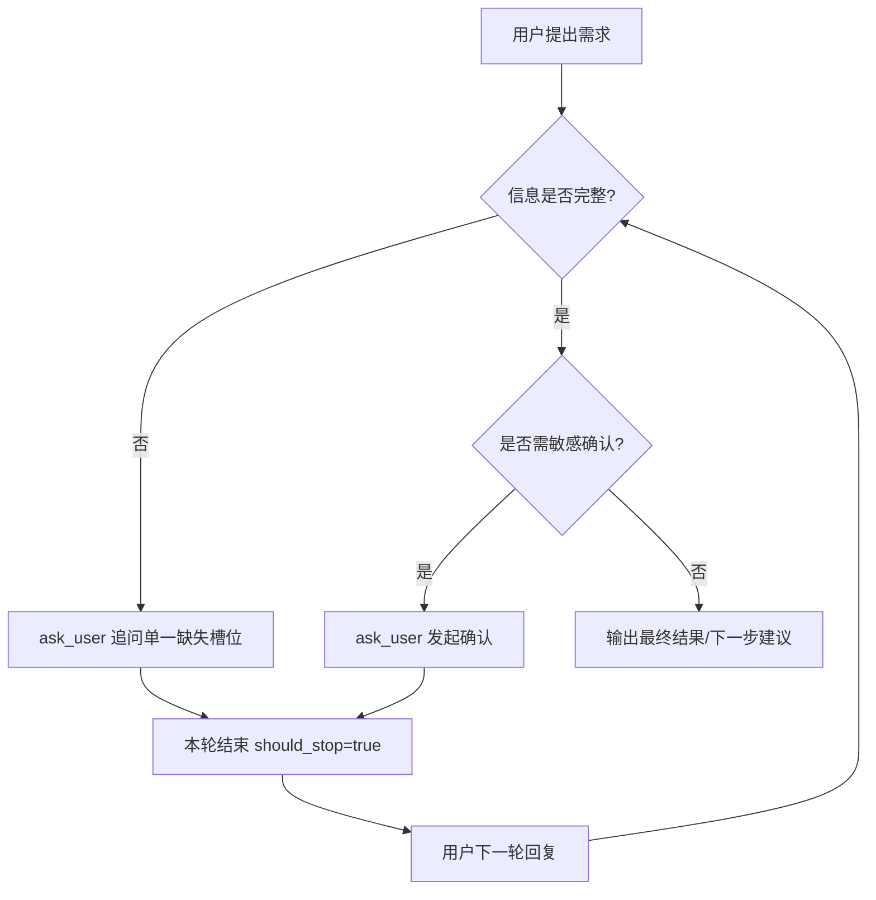
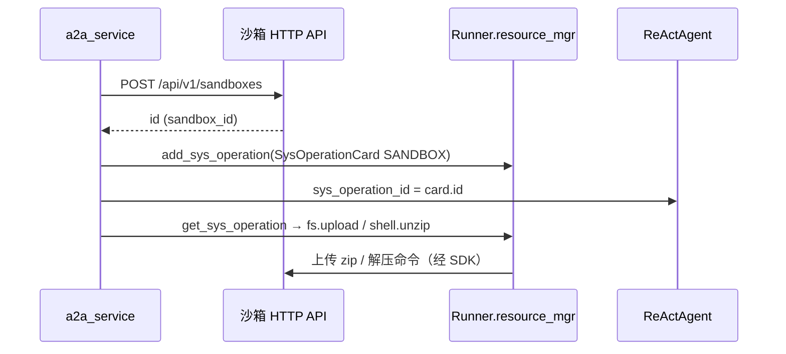
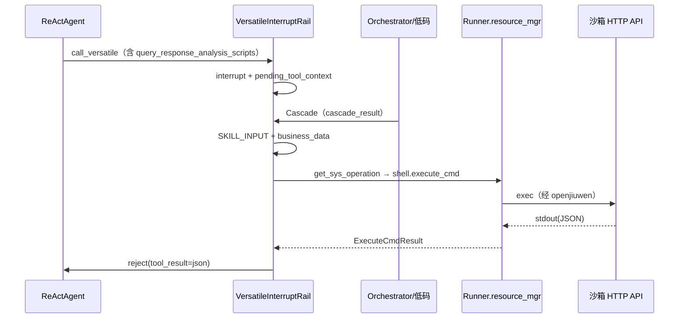

# EDPAgent AgentRule + Skill 装配开发手册

> 基于 330 发布版本实践  
> 文档类型：开发设计与实施手册  
> 版本号：v1.0  
> 编制日期：2026-04-22  
> 适用对象：开发 / 测试 / 运维 / 产品

## 目录

- [1. 背景与设计目标](#1-背景与设计目标)
  - [1.1 项目背景与问题定义](#11-项目背景与问题定义)
  - [1.2 为什么采用 AgentRule + Skill](#12-为什么采用-agentrule--skill)
  - [1.3 设计目标](#13-设计目标)
- [2. 总体架构与执行链路](#2-总体架构与执行链路)
  - [2.1 系统总架构](#21-系统总架构)
  - [2.2 请求生命周期](#22-请求生命周期)
- [3. AgentRule编写规范（全局治理层）](#3-agentrule编写规范全局治理层)
  - [3.1 角色定位](#31-角色定位)
  - [3.2 文件位置与加载机制](#32-文件位置与加载机制)
  - [3.3 YAML 格式](#33-yaml-格式)
  - [3.4 规则正文规范](#34-规则正文规范)
  - [3.5 编写原则](#35-编写原则)
  - [3.6 错误示例](#36-错误示例)
  - [3.7 AgentRule 模板](#37-agentrule-模板)
  - [3.8 AgentRule 话术（scripts）清单、修改范围与示例](#38-agentrule-话术scripts清单修改范围与示例)
- [4. 工具介绍（EDPAgent 可用工具清单）](#4-工具介绍edpagent-可用工具清单)
  - [4.1 本章在讲什么](#41-本章在讲什么)
  - [4.2 工具怎么分层](#42-工具怎么分层)
  - [4.3 注册位置与白名单](#43-注册位置与白名单)
  - [4.4 各工具关键口径（输入输出）](#44-各工具关键口径输入输出)
  - [4.5 Skill 如何使用这些工具](#45-skill-如何使用这些工具)
  - [4.6 观测与排查](#46-观测与排查)
  - [4.7 一句话记忆](#47-一句话记忆)
  - [4.8 后续可补充（可选）](#48-后续可补充可选)
- [5. Skill编写规范（场景执行层）](#5-skill编写规范场景执行层)
  - [5.1 角色定位](#51-角色定位)
  - [5.2 Frontmatter 规范（name/description）](#52-frontmatter-规范namedescription)
  - [5.3 内容结构规范](#53-内容结构规范)
  - [5.4 SKILL.md 话术、模板 key 与 AgentRule.scripts 对齐](#54-skillmd-话术模板-key-与-agentrulescripts-对齐)
- [6. Skill高码调用低码开发指导](#6-skill高码调用低码开发指导)
  - [6.1 适用条件](#61-适用条件)
  - [6.2 相关文件职责](#62-相关文件职责)
  - [6.3 从 Skill 到低码工作流的完整链路](#63-从-skill-到低码工作流的完整链路)
  - [6.4 新增一个“高码调用低码”的 Skill 应该怎么做](#64-新增一个高码调用低码的-skill-应该怎么做)
  - [6.5 推荐的最小实现模板](#65-推荐的最小实现模板)
  - [6.6 PRE_DELEGATE_GUARD：委托前置拦截规则](#6.6 PRE_DELEGATE_GUARD：委托前置拦截规则)
- [7. Skill调用MCP](#7-skill调用mcp)
- [8. Skill 仅通过ask_user.py与用户交互的场景](#8-skill-仅通过ask_userpy与用户交互的场景)
- [9. Agent与沙箱的交互](#9-agent与沙箱的交互)
- [10. 场景落地实践](#10-场景落地实践)
- [11. 上下文与记忆能力](#11-上下文与记忆能力)

---

## 1. 背景与设计目标

本手册用于指导 EDPAgent 在企业场景中的规则化开发、技能化装配与联调上线，面向开发、测试、运维与产品协同交付。目标不是单次“跑通”，而是形成可复制的工程方法：规则可治理、能力可扩展、行为可约束、输出可验收。

本手册所有结论均来自当前项目代码与配置实现，包括 `AgentRule.md`、`skills/*/SKILL.md`、`agents/edp_agent.py`、`rail/*`、`tool/__init__.py` 与部署文档。


### 1.1 项目背景与问题定义

在智能体业务落地中，常见问题包括：提示词与实现脱节、工具调用失控、异常流程无统一收口、前端无法稳定解析结果。EDPAgent 的设计重点是把“业务规则”和“执行能力”解耦：通过 AgentRule 统一治理，通过 Skill 组织场景执行，通过 Rail 进行运行时强约束。因此，本项目关注的不是“模型是否会回答”，而是“模型是否按业务规则可控执行”。

### 1.2 为什么采用 AgentRule + Skill

采用 AgentRule + Skill 的核心收益：

1）职责分离：AgentRule 管全局（边界、限制、总结格式），Skill 管局部（单场景执行步骤）。

2）演进友好：规则升级通常不需要改动主框架；新增场景只需新增 Skill 与工具注册。

3）风险可控：执行次数、迭代轮次、用户中断由 rails 统一治理，而非依赖模型自律。

4）测试可落地：每个层次都有明确验收对象（规则解析、工具调用、事件输出、异常收口）。

### 1.3 设计目标

设计目标分为五类：

A. 业务边界：超范围请求必须可识别、可拒绝、可解释。

B. 执行控制：限制循环、限制工具调用、限制无效输入重试。

C. 过程可观测：输出标准事件（tool_start/tool_end），便于前端展示与日志定位。

D. 结果结构化：输出字段稳定，支持 APP 卡片渲染与后续流程消费。

E. 工程可维护：规则、技能、工具、运行时配置可独立变更与回归。


## 2. 总体架构与执行链路

### 2.1 系统总架构


该架构以“通用能力与业务配置解耦”为核心，形成从业务入口到智能执行、再到运行保障的分层体系。整体目标是：在不改动底层运行内核的前提下，通过规则、Skill、MCP 等配置快速适配企业场景，实现可控、可扩展的智能体生产化落地。

- 企业业务应用层（入口层）
  面向不同业务系统提供统一接入网关，负责承接前端请求、做协议适配与流量分发。
  在项目中对应 `applications/a2a_service` 的北向接口（如 `user_router`）以及 `applications/versatile_adapter` 的协议代理能力，支持企业应用通过统一入口调用智能体服务。
- 动态规划 Agent 层（核心编排层）
  由 EDPA/EDPAgent 承担“规划-执行-观察-修正”的任务闭环，按业务规则动态拆解任务并编排执行路径。
  在项目中对应 `applications/a2a_service/agents/EDPAgent`，通过 `AgentRule`、各类 `SKILL.md`、工具调用与执行轨迹控制，实现“通用规划内核 + 企业规则配置”的组合能力。
- Agent 工具服务层（能力中台层）
  对模型接入、Skill 管理、MCP 调用、记忆/状态管理、运行时调度等能力做统一封装，向上提供标准化能力接口。
  在项目中可映射到 `service/`（AgentApp/BaseApp 通用服务抽象）、`management/`（部署策略与生命周期管理）、以及 `server/`（管理面 API）；同时结合 Redis 任务存储与会话状态实现运行态支撑。
- 基础设施服务层（底座层）
  提供模型、数据库、缓存、容器与沙箱等基础资源，保障系统稳定运行与弹性扩展。
  在项目中由 `foundation/` 统一承接底层能力，支持 SQLite/MySQL、Redis，以及 subprocess / Docker / K8s 等多种部署模式。


### 2.2 请求生命周期

请求生命周期用于定义一次会话从进入到结束的标准执行路径，目标是保证链路可控、过程可观测、结果可验收。建议按“步骤定义 + 关键事件 + 验收标准”描述。

#### 标准 7 步链路

1）接收用户 query：输入为用户请求与 conversation_id，输出为标准化会话上下文（query、会话状态、可选 custom_data）。

2）ScopeRail 首轮边界检查：只在首轮执行业务边界判定；命中范围进入规划，越界直接返回 out_of_scope_message 并结束流程。

3）模型规划当前动作：基于 AgentRule 与会话状态选择本轮动作；约束为“本轮仅一个明确动作”。

4）单次工具调用：调用单个工具完成当前动作，不并发多工具；调用前受 ExecutionLimitRail 校验。

5）写入 tool_start/tool_end：每次工具调用必须写入可追踪事件；tool_end.data 返回结构化结果供上层消费。

6）基于 observation 继续思考：读取工具返回结果，更新状态并决定下一步；受 IterationLimitRail 控制避免循环空转。

7）最终输出或强制结束：正常场景输出最终答复；越界、超限、用户终止、连续无效输入达阈值时强制结束，且必须返回终态话术。

#### 关键执行要求

每轮只做一个明确动作；每次工具调用必须产出 tool_start/tool_end；异常必须有终态回复；终止条件必须可配置（迭代上限、工具上限、终止词、输入重试上限）。

#### 事件与状态要求

关键事件：llm_reasoning、tool_start、tool_end、answer。

关键状态：scope_checked、exec_counts、iter_count、input_attempts。

联调要求：先校验事件是否齐全，再校验事件数据结构是否完整与稳定。

#### 验收标准

1）越界请求是否首轮拦截并结束；

2）单轮是否最多一次工具调用；

3）每次调用是否同时出现 tool_start 与 tool_end；

4）tool_end.data 是否结构化且字段稳定；

5）达到限制后是否强制结束并返回终态话术；

6）终止词是否可立即中止流程。


## 3. AgentRule编写规范（全局治理层）

AgentRule 是全局治理策略，不承担具体 API 或脚本实现细节；其职责是声明“策略与约束”，并被代码层 rails 消化执行。建议每次改 Rule 都做 schema 与 rail 对照检查，确保字段变化真正生效，而不是停留在文案。

### 3.1 角色定位

AgentRule 角色：会话级治理器。负责在一次会话内统一定义：业务范围、规划步骤模板、执行与交互限制（迭代/工具次数、终止与追问）、总结输出规范及关键话术；不负责具体接口、工作流或脚本实现。

职责边界：

写入配置并生效：frontmatter 中的 `scope`、`limits`、`summary` 等由运行时加载并驱动 Rails 等行为。

写入提示并引导：`markdown_body` 注入模型上下文，约束规划与话术。

不写实现细节：不描述低码/工作流内部节点、不替代 Skill 的阶段步骤与白名单。

与实现对齐：正文中的工具名须与已注册工具一致；业务「允许范围」描述须与 Scope 等拦截策略一致，避免规则与代码行为脱节。

### 3.2 文件位置与加载机制

文件路径：applications/a2a_service/agents/EDPAgent/AgentRule.md。

加载入口：applications/a2a_service/agents/EDPAgent/__init__.py 对外导出 initialize（映射到 initialize_dpa）；实际加载发生在 agent.py 的 initialize_dpa() 中，通过 load_agent_rule(_AGENT_RULE_PATH) 读取规则。

解析器：applications/a2a_service/agents/EDPAgent/agent_rule.py 中的 load_agent_rule()；使用 _FRONTMATTER_PATTERN 正则提取 frontmatter YAML。注意：仅在文件不存在时抛 FileNotFoundError；若缺失 frontmatter 不抛错，而是按空配置继续启动。

正文注入：initialize_dpa() 中先取 system_prompt = _agent_rule.markdown_body，再与 build_system_prompt() 拼接后通过 configure_prompt_template 注入模型系统提示词。

### 3.3 YAML 格式

YAML 格式建议采用“字段解释 + 最小示例 + 评审清单”三段式，避免只写原则导致实现偏差。建议字段：scope、planning_steps、limits、summary、scripts（其中 scope 与 limits 在当前实现中最关键）。

字段解释（结合当前代码）
- scope（对象，可缺省）：业务范围控制。scope.allowed 描述允许范围；scope.out_of_scope_message 为越界固定话术。
- planning_steps（数组，可缺省）：规划步骤提示，主要用于引导模型思考顺序。
- limits（对象，强相关）：直接影响 rails 行为。建议至少配置 max_iterations、tasks、termination_keywords；配置不当会导致执行失控、过早终止或中断策略异常。
- summary（对象，可缺省）：总结输出约束，建议配置 format、required_fields 以稳定前端消费。
- scripts（对象，可缺省）：统一话术模板（tool_start/tool_end 等），用于提升输出一致性。
说明：在当前实现中，frontmatter 缺失不会直接导致启动失败；系统会回退默认配置继续运行，因此评审应重点检查“配置是否生效”。

#### 最小可运行示例
scope:
  allowed: "理财相关业务（余额查询、转账、购买）"
  out_of_scope_message: "尚在学习中"
planning_steps:

  - 需求解析
  - 目标拆解
  - 执行动作
  - 结果总结
    limits:
    max_iterations: 30
    max_input_attempts: 3
    interrupt_timeout_seconds: 300
    tasks:
    call_versatile: 10
    ask_user: 5
    termination_keywords:
    - "终止执行"
    - "取消"
    - "stop"
    summary:
    format: "需求概述→执行过程→结果汇总→异常说明"
    max_length: 500
    required_fields:
    - "结果"
    scripts:
    tool_start: "正在调用：{tool_name}"
    tool_end: "{tool_name} 执行完成"
---
### 3.4 规则正文规范

规则正文用于约束模型行为，必须“业务可读、执行可测、结果可验收”。建议按以下 6 段编写，并给出固定话术示例。

#### 范围与越界处理（必须写固定回复）

写法要求：明确允许范围与不允许范围；越界请求必须固定回复；固定回复需与 scope.out_of_scope_message 一致。

项目示例（理财场景）：允许理财推荐、产品选择、余额查询、转账、理财购买；越界为股票、保险、贷款、外汇、信用卡分期等。

应正文示例：允许处理理财推荐、理财购买、余额查询、转账；不允许处理股票、保险、贷款、外汇、信用卡业务。超范围时直接回复“尚在学习中”，并结束本轮，不生成任务，不调用工具。

越界话术示例：用户“帮我分析一下贵州茅台走势”-> 助手“尚在学习中”。

####  路由条件（进入哪条流程）

写法要求：使用“触发条件 -> 进入路径”表达，并确保能映射到已存在的 Skill 或工具能力。

应正文示例：推荐理财/看看理财产品 -> 推荐路径；已选产品并给金额 -> 购买路径；仅问余额 -> 余额查询路径；非理财请求 -> 越界处理。

#### 主流程步骤

写法要求：按先后顺序写清步骤，禁止跳步；每一步必须对应实际已注册工具。

项目当前可用工具名：run_product_recommend_skill、query_balance、transfer、buy_wealth、query_wealth、todolist_create、todolist_modify、todolist_query（ask_user 由中断 rail 支持）。

应正文示例：推荐产品（run_product_recommend_skill）-> 确认产品与金额（必要时 ask_user）-> 购买前确认 -> 资金筹划（query_balance/transfer）-> 发起购买（buy_wealth）。

#### 异常分支（每类异常都要有兜底话术）

写法要求：至少覆盖无效输入、余额不足、用户取消、工具失败四类异常，并给固定话术。

推荐固定话术：无效选择“抱歉没有理解您的意思，请重新输入。”；余额不足“您的活期账户余额不足，结束理财产品购买。”；用户取消“好的，已取消本次理财购买，期待下次为您服务。”；工具异常“当前服务繁忙，请稍后重试。”

#### 输出模板（统一结构，便于前端消费）

写法要求：统一字段顺序并绑定 summary.required_fields。模板要求：场景类型、关键输入、核心步骤、最终结果、异常说明。

#### 示例对话（正向 + 异常各至少 1 个）

示例要求：

A 正向购买链路（推荐 -> 选品 -> 资金筹划 -> 购买）；

B 越界链路（用户“我想买美股 ETF”，助手“尚在学习中”）。

#### 强校验要求（必须写入手册）

强校验要求：正文工具名必须在 tool/__init__.py 注册；规则话术与 frontmatter 配置一致；每条主流程必须具备异常收口。

### 3.5 编写原则

编写原则的目标是让规则“写得出、跑得通、测得准、审得过”。应将原则拆成“定义 + 落地方法 + 验收标准”。

#### 边界先行

定义：先定义可做/不可做的业务边界，再写流程步骤。没有边界的流程等于不可控流程。

落地方法：在 scope.allowed 明确允许域；正文首段写不处理范围；越界回复与 out_of_scope_message 保持一致。

验收标准：越界输入可被首轮拦截；拦截后不触发工具调用；用户看到固定回复，不出现自由发挥。

####  流程闭环

定义：每个主流程必须具备入口、推进、终态、异常收口，不能只写理想路径。

落地方法：正文至少覆盖正常路径、取消路径、失败路径；每条路径明确下一步动作与结束条件；关键确认节点使用标准话术。

验收标准：任意路径都能结束，不出现悬空状态；失败后有可理解回复；终止词触发后流程立即收口。

#### 约束可执行

定义：规则中的限制必须可被运行时机制执行，而不是停留在文案。

落地方法：将次数、轮次、终止关键词放入 limits；通过 ScopeRail、ExecutionLimitRail、IterationLimitRail、AskUserRail 执行；正文工具名与 `tool/__init__.py` 的 `build_tools()` 白名单一致。

验收标准：工具超限可终止；迭代超限可终止；无效输入超过阈值可收口。

#### 字段可消费

定义：输出是给系统消费，不是给模型自解释；字段必须稳定、可解析、可渲染。

落地方法：最终总结字段对齐 summary.required_fields；工具结果统一走 tool_end.data；字段命名和层级保持稳定。

验收标准：前端可稳定渲染；同场景多次执行字段结构一致；字段变更可被测试提前发现。

#### 语言可测试

定义：规则文本必须可转化为测试用例，避免模糊表达。

落地方法：每条关键规则配至少 1 条正向 + 1 条反向用例；关键话术使用固定文本或模板；必须/禁止规则使用可判定表达。

验收标准：每条关键规则都能映射断言。例如：越界请求是否被 ScopeRail 拦截、工具超限是否终止、终止词是否立即生效。

####  反例（应纳入本节末尾）

反例1：只写“按业务规范处理”，未定义越界话术。

反例2：只写“余额不足则处理”，未定义处理顺序与终态。

反例3：正文要求调用工具，但代码未注册该工具。

反例4：总结字段频繁变化，前端无法稳定渲染。

反例5：规则文本无法转测试，评审只能依赖主观判断。

### 3.6 错误示例

常见错误：

- Rule 写理财、当前运行却加载数学版 Rule。

- 配置了 `limits.tasks.transfer`，但工具注册中无 transfer。

- 正文描述“先查余额再购买”，但未限制直接调用 buy_wealth。

- 输出模板与前端字段约定不一致，导致卡片渲染失败。

### 3.7 AgentRule 模板

模板应包含三部分：

A. frontmatter（可被解析和校验）；

B. 规则正文（模型行为规约）；

C. 示例（用于开发联调与测试回归）。

模板落地后需至少通过：启动加载成功、越界拦截成功、核心流程走通、异常路径可收口。

### 3.8 AgentRule 话术（scripts）清单、修改范围与示例

本节对应你写 `AgentRule.md` 时**「哪些是话术、改哪里、怎么改才生效」**。话术分三类：**YAML `scripts`（可模板变量）**、**与前端/中断绑定的固定 key**、**正文里写给模型的「调用话术指令」**（例如要求 `ask_user` 带哪组 `response_template_keys`）。权威字段定义见 `applications/a2a_service/agents/EDPAgent/agent_rule.py` 中 `ScriptsConfig`。

#### 3.8.1 AgentRule.md 涉及的话术（按来源列清单）

**A）`scope`（越界短回复）**

| 字段 | 典型用途 | 是否算「用户可见话术」 |
|------|----------|------------------------|
| `scope.out_of_scope_message` | 越界兜底短句（与正文约定一致） | 是 |
| `scope.allowed` | 允许范围叙述（偏策略，不是按钮卡片） | 多为模型上下文 |

**B）`scripts`（统一模板库，供 Rail / 事件层取用）**

下列 key 与 `ScriptsConfig` 一一对应（未在 YAML 写出时使用代码默认值）。带 `{变量}` 的模板在运行时会 `format_map` 或按 Rail 约定替换。

| scripts key | 默认/常见占位符 | 典型消费路径 |
|-------------|-----------------|-------------|
| `tool_start` | `{tool_name}` | 脚本/事件层通用占位（与 ExecutionLimitRail 等配合） |
| `tool_end` | `{tool_name}` | 同上 |
| `todo_start` | `{title}` | 单步 todo 话术 |
| `todo_end` | `{title}` | 单步 todo 结束 |
| `todolist_start` | 无 | `lite_todo_write` 派生 TodoList 起始话术 |
| `todolist_end` | 无 | TodoList 结束话术 |
| `interrupt_start` | 无 | 中断类提示 |
| `request_start` | 无 | 首轮会话提示（`agent.py` 流式事件） |
| `planning_start` | 无 | 规划开始提示 |
| `mcp_result_empty` | 无 | MCP 空结果提示（Rail 可写入 `response_template`） |
| `product_recommend_success` / `product_recommend_empty` / `product_recommend_no_card` | 无 | 推荐结果分支话术 |
| `product_select_confirm` | `{amount}`、`{productName}` | 选品确认（`ask_user` + 模板） |
| `product_select_missing_product` / `product_select_missing_amount` / `product_select_invalid` | 无 | 选品追问/纠错 |
| `task_cancelled` / `cancel_confirm` | 无 | 取消流程 |
| `out_of_scope` | 无 | 超范围卡片话术（常与 `ask_user` 的 key 映射配合） |
| `fund_planning_*` 系列 | 无 | 购买/资金筹划成功、失败、余额不足、超时等终态话术 |

**C）`todolist_steps[].content`（步骤展示名）**

- 会进入 TodoList 相关事件展示，**属于用户可见文案**；`skill` 字段绑定 `SKILL.md` 的 `name`，改步骤名=改产品体验，不等于改 Skill 逻辑。

**D）`markdown_body`（规则正文）**

- 里面的「必须调用 `ask_user`、参数固定为…」等，是在教模型**怎么选模板 key**，本身不是 `scripts` 文本，但要与 **B）中的 key 同名对齐**，否则 `AskUserRail` 取不到模板。

#### 3.8.2 开发人员常改范围（AgentRule）

| 改动类型 | 改哪里 | 风险/注意 |
|----------|--------|-----------|
| 调产品文案、语气 | `scripts.*` 字符串、`todolist_steps[].content` | 低；注意 `{占位符}` 名不要拼错 |
| 调越界短回复 | `scope.out_of_scope_message` + 正文同句对齐 | 中；与正文「禁止自由发挥」冲突会难测 |
| 调步骤与 Skill 绑定 | `todolist_steps` 的 `step_id` / `content` / `skill` | **高**；`step_id` 与 `lite_todo_write` 枚举绑定，错配会启动失败或步骤错乱 |
| 调次数上限 | `limits.max_iterations`、`limits.tasks.<tool_name>` | 中；工具名须与注册名一致 |
| 调总结字段 | `summary.required_fields` / `format` | 中；影响前端/联调验收 |
| **新增**一条 `scripts: my_new_key: "..."` | 仅写 YAML | **可能不生效**：`ScriptsConfig` 未声明的字段会被 Pydantic 丢弃；要新增 key 须改 `agent_rule.py` 并发布 |

#### 3.8.3 话术示例（可直接粘贴后按需改字）

**示例 1：统一工具行话（短）**

```yaml
scripts:
  tool_start: "正在为您处理：{tool_name}"
  tool_end: "{tool_name} 已处理完成"
```

**示例 2：推荐结果「有/无」分支（与 Versatile/MCP 脚本返回分支配合）**

```yaml
scripts:
  product_recommend_success: "已为您筛选出候选产品，请回复序号或产品代码；如需换条件请直接说。"
  product_recommend_empty: "当前条件下暂无合适产品，您可以放宽风险/期限，或说「换一批」再试。"
  mcp_result_empty: "外部检索暂无结果，您可以调整筛选条件后重试。"
```

**示例 3：选品确认（带变量，供 `ask_user` 模板渲染）**

```yaml
scripts:
  product_select_confirm: "请确认是否购买 {amount} 元「{productName}」？确认请回复「确认」，取消请回复「取消」。"
  product_select_missing_amount: "请用数字回复购买金额（单位：元），例如 50000。"
```

**示例 4：正文里约束「超范围必须走 ask_user + 固定 key」**（节选写法）

```markdown
若用户请求超出支持范围，必须调用 `ask_user`，且：
- `response_template_status="out_of_scope"`
- `response_template_keys` 为 JSON 字符串：'{"out_of_scope":"out_of_scope"}'
```

> 与第 **5.4** 节、`SKILL.md` 中的 `ask_user` 示例、`AskUserRail` 行为一起看，避免「正文写了 key、YAML 没配文案」。

## 4. 工具介绍（EDPAgent 可用工具清单）

编写 **Skill** 之前，建议先读完本章：先搞清楚「有哪些工具可用、各自干什么、从哪注册、出问题从哪查」，再写 `SKILL.md` 里的白名单与步骤，避免规则和代码对不上。

### 4.1 本章在讲什么

三件事：**工具怎么分工**、**工具在哪注册**、**出了问题怎么排查**。

结论：`applications/a2a_service/agents/EDPAgent/tool/` 里大多是入口定义（`ToolCard` + 壳函数），真正执行逻辑主要在 `applications/a2a_service/agents/EDPAgent/rail/` 里，由各类 Rail 拦截、补参、跑沙箱或中断续轮。

### 4.2 工具怎么分层

**业务工具**

- `call_versatile`
- `call_mcp`

用于触发真正的业务动作（例如走 Versatile/低码、跑脚本拉 MCP 数据等）。

**流程控制工具**

- `ask_user`
- `cancel_task`

追问用户；仅在用户明确确认后终止当前任务。

**辅助编排工具**

- `lite_todo_write`

只做会话内待办步骤的**覆盖式**维护，不直接执行业务。

**补充**：框架还可能暴露 **系统能力**（如按需 `read_file`、`execute_cmd`）给 Agent 读 `SKILL.md` 或执行脚本，这类不在 `build_tools()` 列表里，行为见本手册第 9 章「Agent 与沙箱」。

### 4.3 注册位置与白名单

- **组装**：`tool/__init__.py` 的 `build_tools()`。
- **注册**：`agent.py` 的 `initialize_dpa()` 里 `Runner.resource_mgr.add_tool` + `agent.ability_manager.add`。

`build_tools()` 的返回列表可视为**运行时工具白名单**：Skill 里写的工具名必须与此一致。

**初始化顺序（重要）**：`lite_todo_write` 依赖 `AgentRule.md` 中的步骤配置。必须先加载规则并调用 `configure_steps(...)`，再 `build_tools()`；顺序错了会直接构建失败。

### 4.4 各工具关键口径（输入输出）

**`ask_user`**：本轮只负责把问题抛给用户，**不把**本次调用当成用户已确认；答案在下一轮用户消息里。

**`call_versatile`**：核心入参 `query_description`、`query_intent`；后续由 `VersatileInterruptRail` 接管执行与结果回填。

**`call_mcp`**：入参 `script_command`、`script_params`（JSON 字符串）；会话侧必填上下文由 `MCPInterruptRail` 注入，**不要**让模型伪造敏感字段。

**`cancel_task`**：仅在用户明确确认取消后调用；调用后本轮 Agent 循环结束。

**`lite_todo_write`**：每次传入**完整**待办列表、覆盖写；`step_id` 须合法且不重复。

### 4.5 Skill 如何使用这些工具

Skill 更像**任务说明书**（触发条件、步骤、工具白名单、输出结构），并不会在代码里「绑定」某个 Python 函数；由模型在 ReAct 循环里发起 tool call，再由对应 Rail 执行。

**典型顺序**（可按场景裁剪）：

1. `lite_todo_write` 写清本轮步骤；
2. 缺参时用 `ask_user`；
3. 走低码/工作流用 `call_versatile`；
4. 走脚本 + MCP 用 `call_mcp`；
5. 用户确认终止用 `cancel_task`。

Skill 文案建议写清：**触发条件**、**必填槽位**、**先问还是先查**、**每一步对应哪个工具**、**失败/空结果话术**。

**简化示例（理财推荐）**：用户要推荐 → `lite_todo_write` → 缺风险偏好则 `ask_user` → 齐全后 `call_mcp` 或 `call_versatile` → 视结果更新 `lite_todo_write` 状态。

### 4.6 观测与排查

**前端**：优先看 `tool_start → tool_status → tool_end`；`lite_todo_write` 可能派生 `todolist_*` 事件，属正常行为。

**后端日志**：建议带 `trace_id`、`conversation_id`、`tool_name`、`duration_ms`、`result_keys` 或错误信息。

**常见三连查**：工具是否在 `build_tools()` 里；入参是否符合 `ToolCard` schema；是否被 Rail 改写了执行路径（与「只读 Python 壳函数」的直觉不一致）。

### 4.7 一句话记忆

**入口轻、Rail 重**：工具声明「要做什么」，Rail 负责「怎么做、怎么中断、怎么回填、怎么打日志」。

### 4.8 后续可补充（可选）

- 各工具 I/O 示例与边界用例；
- 失败模板（超时、空结果、鉴权、解析失败）；
- FAQ：现象 → 原因 → 排查步骤 → 修复建议。

## 5. Skill编写规范（场景执行层）

Skill 是单场景执行规范，强调“单一职责、白名单调用、结构化输出”。

本项目中推荐、选品、资金筹划 skill 已提供参考风格，应统一结构与术语。

### 5.1 角色定位

Skill 角色：阶段执行器（Stage Executor）。其核心职责是在 AgentRule 给定的全局边界内，完成单一业务阶段的参数收集、工具调用、结果归一化与阶段收口。

边界要求：每个 Skill 只处理一个业务阶段，禁止跨阶段抢职责（例如推荐 skill 不做转账/购买执行）；当输入超出本阶段职责时，应返回明确的“下一步引导”或“交由其他阶段处理”信号，而不是继续扩展执行范围。

协同原则：Rule 决定“做不做、做到哪”，Skill 决定“怎么做、怎么收口”。验收时应至少检查三点：职责是否单一、工具白名单是否匹配、阶段输出是否可被下一阶段稳定消费。

文件位置：`community/EDPAgent/skills/<skill_name>/SKILL.md`。

当前仓库可见的是“文档规范 + 工具脚本配套”模式；未在仓库中看到统一 SKILL.md 动态加载器。

因此应把 SKILL.md 视为模型执行规约，真正执行依赖对应 Python 工具与注册。

### 5.2 Frontmatter 规范（name/description）

最小 frontmatter：`name`、`description`。

description 应同时写：触发词、适用边界、不适用场景，减少误触发。

### 5.3 内容结构规范

Skill 内容结构的目标是保证“可理解、可执行、可测试、可复用”。应固定为 7 段结构，并要求每段都有可检验输出。

#### 职责（必须单一且可判定）

写法要求：一句话说明本 Skill 负责什么，不负责什么；禁止跨阶段抢职责。

示例（推荐 Skill）：负责理财产品推荐与展示，不负责选品确认、资金筹划、购买执行。

验收要点：用户意图命中后，Skill 行为仅落在职责范围内。

####  工具白名单（允许 + 禁止）

写法要求：列出允许工具和禁止工具两张清单，工具名必须与实际注册名一致（tool/__init__.py）。

示例：允许 run_product_recommend_skill；禁止 query_balance、transfer、buy_wealth、todolist_modify。

验收要点：执行日志中不出现禁止工具调用。

#### 输入槽位与解析规则

写法要求：定义必填/选填槽位、默认值、解析规则、合法值范围和冲突处理。

示例：risk_level 取值 R1~R5；amount 必须为正数；“5万”统一换算为 50000。

验收要点：同一输入在不同轮次解析结果一致。

#### 执行步骤（有序、可追踪）

写法要求：按编号写步骤，每步说明触发条件、动作、下一步；禁止跳步。

模板要求：输入校验 -> 参数归一化 -> 工具调用 -> 结果判定 -> 回复生成。

验收要点：每步都能映射到日志事件或工具调用结果。

#### 输出模板（结构化）

写法要求：输出使用固定字段和固定顺序，便于前端渲染与回归测试。

模板要求：状态、关键输入、关键动作、结果、后续建议。

示例：推荐成功返回 products 列表与 bankCardNumber；失败返回 error/message。

验收要点：同场景重复执行，输出字段结构不漂移。

#### 异常处理（分类 + 兜底话术）

写法要求：至少覆盖输入非法、工具失败、空结果、用户取消四类异常，并给固定话术。

示例话术：

输入非法："输入信息不完整，请补充后重试。"

工具失败："当前服务繁忙，请稍后重试。"

空结果："暂无符合条件的结果，请调整筛选条件。"

用户取消："好的，已取消本次操作。"

验收要点：每类异常都能稳定收口，不出现静默失败。

#### 示例（至少 1 正向 + 1 失败）

正向样例建议：用户“推荐低风险理财”，Skill 调用 run_product_recommend_skill，返回产品列表并引导下一步。

失败样例建议：用户输入无效风险等级或工具超时，Skill 返回固定错误话术，不进入后续购买流程。

验收要点：样例可直接转化为自动化测试用例（输入、工具序列、输出断言齐全）。

#### 发布前检查清单（必须新增）

检查项：职责是否单一；白名单是否与注册一致；槽位规则是否可测；异常分支是否完整；正反样例是否可复现。

### 5.4 SKILL.md 话术、模板 key 与 `AgentRule.scripts` 对齐

本节回答：「Skill 里哪些算话术、能改什么、怎么和 AgentRule 里的话术库对齐」。更细的 `ask_user` 语义见第 **8** 章；MCP 空结果模板 key 见第 **7** 章。

#### 5.4.1 SKILL.md 里常见「话术」形态

| 形态 | 出现在 SKILL 的哪里 | 是否依赖 AgentRule |
|------|---------------------|---------------------|
| **触发/边界描述** | frontmatter `description`、正文「何时启用本 Skill」 | 否（但应与 `scope.allowed` 不打架） |
| **给用户看的固定短句** | 异常分支、最终回复模板、列表展示格式说明 | 可不依赖；若希望全渠道统一，应迁到 `scripts` 再在 Skill 里引用 key |
| **`ask_user(question=...)` 兜底问句** | 执行步骤示例 | 否；但当走模板中断路径时，以 `scripts` 渲染结果为准 |
| **模板 key 名字** | `ask_user` 的 `response_template_keys` / `response_template_status`；`call_versatile` 的 `response_template_keys` JSON 数组；`call_mcp` 的 `script_params.empty_result_template_key` | **是**：这些字符串必须能在 `AgentRule.md` → `scripts` 中找到同名 key |
| **脚本 stdout 里的 `ui_notice.key`** | 归一化脚本约定（见 Versatile 章节） | **是**：`key` 对应 `scripts` 中某模板名 |

#### 5.4.2 开发人员常改范围（Skill）

| 改动 | 建议改法 | 注意 |
|------|----------|------|
| 只改本 Skill 流程与参数 | 改 `SKILL.md` 正文：步骤、白名单、`query_*` 拼装规则 | 工具名必须落在第 **4** 章白名单内 |
| 改「产品对用户说的话」且多处复用 | **优先**改 `AgentRule.md` 的 `scripts`，Skill 只引用 key | 避免同一语义两套文案 |
| 改步骤在待办里的显示名 | 改 `AgentRule.md` 的 `todolist_steps[].content`（必要时改 `skill` 绑定） | 与 `lite_todo_write` 强绑定 |
| 新增一种业务话术 | 若走 `get_response_template(key)`：须 **同时** 加 `scripts` 字段 +（如需）扩展 `ScriptsConfig` | 仅写 YAML 新 key 可能不加载 |

#### 5.4.3 话术与模板示例（Skill 侧写法）

**示例 A：`ask_user` 走模板（超范围 / 确认类）**

Skill 正文约定模型这样调用（key 必须在 `scripts` 中存在）：

```text
ask_user(
  question="（兜底问句，可简短）",
  response_template_status="out_of_scope",
  response_template_keys='{"out_of_scope":"out_of_scope"}',
  response_template_vars='{}'
)
```

对应 `AgentRule.md`：

```yaml
scripts:
  out_of_scope: "该业务暂不支持，您可以换一个问题试试。"
```

**示例 B：`ask_user` 选品缺参（status → key 映射）**

```text
response_template_keys='{"missing_amount":"product_select_missing_amount","confirm":"product_select_confirm"}'
response_template_status="missing_amount"
response_template_vars='{"productName":"添利宝"}'
```

对应 `scripts` 至少包含 `product_select_missing_amount`、`product_select_confirm`，且 `product_select_confirm` 含 `{amount}`、`{productName}`。

**示例 C：`call_versatile` 成功/失败双话术（JSON 数组字符串）**

```text
response_template_keys='["product_recommend_success","product_recommend_empty"]'
```

Rail 按工作流状态取 `[0]` 或 `[1]` 的 key，再到 `scripts` 取文案——**Skill 要写清两个 key 的顺序含义**。

**示例 D：Skill 正文「自由话术」 vs 规则库话术（取舍）**

- 适合留在 SKILL 内：本阶段特有的列表展示格式、示例对话、槽位纠错提示。
- 适合沉到 AgentRule `scripts`：多 Skill 复用的成功/失败/取消/超时、监管合规固定用语。

#### 5.4.4 评审清单（写 Skill 时自检）

1. 所有模板 key 均在 `AgentRule.md` → `scripts` 有定义，且与 `agent_rule.py` 中字段一致。  
2. `ask_user` 的 `response_template_keys` 能被 `json.loads` / `AskUserRail` 解析（见第 8 章容错说明）。  
3. 需要变量的模板，`response_template_vars` 与模板占位符同名。  
4. 正文**不要**再写一套与 `scripts` 冲突的「最终用户可见句」，避免模型选错信源。

## 6. Skill高码调用低码开发指导

本节职责：只说明如何在 Skill 中落地“高码调用低码工作流”。

核心原则：Skill 不直接请求低码平台，只调用 call_versatile；低码调用由 VersatileInterruptRail + Executor + VersatileAdapter 完成。

### 6.1 适用条件

适用于：存在外部平台工作流、需要实时业务数据、返回结果需结构化渲染。

不适用于：纯本地推理即可完成、无外部依赖的轻量问答。

### 6.2 相关文件职责

实现这条链路时，至少要理解下面这些文件：

- AgentRuntime 模块（运行时编排/接入层）
  - `applications/a2a_service/orchestrator/executor.py`  运行时编排核心，负责承接委托请求、调用 VersatileAdapter、处理流式事件并在 INPUT_REQUIRED 与 cascade_result 两种状态间驱动会话流转。
  - `applications/a2a_service/orchestrator/user_router.py`  用户入口路由层，负责解析首轮/续轮请求、维护 conversation_id -> task_id 映射与首轮请求缓存，并将请求送入 Executor 执行。
  - `applications/a2a_service/orchestrator/agent_adapter.py` 事件适配层，负责把 Agent 侧事件转换为 A2A 标准事件输出，并将 DelegateRequest 留给编排层而非直接下沉为普通工具结果。
- Agent模块
  - `applications/a2a_service/agents/EDPAgent/agent.py`  装配入口，负责在启动时注册工具、Rail、系统操作能力与 Skill 目录，构建完整可运行的 Agent 执行链。
  - `applications/a2a_service/agents/EDPAgent/tool/call_versatile.py`   声明式委托工具，主要向模型暴露低码调用所需参数协议（描述/意图/归一化脚本），自身不承载真实业务执行。
  - `applications/a2a_service/agents/EDPAgent/rail/versatile_interrupt_rail.py`  低码委托桥接 Rail，负责拦截 call_versatile 请求、管理委托上下文，并在低码返回后执行归一化脚本再回注 Agent。
- Skill文件
  - `applications/a2a_service/agents/EDPAgent/skills/*/SKILL.md`  能力声明与约束配置文件，定义每个业务技能的输入输出规范、调用意图和可执行流程。
  - `applications/a2a_service/agents/EDPAgent/skills/*/scripts/run_*.py`  对应的脚本执行实现，负责对低码返回结果进行具体解析、清洗与业务归一化处理。


### 6.3 从 Skill 到低码工作流的完整链路

下面按时序拆开。

#### 启动阶段

应用启动时，`initialize_dpa()` 会完成以下装配：

1. 创建并注册 `SysOperationCard`
2. 注册 `call_versatile` 到 Agent 能力集
3. 注册 `VersatileInterruptRail`
4. 注册所有 Skill

这一阶段相当于把“Skill 可声明低码调用”这件事准备好。

#### Skill 发起调用

Skill 中只需要写类似下面的调用：

```python
call_versatile(
  query_description="推荐理财产品，关键词：固收，风险等级：R2",
  query_intent="理财推荐",
  query_response_analysis_scripts="python rebuild_product_recommend_skill/scripts/run_product_recommend_skill.py"
)
```

这里要注意：

- `query_description` 是给低码平台看的自然语言任务描述
- `query_intent` 是给低码路由看的业务意图
- `query_response_analysis_scripts` 是给高码回填看的归一化脚本

#### Rail 首轮拦截

`VersatileInterruptRail.resolve_interrupt()` 在没有 `cascade_result` 时，会：

1. 读取 `tool_args`
2. 构造 `delegate_info`
3. 将下面这些状态写入 Session

```json
{
  "pending_delegate": {
    "intent": "理财推荐",
    "task_description": "推荐理财产品，关键词：固收，风险等级：R2"
  },
  "pending_tool_context": {
    "tool_name": "call_versatile",
    "tool_args": { ... }
  }
}
```

4. 调用 `interrupt()` 中断本轮工具执行

这一步并不返回业务结果，而是把“委托请求”挂到 Session 上。

#### agent_stream 输出 DelegateRequest

`agent_stream()` 在底层流跑完后，会检查 Session 中是否存在 `pending_delegate`。

如果存在，就会：

1. `yield DelegateRequest`
2. 清空 `pending_delegate`
3. 直接 `return`

这就是 Skill 把需求转交给 Orchestrator 的出口。

#### Executor 真正调用低码工作流

`Executor._run_agent()` 收到 `DelegateRequest` 后，会调用 `_call_versatile_adapter()`。

这个函数的关键逻辑：

1. 从 Redis 读取首轮缓存的 `headers/body/params`
2. 把 `delegate.intent` 和 `delegate.task_description` 注入到低码请求体
3. 通过 `self._va_client.send_message()` 真实请求 VersatileAdapter
4. 在流式返回中寻找：
   - QA 节点结果
   - End 节点结果
5. 根据是否命中 End 节点决定：
   - 命中 End 节点：返回 `cascade_result`
   - 未命中 End 节点：把当前任务挂起为 `INPUT_REQUIRED`

这里有一个项目里的兼容逻辑要特别注意：

- 当 Skill 传入 `query_intent="理财推荐"` 时，`Executor` 会临时改写成低码历史兼容入口 `理财选品购买`
- 所以 Skill 层应该继续传业务语义正确的 `理财推荐`
- 不要为了兼容而在 Skill 中手工写成 `理财选品购买`

#### 低码续轮

如果低码工作流没有在当前轮返回 End 节点，`Executor` 会把当前 Task 设为 `INPUT_REQUIRED` 并记住 `va_task_id`。

下一次用户输入进来后：

1. `user_router` 识别当前 Task 为 `INPUT_REQUIRED`
2. `Executor.execute()` 进入 `_continue_versatile_adapter()`
3. 使用原来的 `va_task_id` 继续调用低码工作流
4. 如果这次拿到 End 节点，就构造 `cascade_result` 并重新调用 `_run_agent()`

#### Cascade 回填到 Skill

当 Agent 以 `cascade_result` 重新进入 `agent_stream()` 后，`VersatileInterruptRail` 会走第二条路径：

1. 从 `pending_tool_context` 恢复首轮工具参数
2. 从 `cascade_result` 里提取 `business_data`
3. 组装 `SKILL_INPUT`
4. 在沙箱中执行 `query_response_analysis_scripts`
5. 将脚本 stdout 解析为 JSON
6. `reject(tool_result=normalized)`，把归一化结果作为 `call_versatile` 的工具返回值交回给 Agent

最终，Skill 感知到的只是：

- 我调用了 `call_versatile`
- 我拿到了结构化结果

中间所有低码执行、续轮、状态保存、脚本执行，对 Skill 来说都是透明的。

#### 归一化脚本是怎么接入的

归一化脚本的输入不是命令行参数，而是环境变量 `SKILL_INPUT`。

Rail 里构造的基础结构是：

```json
{
  "query_intent": "理财推荐",
  "query_description": "推荐理财产品，关键词：固收，风险等级：R2",
  "business_data": { ... }
}
```

如果 Skill 额外传了 `skill_context`，Rail 会把它合并进 `SKILL_INPUT`。如果链路前面还有 MCP 结果，Rail 也可能注入：

```json
{
  "mcp_products_data": { ... }
}
```

脚本必须满足两个硬约束：

1. 只从 `SKILL_INPUT` 读取输入
2. 最终只向 stdout 输出一段可被 `json.loads()` 解析的 JSON

推荐写法如下：

```python
import json
import os


def normalize(skill_input: dict) -> dict:
    business_data = skill_input.get("business_data", {})
    return {
        "result": business_data
    }


if __name__ == "__main__":
    skill_input = json.loads(os.environ.get("SKILL_INPUT", "{}"))
    result = normalize(skill_input)
    print(json.dumps(result, ensure_ascii=False))
```

### 6.4 新增一个“高码调用低码”的 Skill 应该怎么做

建议按下面 6 步走。

#### 第一步：先定义低码调用契约

先确认三件事：

1. 低码入口意图是什么
2. `query_description` 的固定格式是什么
3. 最终归一化结果希望长成什么样

如果归一化脚本需要从 `query_description` 反向提取参数，那这个字符串格式必须稳定，不要让模型自由发挥。

#### 第二步：写 SKILL.md

Skill 文档里至少要写清：

- 工具白名单里允许 `call_versatile`
- `query_description` 的拼装规范   添加作用细节， 如何产生， 可固定，可拼装
- `query_intent` 固定值
- `query_response_analysis_scripts` 固定脚本路径
- 工具返回后的结构化结果如何使用

最小模板如下 （举多个例子说明）：

````markdown
## 工具白名单

- `call_versatile`

## 固定参数

- `query_intent`：`"某个业务意图"`
- `query_response_analysis_scripts`：`"python your_skill/scripts/run_xxx.py"`

## 调用示例

```python
call_versatile(
  query_description="你的稳定描述",
  query_intent="某个业务意图",
  query_response_analysis_scripts="python your_skill/scripts/run_xxx.py"
)
```
````

#### 第三步：写归一化脚本

脚本放在：

`applications/a2a_service/agents/EDPAgent/skills/<skill_name>/scripts/run_xxx.py`

（Skill 里 `query_response_analysis_scripts` 的工作目录为打包后的 `skills/` 根目录，命令形如：`python <skill_name>/scripts/run_xxx.py`。）

##### 如何确定「输入 → 输出」的转换协议（建议按顺序做）

1. **看清上游给脚本什么**  
   Cascade 续轮时，`VersatileInterruptRail` 会把工具参数与低码返回组装进环境变量 **`SKILL_INPUT`**（JSON）。至少包含：
   - `query_intent`、`query_description`
   - `business_data`：从 `cascade_result` 抽取的工作流业务载荷（形态随低码节点而异）
   - 可选：`skill_context`（合并进 `SKILL_INPUT`）、`mcp_products_data`（MCP 先行时）等  

   **协议结论**：脚本的「合法输入」= `json.loads(os.environ["SKILL_INPUT"])` 后得到的 dict；不要再假定另有 CLI 参数。

2. **看清下游需要什么**  
   同一脚本输出的 JSON 会成为 **`call_versatile` 的 tool_result**，直接被模型与可能的卡片渲染消费。  
   **协议结论**：先写死输出 schema（字段名、类型、空列表时的形态），在 `SKILL.md` 的「工具返回结构」里与实现对齐。

3. **看清低码 `business_data` 的不稳定点**  
   典型问题：同一字段有时是 **list**、有时是 **JSON 字符串**、有时是 **Python repr 字符串**（单引号）。  
   **协议结论**：对「列表类」字段做多种解析尝试（如 `ast.literal_eval` → `json.loads`），对同一语义字段兼容别名（如 `productCode` / `product_code`）。

4. **落地方式**  
   
   - 与低码对齐：`End` 节点/`workflow_result` 样例 JSON（至少 1 份生产形态）  
   - 在脚本内写 `normalize(skill_input: dict) -> dict`，`main` 只做读 env、`json.loads`、`print(json.dumps(...))`

##### 脚本硬性要求（不变）

- 仅从 **`SKILL_INPUT`** 读入（本地模式与沙箱模式下均由执行进程注入该环境变量；沙箱里是远端进程的环境变量）。
- **`stdout` 仅输出一段合法 JSON**，不要夹杂日志（日志可写 `stderr`，生产环境慎用）。
- **禁止** `import openjiuwen`、`import` 本项目 Agent/Rail 等框架代码；仅用标准库或本 skill 目录内模块。
- **容错**：缺字段用默认值；解析失败返回约定空结构，避免进程异常退出导致整条链路失败。

##### 脚本示例（理财产品推荐类：`productList` 多格式兼容）

下列示例对齐仓库实现思路（见 `skills/rebuild_product_recommend_skill/scripts/run_product_recommend_skill.py`），并补充注释便于照抄改写。

```python
"""示例：归一化脚本（独立进程运行，仅依赖标准库）。

Rail 调用方式大致为：cd "<skills根目录>" && python xxx/scripts/run_xxx.py
环境变量 SKILL_INPUT 为 JSON 字符串。
"""

from __future__ import annotations

import ast
import json
import os
from typing import Any


def parse_product_list(raw: Any) -> list[dict]:
    """兼容 productList 的多种形态：list / JSON 字符串 / Python repr 字符串。"""
    if isinstance(raw, list):
        return [x for x in raw if isinstance(x, dict)]
    if not isinstance(raw, str):
        return []
    s = raw.strip()
    if not s:
        return []
    # 生产环境常见：单引号的 repr 风格列表
    try:
        v = ast.literal_eval(s)
        if isinstance(v, list):
            return [x for x in v if isinstance(x, dict)]
    except Exception:
        pass
    try:
        v = json.loads(s)
        if isinstance(v, list):
            return [x for x in v if isinstance(x, dict)]
    except Exception:
        pass
    return []


def normalize(skill_input: dict) -> dict:
    """定义「输出协议」：本 Skill 承诺返回 products / bankCardNumber / total。"""
    business_data = skill_input.get("business_data") or {}
    if not isinstance(business_data, dict):
        business_data = {}

    products = parse_product_list(business_data.get("productList", []))
    bank_card = str(business_data.get("bankCardNumber", "") or "")

    return {
        "products": products,
        "bankCardNumber": bank_card,
        "total": len(products),
    }


if __name__ == "__main__":
    raw = os.environ.get("SKILL_INPUT", "{}")
    params = json.loads(raw)
    out = normalize(params)
    # 仅此一行输出到 stdout，供 Rail json.loads 解析
    print(json.dumps(out, ensure_ascii=False))
```

#### 第四步：确保低码结果能形成 End 或可续轮（原理简述）

如果低码工作流是一次性完成，那实现最简单。

如果低码工作流会多轮追输入，就必须保证：

- End 节点最终能回到 `Executor`
- 中间轮次能稳定进入 `INPUT_REQUIRED`
- 当前轮输入需要透传给低码工作流的字段能从 `original_body` 中带过去

#### 第五步：按日志检查整条链路

新增 Skill 后，建议最少看下面几类日志：

1. `call_versatile` 日志
2. `VersatileInterruptRail` 拦截日志
3. `Executor` 的 `DelegateRequest` 日志
4. `Executor` 的 `VA end node` 或 `VA 无 end node` 日志
5. `VersatileInterruptRail` 的 `Cascade 续轮` 日志

只要这 5 段都出现，链路基本就是通的。

### 6.5 推荐的最小实现模板

#### Skill 调用模板 说明参数来源

```python
call_versatile(
  query_description="查询尾号为6605的卡的余额",
  query_intent="查询账户余额",
  query_response_analysis_scripts="python your_skill/scripts/run_xxx.py"
)
```

#### 归一化脚本模板 

```python
from __future__ import annotations

import json
import os


def normalize(skill_input: dict) -> dict:
    """
    示例：Skill 归一化函数（用于把上游输入整理成统一结构）。

    输入：
        skill_input: 从上层传入的 dict，典型包含：
        - query_intent: str
        - query_description: str
        - business_data: dict（工作流的原始业务数据）

    输出：
        一个 dict，用于让下游/框架读取。
        这里的示例输出包含三类字段：
        - query_intent：原样透传
        - query_description：原样透传
        - normalized：把 business_data 归一化后放到 normalized 字段中
    """
    # 读取意图与描述（若缺失则用空字符串兜底）
    query_intent = skill_input.get("query_intent", "")
    query_description = skill_input.get("query_description", "")
    # 业务数据（若缺失则用空 dict 兜底）
    business_data = skill_input.get("business_data", {})

    # 统一返回结构：把 business_data 放到 normalized 字段
    return {
        "query_intent": query_intent,
        "query_description": query_description,
        "normalized": business_data,
    }


if __name__ == "__main__":
    """
    沙箱入口（示例用法）：
    - 从环境变量 SKILL_INPUT 读取 JSON 字符串
    - 解析后调用 normalize()
    - 将结果输出到 stdout（供框架 json.loads 读取）
    """
    # 从环境变量读取并反序列化 skill_input
    # 注意：SKILL_INPUT 必须是合法 JSON；否则会在 json.loads 处报错退出
    skill_input = json.loads(os.environ.get("SKILL_INPUT", "{}"))

    # 执行归一化
    normalized = normalize(skill_input)

    # 输出 JSON 到 stdout，ensure_ascii=False 用于保留中文等字符
    print(json.dumps(normalized, ensure_ascii=False))
```

### 6.6 PRE_DELEGATE_GUARD：委托前置拦截规则

#### 6.6.1 背景与解决的问题

在某些 Skill 中，`call_versatile` 可能在同一 Skill 内被 LLM 连续多次调用。例如资金筹划 Skill（`model_driven_fund_planning_skill`）的第五步"转账"允许在 Skill 内部连续执行多轮转账——如果低码工作流每次只转一部分，模型就需要反复调用直到 `transfer_satisfied=true`。

如果没有限制，理论上次数可以无限增长（极端情况下模型可能陷入循环）。`PRE_DELEGATE_GUARD` 的作用就是在 **委托（delegate）请求发出之前** 进行拦截——当某类工具调用次数超过上限时，直接终止流程并返回固定话术，而不等到 `ExecutionLimitRail` 的工具次数上限（那个上限通常设得很大，如 100 次）。

**与 ExecutionLimitRail 的区别**：

- `ExecutionLimitRail` 在工具**执行后**计数，上限是粗粒度的（如所有 `call_versatile` 共用一个配额）
- `PRE_DELEGATE_GUARD` 在委托**发出前**计数，可以在脚本维度按 `query_intent` 等条件做精细匹配，专门拦截会产生副作用的高频调用（如转账）

#### 6.6.2 运行时机（在完整链路中的位置）

回顾 5.3 节的完整链路。`_apply_pre_delegate_guard` 的检查点位于：

```
LLM 调用 call_versatile
  → VersatileInterruptRail.resolve_interrupt（首轮）
      → ★ _apply_pre_delegate_guard(ctx, tool_args) ← 在这里
      → （超限则直接 reject，跳过后续 delegate/低码执行）
      → _build_delegate → interrupt() → ...
```

即在 Rail 准备将 `pending_delegate` 写入 Session 之前做检查。如果命中超限规则，Rail 会：

1. 清空 `pending_delegate`、`pending_tool_context` 等状态（阻止后续 delegate 流程）
2. 将 `response_template` 写入 Session（由 `agent.py` 流末北向输出话术）
3. 调用 `reject()` 将终止消息作为 `call_versatile` 的工具结果直接返回给 LLM

#### 6.6.3 在归一化脚本中定义 PRE_DELEGATE_GUARD

在归一化脚本（如 `run_fund_planning.py`）中定义一个模块级常量 `PRE_DELEGATE_GUARD`，Rail 会通过 **静态 AST 解析** 读取它（不 import、不执行脚本）：

```python
PRE_DELEGATE_GUARD = {
    "rules": [
        {
            "id": "fund_planning_transfer_limit",           # 规则唯一标识
            "match": {"query_intent": "快速转账"},           # 匹配条件：仅当 tool_args 中这些 key-value 全部相等时触发
            "max_calls": 10,                                 # 最大允许调用次数（超过此值则拦截）
            "response_template_key": "fund_planning_transfer_limit",  # 拦截后的话术 key（对应 AgentRule.md scripts 配置项）
            "fallback_message": "您已超过转账次数限制，购买失败",     # 话术 key 未命中时的兜底文本
        }
    ]
}
```

**字段说明**：

| 字段                    | 必填 | 说明                                                         |
| ----------------------- | ---- | ------------------------------------------------------------ |
| `id`                    | 是   | 规则唯一标识，用于 Session 状态计数 key（`_pre_delegate_guard:{command}:{id}`） |
| `match`                 | 是   | 匹配条件字典，键值对必须与 `tool_args` 中的对应字段**完全相等**才触发该规则。常用 key：`query_intent`。空字典 `{}` 表示匹配所有 `call_versatile` 调用（慎用） |
| `max_calls`             | 是   | 最大允许调用次数。计数超过此值后拦截。例如设为 10 表示第 11 次匹配调用被拦截 |
| `response_template_key` | 否   | 拦截后输出的话术 key。Rail 会从 AgentRule.md 的 `scripts` 配置中查找对应话术模板。若省略则使用 `fallback_message` |
| `fallback_message`      | 否   | 当 `response_template_key` 未配置或未命中时使用的兜底话术文本 |

**计数机制**：

- 计数的 Session key 为 `_pre_delegate_guard:{command}:{rule_id}`
- `command` 取的是 `query_response_analysis_scripts` 参数值（如 `python model_driven_fund_planning_skill/scripts/run_fund_planning.py`）
- 不同脚本的计数互相隔离，同一脚本的不同 `rule_id` 也互相隔离
- 计数是**会话级别**的（存储于 Redis Session），跨轮次累积

**一条规则可以匹配多个 match 条件**：

```python
"match": {"query_intent": "快速转账", "query_description": "大额转账"}
# 只有同时满足两个条件才触发
```

**可以定义多条规则**（不同条件不同上限）：

```python
PRE_DELEGATE_GUARD = {
    "rules": [
        {"id": "transfer_limit", "match": {"query_intent": "快速转账"}, "max_calls": 10, ...},
        {"id": "balance_check_limit", "match": {"query_intent": "查询账户余额"}, "max_calls": 5, ...},
    ]
}
```

#### 6.6.4 Rail 加载机制

`_load_pre_delegate_guard(command)` 的执行流程：

```
从 query_response_analysis_scripts 中提取 .py 文件名
  → 在 skills/ 目录下拼接完整路径
  → 安全检查：脚本路径必须在 skills/ 目录子树内（防目录穿越）
  → 检查文件是否存在
  → 用 Python ast 模块静态解析脚本的抽象语法树（不 import、不执行）
  → 查找模块级赋值语句中 target 为 PRE_DELEGATE_GUARD 的节点
  → 用 ast.literal_eval 安全求值（只支持字面量：dict/list/str/int 等）
  → 返回 dict 或 {}
```

**关键约束**：

- `PRE_DELEGATE_GUARD` **只能包含 Python 字面量**（dict、list、str、int、bool、None），不能包含变量引用、函数调用、表达式
- 因为使用了 `ast.literal_eval`，如果值不是纯字面量会解析失败，Rail 会降级跳过（返回 `{}`）
- 如果脚本文件中不存在 `PRE_DELEGATE_GUARD`，Rail 直接返回 `{}`——所有 `call_versatile` 调用正常放行，对存量 Skill 零影响

#### 6.6.5 完整示例：资金筹划转账次数限制

**场景**：`model_driven_fund_planning_skill` 允许在 Skill 内部连续多轮转账（第五步），每轮转账受低码工作流限制可能只转一部分。如果不加限制，极端情况下会无限循环调用。

**归一化脚本** `run_fund_planning.py`：

```python
"""run_fund_planning: sandbox normalization script for fund planning skill."""

from __future__ import annotations

import json
import os
from typing import Any

# ═══════════════════════════════════════════════════
# 委托前置拦截规则（由 VersatileInterruptRail 静态解析）
# ═══════════════════════════════════════════════════
PRE_DELEGATE_GUARD = {
    "rules": [
        {
            "id": "fund_planning_transfer_limit",
            "match": {"query_intent": "快速转账"},
            "max_calls": 10,
            "response_template_key": "fund_planning_transfer_limit",
            "fallback_message": "您已超过转账次数限制，购买失败",
        }
    ]
}


def normalize(skill_input: dict) -> dict:
    # ... 归一化逻辑 ...
    pass


if __name__ == "__main__":
    params = json.loads(os.environ.get("SKILL_INPUT", "{}"))
    result = normalize(params)
    print(json.dumps(result, ensure_ascii=False))
```

**AgentRule.md scripts 对应话术**：

```yaml
scripts:
  fund_planning_transfer_limit: "您已超过转账次数限制，购买失败"
```

**执行效果**：

- 第 1~10 次 `call_versatile(query_intent="快速转账", ...)`：正常委托给低码工作流执行
- 第 11 次被拦截：Rail 直接 `reject(tool_result={"status": "failed", "message": "您已超过转账次数限制，购买失败"})`，不再发起 delegate 请求

#### 6.6.6 日志排查关键字

新增 Skill 后可通过以下日志关键字检查 PRE_DELEGATE_GUARD 是否正常工作：

| 日志关键字                                                 | 含义                                                        |
| ---------------------------------------------------------- | ----------------------------------------------------------- |
| `pre-delegate guard loaded`                                | 成功从脚本中加载到 PRE_DELEGATE_GUARD 配置（含 rules 数量） |
| `pre-delegate guard skipped: no script`                    | 命令中未能提取 .py 文件名，跳过                             |
| `pre-delegate guard skipped: script outside`               | 脚本路径不在 skills/ 目录下，跳过（安全检查）               |
| `pre-delegate guard skipped: script not found`             | 脚本文件不存在，跳过                                        |
| `pre-delegate guard skipped: PRE_DELEGATE_GUARD not found` | 脚本存在但未定义该常量，跳过                                |
| `pre-delegate guard matched`                               | 当前 tool_args 命中某条规则，打印当前计数与上限             |
| `pre-delegate guard passed`                                | 命中规则但未超限，打印当前计数                              |
| `pre-delegate guard exceeded`                              | **超限拦截**，打印规则 id、计数、上限及最终话术             |

#### 6.6.7 新增一个使用 PRE_DELEGATE_GUARD 的 Skill 检查清单

- [ ] 归一化脚本中定义了 `PRE_DELEGATE_GUARD` 常量（仅使用字面量，不引用变量/函数）
- [ ] 每条规则的 `match` 条件与 SKILL.md 中实际会传的 `tool_args` 参数一致
- [ ] `max_calls` 设置了合理的上限值
- [ ] `response_template_key` 在 AgentRule.md 的 `scripts` 配置中有对应话术
- [ ] `fallback_message` 提供了兜底话术
- [ ] 启动日志中出现 `pre-delegate guard loaded` 确认配置被正确解析
- [ ] 测试验证：超限场景下能正确拦截并输出话术，且不会继续发起低码委托

## 7. Skill调用MCP

本节说明 Skill 如何通过 `call_mcp` 对接 MCP 服务，并沿着“工具注册 -> Rail 拦截 -> 沙箱脚本执行 -> 结果回填”的链路稳定运行。这里的关键认知是：`call_mcp` 函数本体是入口壳，真实 MCP 通信在 `MCPInterruptRail` 里完成。

### 7.1 适用场景

- 需要通过 MCP 服务获取外部数据（如产品推荐、检索结果）。
- 返回结果需要进入后续对话推理或继续被其它工具消费。
- 需要把外部查询和本地 Agent 行为解耦（参数治理、错误治理、可观测治理）。

### 7.2 相关文件职责（建议按这张表排查）

| 层次 | 位置 | 职责 |
|---|---|---|
| 工具定义 | `tool/call_mcp.py` | 定义 `call_mcp` 的 ToolCard、参数 schema 与函数签名 |
| 工具注册入口 | `tool/__init__.py` | 在 `build_tools()` 中将 `call_mcp_tool` 纳入工具白名单 |
| Agent 注册 | `agent.py` | 统一注册工具到 Runner 与 Agent ability，并注册 `MCPInterruptRail` |
| Rail 拦截执行 | `rail/mcp_interrupt_rail.py` | 拦截 `call_mcp`，组装 `SKILL_INPUT`，调用沙箱脚本，回填结果 |
| Skill 说明 | `skills/*/SKILL.md` | 规定何时调用 `call_mcp`、参数来源、约束与失败处理 |
| 脚本入口 | `skills/*/scripts/*.py` | 真正执行 MCP 请求、参数合并、结果整理与 stdout 输出 |

### 7.3 注册与拦截流程（端到端）

1. `initialize_dpa()` 先构建工具列表并注册到 Agent 能力集。
2. 同时注册 `MCPInterruptRail`，声明仅拦截 `call_mcp`。
3. LLM 在某轮选择调用 `call_mcp` 后，框架进入 rail 的 `resolve_interrupt()`。
4. Rail 解析参数、注入系统侧上下文，执行沙箱脚本。
5. 脚本 stdout JSON 被解析后，通过 `reject(tool_result=...)` 回传给 LLM，并可写入 session state 供后续链路复用。

一句话理解：**模型发起调用，Rail 接管执行，脚本负责产出，结果再回到模型。**

### 7.4 `call_mcp` 参数约定（当前实现）

当前实现的核心入参是：

- `script_command`：要执行的脚本命令（如 `python xxx/scripts/run_xxx.py`）。
- `script_params`：业务参数 JSON 字符串。

补充说明：

- `mcp_required_params` 这类客户端上下文不建议由模型直传，而是由 `MCPInterruptRail` 从会话上下文注入，避免篡改和泄露。
- `script_params` 内可约定 `env_vars`（key 列表）与 `empty_result_template_key` 等扩展字段，由 rail 在执行前拆分处理。

### 7.5 SKILL_INPUT 与环境变量注入

`MCPInterruptRail` 执行前会做两件事：

1. 组装 `SKILL_INPUT`（业务参数 + 系统注入参数）；
2. 构造沙箱环境变量（如 `SKILL_INPUT`，以及按需解析得到的 `env_vars`）。

建议约束：

- Skill 侧只关心业务参数，不传敏感密钥值。
- 环境密钥统一由服务端环境变量注入，不在 Skill 文本中硬编码。

### 7.6 沙箱执行与输出约束

Rail 通过 `sys_op.shell().execute_cmd(...)` 执行脚本。为保证回填稳定，脚本必须满足：

1. `stdout` 最终输出为单个 JSON（可 `json.loads`）；
2. 非业务日志尽量写 `stderr`，避免污染 stdout；
3. 对空结果、超时、解析失败给出可识别字段（如 `mcp_error`）。

推荐返回结构（可按场景扩展）：

- `products`: 推荐列表
- `total`: 数量
- `next_sort_type`: 下一轮排序游标
- `updated_recommend_params`: 下一轮可复用筛选参数
- `history_product_codes`: 已推荐产品去重列表
- `mcp_error`: 错误原因（无错误时为空）

### 7.7 与 `call_versatile` 的关系（怎么配合）

常见有两种模式：

- **MCP 直出模式**：Skill 只调用 `call_mcp`，直接基于返回结果向用户收口。
- **MCP + 低码联动模式**：先 `call_mcp` 获取候选，再由 `call_versatile` 或归一化脚本做结构整形和动作闭环。

实践建议：如果场景是“查数并展示”，优先 MCP 直出；如果场景需要后续交易/编排，建议接 `call_versatile`。

### 7.8 多轮状态传递建议

涉及“换一批/继续推荐”时，建议在下一轮调用时回填上一轮关键字段：

- 上一轮 `next_sort_type` -> 下一轮排序参数
- 上一轮 `updated_recommend_params` -> 下一轮历史筛选参数
- 上一轮 `history_product_codes` -> 下一轮去重输入

这样能保证多轮推荐的连贯性（不重复、可轮换、可增量筛选）。

### 7.9 错误处理与验收口径

建议至少覆盖这些失败场景：

- `script_command` 缺失
- `script_params` 非法 JSON
- 沙箱命令执行失败或超时
- stdout 为空或 JSON 解析失败
- MCP 返回空结果或业务错误

验收时重点看三件事：

1. 是否稳定产出 `tool_start/tool_end` 事件；
2. `tool_end.data` 字段结构是否稳定；
3. 错误场景下是否有可读、可回归的失败标识（如 `mcp_error`）。

### 7.10 可直接参考的 Skill 写法（MCP 直出）

下面这段可以作为“Skill 如何调用 MCP”的最小模板。重点是：明确触发条件、限制工具白名单、给出 `call_mcp` 参数组织方式。

```markdown
---
name: finance_recommend_mcp_skill
description: >
  用于基金推荐场景。通过 call_mcp 调用外部 MCP 服务拿候选产品，
  并基于返回结果直接向用户展示。触发词：推荐基金、换一批、再推荐几个。
---

# finance_recommend_mcp_skill

## 职责

- 读取用户的筛选偏好（风险等级、期限、关键词等）
- 调用 call_mcp 获取推荐列表
- 组织可读结果返回给用户

## 工具白名单4

允许：
- `call_mcp`
- `ask_user`（仅在缺参数时追问）

禁止：
- `call_versatile`（本 Skill 为 MCP 直出模式）

## 执行步骤

1. 先判断推荐参数是否齐全；缺失则 ask_user 补齐。
2. 参数齐全后，只调用一次 call_mcp。
3. 若 total > 0，按最多 5 条组织结果返回。
4. 若 total = 0，按空结果话术收口。
5. 若 mcp_error 非空，按失败话术收口。

## call_mcp 参数组织要求

- script_command 固定写脚本入口，例如：
  `python rebuild_interact_finance_rec_skill/scripts/run_mcp_recommend.py`
- script_params 为 JSON 字符串，至少包含：
  - mcp_params（当前筛选条件）
  - history_recommend_params（历史筛选条件）
  - history_product_codes（历史已推荐产品）
  - current_sort_type（当前轮次排序游标）
  - env_vars（环境变量 key 列表）
```

### 7.11 `call_mcp` 调用示例（可直接复用）

#### 7.11.1 首轮推荐调用示例

```json
{
  "script_command": "python rebuild_interact_finance_rec_skill/scripts/run_mcp_recommend.py",
  "script_params": "{\"mcp_params\":{\"filterRiskLevel\":\"2\"},\"history_recommend_params\":{},\"history_product_codes\":[],\"current_sort_type\":0,\"env_vars\":[\"MCP_MASTER_URL\",\"MCP_ACCESS_TOKEN\"]}"
}
```

#### 7.11.2 “换一批”场景调用示例（带历史回填）

```json
{
  "script_command": "python rebuild_interact_finance_rec_skill/scripts/run_mcp_recommend.py",
  "script_params": "{\"mcp_params\":{\"filterRiskLevel\":\"2\"},\"history_recommend_params\":{\"filterRiskLevel\":\"2\",\"sortType\":\"1\"},\"history_product_codes\":[\"250761\",\"250871\"],\"current_sort_type\":1,\"env_vars\":[\"MCP_MASTER_URL\",\"MCP_ACCESS_TOKEN\"]}"
}
```

### 7.12 多轮示例（从用户输入到 Skill 调用）

#### 第 1 轮：用户发起推荐

- 用户输入：`给我推荐几个稳健型基金`
- Skill 行为：构造首轮 `call_mcp` 参数并调用
- 预期：返回 `products/total/next_sort_type/updated_recommend_params/history_product_codes`

#### 第 2 轮：用户说“换一批”

- 用户输入：`换一批`
- Skill 行为：把上轮返回的 `next_sort_type`、`updated_recommend_params`、`history_product_codes` 回填到本轮 `script_params` 后再次调用 `call_mcp`
- 预期：新结果与上轮去重，排序策略轮换

#### 第 3 轮：用户说“就买第2个”

- 若当前 Skill 是 MCP 直出模式：先做确认或引导切换到购买流程 Skill；
- 若当前场景需要低码交易：由路由切到 `call_versatile` 对应 Skill，不在本 Skill 内直接完成交易。

这三轮示例的目的，是让使用方知道：**MCP Skill 主要负责“查”和“筛”，交易动作应按路由进入交易 Skill。**

## 8. Skill 仅通过ask_user.py与用户交互的场景

本章节聚焦一种特定模式：**Skill 不调用任何工作流（`call_versatile`）和 MCP（`call_mcp`）**，仅通过 `ask_user` 与用户多轮交互完成信息收集或确认。

适用代码基线：

- `tool/ask_user.py`
- `AgentRule.md`（HITL 规则）
- 各 Skill 的工具白名单约束

---

### 8.1 ask_user 的运行语义（当前实现）

`ask_user` 是普通工具，不经过专门 Rail 拦截。调用后直接返回固定结构：

```json
{
  "status": "awaiting_user_response",
  "question": "<你要追问的问题>",
  "user_response": null,
  "should_stop": true,
  "message": "问题已发送给用户，当前轮到此停止，等待用户下一轮回复。"
}
```

关键点：

- `should_stop=true`：本轮应结束，等待用户下一轮输入。
- 本工具**只负责发问，不负责拿到答案**；答案会在下一轮用户消息中出现。
- 每次 `ask_user` 只问一个问题，避免把多个槽位混在同一问句。

---

### 8.2 什么时候用“仅 ask_user”模式

当任务本身不需要外部数据查询或工作流执行，只需要补齐用户输入时，优先采用该模式。

典型场景：

1. **关键参数补齐**  
   例：用户说“我要买理财”，但未给产品编号/金额。

2. **敏感动作确认**  
   例：提交购买前二次确认“是否确认购买 X 产品 Y 元”。

3. **语义消歧**  
   例：“买那个收益高的”无法唯一定位产品。

4. **纯会话表单收集**  
   例：收集偏好（风险等级、期限、可接受回撤），用于后续流程（但当前轮不触发流程）。

---

### 8.3 对 Skill 的约束建议（无工作流/MCP版本）

为保证行为稳定，建议在 Skill 的 `SKILL.md` 中明确以下规则：

1. 工具白名单只包含 `ask_user`（以及必要的 todolist 工具）。
2. 禁止调用 `call_versatile`、`call_mcp`。
3. 单轮最多一次 `ask_user`。
4. 全流程 `ask_user` 次数上限（建议 3~5 次）。
5. 超限后给出超时/终止话术，要求用户重新发起。

可参考约束文案：

```text
- 本 Skill 仅允许 ask_user 进行多轮信息收集。
- 禁止调用 call_versatile / call_mcp。
- ask_user 累计最多 5 次，超限后结束并提示用户重新发起。
```

---

### 8.4 交互状态机（推荐）



---

### 8.5 话术设计规范

#### 8.5.1 好问题的标准

- 一次只问一个目标槽位。
- 给出输入格式提示（如“请输入数字金额，单位元”）。
- 给出示例，降低用户理解成本。
- 明确分支选项（如“确认/取消”）。

#### 8.5.2 建议模板

1. 补产品：
   - `请问您想选择哪款产品？请输入序号（如 1、2、3）或产品代码（如 XLT1801）。`

2. 补金额：
   - `您打算购买多少金额？请仅输入数字，单位元，例如 50000。`

3. 金额非法：
   - `金额需大于 0 且不低于 100 元，请重新输入购买金额。`

4. 二次确认：
   - `请确认：产品代码 {productCode}，购买金额 {amount} 元。确认请回复“确认”，取消请回复“取消”。`

---

### 8.6 仅 ask_user 的示例流程（基金选品）

场景：用户只说“帮我买刚才推荐的第二个，买一点”。

#### 8.6.1 第 1 轮（信息不全）

- 已知：产品选择=第2个
- 缺失：金额（“一点”不合法）
- 行为：调用 `ask_user`

```json
{"question":"您打算购买多少金额？请仅输入数字，单位元，例如 50000。"}
```

#### 8.6.2 第 2 轮（用户回复“5万”）

- 解析金额=50000，信息齐全
- 敏感操作需确认
- 行为：调用 `ask_user`

```json
{"question":"请确认：产品代码 XLT1801，购买金额 50000 元。确认请回复“确认”，取消请回复“取消”。"}
```

#### 8.6.3 第 3 轮（用户回复“确认”）

- 不再调用任何工具
- 直接输出结构化确认结果，结束当前任务


### 8.7 Skill 示例（仅 ask_user 版本）

下面给出一个可直接参考的 `SKILL.md` 示例，适用于“只做信息收集/确认，不触发任何工作流与 MCP”。


```markdown
---
name: risk_profile_collect_skill
description: >
  仅通过 ask_user 收集用户风险画像，不调用 call_versatile/call_mcp。
  触发词：做理财规划、想先评估风险、先做画像。
---

# risk_profile_collect_skill

## 职责

通过多轮追问收集三个槽位：
- 风险偏好（保守/稳健/进取）
- 投资期限（短期/中期/长期）
- 可投入金额（元）

收集完成后输出结构化结果并结束。

## 工具白名单（严格）

只允许调用：
- `ask_user`

禁止调用：
- `call_versatile`
- `call_mcp`
- 其他非白名单工具

## 执行流程

### 第一步：识别缺失槽位

从用户输入中提取：
- risk_level: 保守/稳健/进取
- invest_term: 短期（<=6个月）/中期（6-24个月）/长期（>24个月）
- invest_amount: 正数金额（元）

若有缺失，按优先级追问：风险偏好 → 投资期限 → 可投入金额。

### 第二步：调用 ask_user（每轮仅一次）

缺风险偏好：
`ask_user(question="为便于给您建议，请先选择风险偏好：保守、稳健、进取。")`

缺投资期限：
`ask_user(question="请问您的投资期限是短期（6个月内）、中期（6-24个月）还是长期（24个月以上）？")`

缺金额：
`ask_user(question="您计划投入多少金额？请仅输入数字，单位元，例如 50000。")`

金额非法（<=0 或无法解析）：
`ask_user(question="金额需为大于 0 的数字，请重新输入（单位元），例如 50000。")`

### 第三步：收口输出

当三个槽位齐全时，不再调用任何工具，直接输出：

已完成您的基础画像收集：
- 风险偏好：{risk_level}
- 投资期限：{invest_term}
- 可投入金额：{invest_amount} 元

如需继续，我可以基于以上信息进入下一步方案建议。

## 终止规则

- 用户回复“取消/算了/不需要了”时立即结束：
  `已结束本次画像收集，欢迎您随时再来。`
- `ask_user` 累计最多 5 次；超限后结束：
  `当前会话已超时，如需继续请重新发起。`

## 约束

- 每轮最多调用一次 `ask_user`。
- 不并发追问多个问题。
- 不编造用户未提供的信息。
- 不将本轮 ask_user 视为用户已确认，必须等待下一轮用户回复。
```


## 9. Agent与沙箱的交互

​		与 **jiuwenbox** API 兼容的服务进程，基址由环境变量 `SANDBOX_URL` 指定（例如 `http://sandbox-host:8080`，不含尾部路径）。在应用启动时，agent.py. `initialize_dpa()` 会被调用一次，并创建沙箱、注册 `SysOperationCard`、上传并解压技能包；运行时通过同一 `sys_operation_id` 执行远程 `fs` / `shell`。具体 HTTP 路径（如 `/api/v1/sandboxes/{id}/exec`）由依赖包 **`openjiuwen`** 中的 **jiuwenbox provider** 实现，本仓库只配置网关参数与业务编排。

---

### 9.1 模式与环境变量

| 变量                | 说明                                                     | 默认值 |
| ------------------- | -------------------------------------------------------- | ------ |
| `SANDBOX_URL`       | 若为非空字符串，则进入 **沙箱模式**；为空则 **本地模式** | 空     |
| `SKILL_TARGET_PATH` | 沙箱内技能解压目录的父路径（POSIX，如 `/tmp`）           | `/tmp` |

配置读取位置：`applications/a2a_service/agents/EDPAgent/config.py`（`DPASettings.sandbox_url`、`skill_target_path`）。

**判定规则（代码注释为准）**：只要配置了 `SANDBOX_URL` 就走沙箱；否则默认本地 `OperationMode.LOCAL`。

---

### 9.2 链路总览（两段生命周期）

| 阶段       | 触发点                                         | 作用                                                         |
| ---------- | ---------------------------------------------- | ------------------------------------------------------------ |
| **启动期** | `initialize_dpa()`                             | 创建沙箱实例、注册 `SysOperationCard`、上传解压 `skills.zip`、`ReActAgent.config.sys_operation_id` 绑定同一 id |
| **请求期** | 用户对话 → `agent_stream` → Agent 推理 / Rails | 凡使用 `sys_operation_id` 的 `fs` / `shell` 调用，经 SDK 网关打到 `SANDBOX_URL` |

---

### 9.3 启动期链路（创建沙箱 + 注册技能）

顺序与代码对应关系：`agent.py` 中 `initialize_dpa()`。

```text
a2a_service 进程启动
  → initialize_dpa()
      → Runner.start()
      →（若 SANDBOX_URL 存在）
            → httpx POST /api/v1/sandboxes  → 得到 sandbox_id
            → SysOperationCard(mode=SANDBOX, gateway_config=..., extra_params.sandbox_id)
            → Runner.resource_mgr.add_sys_operation(card)
      → ReActAgent.configure(...); config.sys_operation_id = card.id
      → get_sys_op_tool_cards(... read_file / execute_cmd ...) → ability_manager.add
      → register_rail(MCPInterruptRail, VersatileInterruptRail, ...) 传入同一 sys_operation_id
      →（沙箱模式）
            → get_sys_operation(card.id)
            → fs().upload_file(本地 skills.zip → 远端 SKILL_TARGET_PATH/skills.zip)
            → shell().execute_cmd(unzip ...)
            → agent.register_skill("{SKILL_TARGET_PATH}/skills")
```

要点：

- **`sandbox_id`** 由应用直连创建接口拿到，再通过 **`launcher_config.extra_params`** 交给 SDK，后续 **jiuwenbox provider** 按 id 访问同一实例。
- 启动期已在沙箱内备好 **`{SKILL_TARGET_PATH}/skills`**，与 Versatile 归一化脚本里 `cd "<skills根目录>"` 一致。


### 9.4 请求期链路（运行时谁在打沙箱）

所有运行时沙箱调用最终形态一致：**`Runner.resource_mgr.get_sys_operation(sys_operation_id)` → `fs()` / `shell()` → openjiuwen `SandboxGateway` → jiuwenbox HTTP（`SANDBOX_URL`）**。

下面按业务入口分列。

#### 9.4.1 `call_versatile` + 归一化脚本（VersatileInterruptRail）

对应文件：`rail/versatile_interrupt_rail.py`。

```text
LLM 调用 call_versatile(..., query_response_analysis_scripts="python .../run_xxx.py")
  → VersatileInterruptRail.resolve_interrupt（首轮）
      → pending_tool_context 存档 tool_args（含脚本命令）
      → interrupt()，等待 Orchestrator 执行低码工作流
  → Cascade 续轮，session 带 cascade_result
  → VersatileInterruptRail._handle_cascade_resume
      → _extract_business_data(cascade_result) → business_data
      → _build_skill_input(...) → SKILL_INPUT 字典
      → _sandbox_normalize(command, skill_input, fallback)
            → sys_op.shell().execute_cmd(
                  command = cd "{SKILL_TARGET_PATH}/skills" && <query_response_analysis_scripts>,
                  environment = { "SKILL_INPUT": json.dumps(skill_input) }
               )
      → json.loads(stdout) → reject(tool_result=normalized)
```

退化行为：

- **`query_response_analysis_scripts` 为空**：不执行命令，直接返回 **`business_data`**（透传）。
- **`sys_operation_id` 未配置或取不到 SysOperation**：跳过脚本，返回 **`business_data`**。

#### 9.4.2 `call_mcp`（MCPInterruptRail）

对应文件：`rail/mcp_interrupt_rail.py`。

```text
LLM 调用 call_mcp(...)
  → MCPInterruptRail.resolve_interrupt
      → _build_mcp_skill_input(tool_args)
      → _execute_mcp_sandbox
            → sys_op.shell().execute_cmd(
                  command = cd "<skills目录>" && python .../run_mcp_recommend.py,
                  environment = SKILL_INPUT + MCP_* 等（来自宿主 .env）
               )
      → json.loads(stdout) → session state + reject(tool_result)
```

说明：此处 **`cd` 的目标路径**在代码中为 Agent 包内本地 `skills` 路径写法；若你在沙箱模式下遇到路径不一致，需与 **`SKILL_TARGET_PATH/skills`** 对齐排查（属运维/代码约定问题）。

#### 9.4.3 Agent 系统工具：`read_file` / `execute_cmd`（Skill 按需）

对应：`agent.py` 里通过 `Runner.resource_mgr.get_sys_op_tool_cards` 挂在 `ability_manager` 上的能力。

```text
LLM 选择系统工具（read_file / shell execute_cmd）
  → ReActAgent 执行工具
      → 底层同样走已注册的 SysOperation（SANDBOX 模式下即远端 fs/shell）
```

Skill 文档里写的脚本路径，相对于 **`skills/` 根目录**。

---

### 9.5 SDK 内部（概念层，便于对照日志）

本仓库不实现下列 HTTP，仅依赖 **`openjiuwen`**：

```text
SysOperation(shell|fs)
  → SandboxGatewayClient.invoke(op_type, method, params...)
  → SandboxGateway.handle_request → 按 sandbox_type=jiuwenbox 选 provider
  → HTTP 请求发往 SANDBOX_URL（如 /api/v1/sandboxes/{id}/exec、upload 等）
```

---

### 9.6 序列图（Mermaid）

#### 9.6.1 启动 + 绑定



#### 9.6.2 call_versatile 归一化



---

### 9.7 相关源码索引

| 链路环节                                             | 路径                                                         |
| ---------------------------------------------------- | ------------------------------------------------------------ |
| 模式判定、创建实例、注册 Card、上传解压、绑定 Agent  | `applications/a2a_service/agents/EDPAgent/agent.py`          |
| `call_versatile` 续轮执行脚本                        | `applications/a2a_service/agents/EDPAgent/rail/versatile_interrupt_rail.py` |
| `call_mcp` 沙箱执行                                  | `applications/a2a_service/agents/EDPAgent/rail/mcp_interrupt_rail.py` |
| 工具参数语义（含 `query_response_analysis_scripts`） | `applications/a2a_service/agents/EDPAgent/tool/call_versatile.py` |
| `SANDBOX_URL` / `SKILL_TARGET_PATH`                  | `applications/a2a_service/agents/EDPAgent/config.py`         |


#### 9.7.1 修订说明

本章节随 `agent.py` 与 Rails 行为编写；更多沙箱操作，请参考openjiuwen的官方文档：https://www.openjiuwen.com/docs-page?version=core-v0.1.11-zh-SAzvPgsd&path=2.%E5%BC%80%E5%8F%91%E6%8C%87%E5%8D%97%2F%E9%AB%98%E9%98%B6%E7%94%A8%E6%B3%95%2F%E6%B2%99%E7%AE%B1.md


## 10. 场景落地实践

本实践用于手册落地：按固定步骤实现一个“用户先表达买基金意图，系统先补全信息，再返回基金推荐”的完整流程。


### 1. 目标流程

按以下顺序执行：

1. 用户提出“要买基金”
2. 命中 **Skill A（ask_user 模式）**，通过多轮交互补全信息
3. 信息补全后，切换到 **Skill B（工作流模式）**
4. Skill B 调用 `call_versatile` 获取基金推荐结果
5. 将推荐结果整理后返回给用户


### 2. Skill 划分与配置

### Skill A：基金购买信息补全（ask_user 模式）

用途：只负责收集字段，不调用外部工作流。

工具白名单（严格）：
- `ask_user`

禁止调用：
- `call_versatile`
- `call_mcp`

建议必填字段：
- `risk_level`（R1~R5）
- `invest_term`（短期/中期/长期）
- `invest_amount`（元，正数）

建议可选字段：
- `fund_type_preference`（如：债券型/混合型/权益型）


### Skill B：基金推荐执行（工作流模式）

用途：在字段齐全后，触发低码工作流并返回推荐列表。

工具白名单（严格）：
- `call_versatile`

固定参数建议：
- `query_intent`: `基金推荐`
- `query_response_analysis_scripts`: `python fund_recommend_skill/scripts/run_fund_recommend.py`

---

### 2.1 文件放置位置（直接按此目录创建）

将两个 Skill 放在 `EDPAgent/skills/` 下：

```text
applications/a2a_service/agents/EDPAgent/skills/
├─ fund_ask_user_skill/
│  └─ SKILL.md
└─ fund_recommend_skill/
   ├─ SKILL.md
   └─ scripts/
      └─ run_fund_recommend.py
```

说明：
- `fund_ask_user_skill/SKILL.md`：只做信息补全（`ask_user`）。
- `fund_recommend_skill/SKILL.md`：只做工作流调用（`call_versatile`）。
- `fund_recommend_skill/scripts/run_fund_recommend.py`：工作流返回归一化脚本。

---

### 2.2 Skill A 示例（`fund_ask_user_skill/SKILL.md`）

```md
---
name: fund_ask_user_skill
description: >
  基金购买信息补全。仅通过 ask_user 多轮追问补全推荐所需参数。
  不调用工作流，不调用 MCP。
---

# 基金购买信息补全 Skill

## 工具白名单（严格）
- ask_user

## 禁止调用
- call_versatile
- call_mcp

## 必填槽位
- risk_level（R1~R5）
- invest_term（短期/中期/长期）
- invest_amount（元，正数）

## 执行规则
1. 每轮只追问一个槽位。
2. 槽位未齐全前，不允许切到工作流 Skill。
3. 追问总次数不超过 5 次，超限直接结束并提示用户重新发起。

## 追问模板
- 风险等级：请告诉我您的风险偏好（R1-R5），例如 R2（稳健型）。
- 投资期限：您的投资期限是短期（6个月内）、中期（6-24个月）还是长期（24个月以上）？
- 投资金额：您计划投入多少金额？请仅输入数字（单位元），例如 50000。
- 金额非法：金额需为大于 0 的数字，请重新输入投资金额（单位元）。

## 切换条件
当 risk_level、invest_term、invest_amount 全部有效后，
结束当前 Skill，并进入 fund_recommend_skill。
```

---

### 2.3 Skill B 示例（`fund_recommend_skill/SKILL.md`）

```md
---
name: fund_recommend_skill
description: >
  基金推荐执行 Skill。接收已补全的用户参数，调用 call_versatile 获取基金推荐，
  并按固定模板返回给用户。
---

# 基金推荐执行 Skill

## 工具白名单（严格）
- call_versatile

## 固定参数
- query_intent: 基金推荐
- query_response_analysis_scripts: python fund_recommend_skill/scripts/run_fund_recommend.py

## 执行步骤
1. 从上下文读取 risk_level、invest_term、invest_amount（可附带 fund_type_preference）。
2. 组装 query_description，例如：
   基金推荐，风险等级R2，期限中期，投资金额50000元
3. 调用 call_versatile：
   - query_description=<组装后的描述>
   - query_intent=基金推荐
   - query_response_analysis_scripts=python fund_recommend_skill/scripts/run_fund_recommend.py
4. 收到结果后，最多展示前 3~5 条，并引导用户继续选品。

## 输出模板
已根据您的偏好（{risk_level}，{invest_term}，{invest_amount}元）为您筛选到 {total} 只基金：
1. {fund_name_1}（风险等级{risk_1}，近一年收益{yield_1}，起投{min_amount_1}）
2. ...

您可以回复“选第1只”继续下一步。
```

---

### 2.4 归一化脚本示例（`fund_recommend_skill/scripts/run_fund_recommend.py`）

```python
import json
import os


def _safe_list(value):
    return value if isinstance(value, list) else []


if __name__ == "__main__":
    params = json.loads(os.environ.get("SKILL_INPUT", "{}"))
    business_data = params.get("business_data", {})

    # 兼容不同工作流返回字段名（示例）
    funds = _safe_list(business_data.get("funds") or business_data.get("products") or [])

    normalized = {
        "funds": funds,
        "total": len(funds),
    }
    print(json.dumps(normalized, ensure_ascii=False))
```

---

### 3. 实施步骤（可直接照做）

### 步骤 1：识别入口意图并进入 Skill A

用户示例输入：
> 我想买基金

执行动作：
- 进入 Skill A
- 检查必填字段是否齐全（通常都缺）
- 发起第一轮追问

示例：
```json
{"question":"请先告诉我您的风险偏好（R1-R5），例如 R2（稳健型）。"}
```

---

### 步骤 2：按“单槽位”持续追问

规则：
- 每轮只问一个字段
- 用户输入合法则写入上下文
- 输入不合法就重问同一字段

推荐追问模板：

1. 风险等级  
`请告诉我您的风险偏好（R1-R5），例如 R2（稳健型）。`

2. 投资期限  
`您的投资期限是短期（6个月内）、中期（6-24个月）还是长期（24个月以上）？`

3. 投资金额  
`您计划投入多少金额？请仅输入数字（单位元），例如 50000。`

金额非法重问模板：
`金额需为大于 0 的数字，请重新输入投资金额（单位元）。`

---

### 步骤 3：信息齐全后退出 Skill A，切换 Skill B

切换条件（全部满足）：
- `risk_level` 已有值
- `invest_term` 已有值
- `invest_amount` 已有值且合法

满足后不再调用 `ask_user`，直接执行 `call_versatile`：

```json
{
  "query_description": "基金推荐，风险等级R2，期限中期，投资金额50000元",
  "query_intent": "基金推荐",
  "query_response_analysis_scripts": "python fund_recommend_skill/scripts/run_fund_recommend.py"
}
```

如果有可选偏好（如基金类型），拼到 `query_description`：
- `基金推荐，风险等级R2，期限中期，投资金额50000元，偏好债券型`

---

### 步骤 4：返回推荐结果给用户

拿到工具结果后，按统一模板回复（建议最多展示前 3~5 条）：

```text
已根据您的偏好（R2，中期，5万元）为您筛选到 3 只基金：
1. 基金A（风险等级R2，近一年收益3.8%，起投100元）
2. 基金B（风险等级R2，近一年收益3.5%，起投1000元）
3. 基金C（风险等级R3，近一年收益4.1%，起投100元）

您可以回复“选第1只”继续下一步。
```

---

### 4. 完整对话示例（手册可直接引用）

### 第 1 轮

用户：`我想买基金`

系统（Skill A / ask_user）：  
`请先告诉我您的风险偏好（R1-R5），例如 R2（稳健型）。`

### 第 2 轮

用户：`R2`

系统（Skill A / ask_user）：  
`您的投资期限是短期（6个月内）、中期（6-24个月）还是长期（24个月以上）？`

### 第 3 轮

用户：`中期`

系统（Skill A / ask_user）：  
`您计划投入多少金额？请仅输入数字（单位元），例如 50000。`

### 第 4 轮

用户：`50000`

系统动作：  
- Skill A 判定信息齐全，结束补全  
- 切换 Skill B，调用 `call_versatile` 获取基金推荐

系统（Skill B 输出给用户）：  
`已根据您的偏好为您筛选到 3 只基金，分别是……（展示列表）`

---

### 5. 落地检查清单

- [ ] Skill A 只允许 `ask_user`
- [ ] Skill B 只允许 `call_versatile`
- [ ] 必填字段未齐全前，不允许进入 Skill B
- [ ] `query_intent` 与工作流配置保持一致（本示例：`基金推荐`）
- [ ] `query_response_analysis_scripts` 使用可执行脚本路径
- [ ] 推荐结果输出模板已统一（列表 + 下一步引导）

---

### 6. 调用测试（curl 多轮对话）

以下示例使用同一个 `conversation_id` 连续发 4 轮请求，验证“先 ask_user 补全，再工作流推荐”。

> Windows PowerShell 示例（`$convId` 保持不变）。
> 
> 说明：Windows PowerShell 下直接 `-d "{\"input\":...}"` 容易出现转义/编码问题，建议使用 UTF-8 临时文件 + `--data-binary @file`。

```powershell
$convId = "fund-practice-001"
$url = "http://localhost:8090/v1/edp/agents/edp_agent/conversations/$convId"

function Send-FundCaseQuery {
  param([string]$QueryText)
  $tmp = Join-Path $env:TEMP ("fund_case_" + [guid]::NewGuid().ToString() + ".json")
  $body = @{ input = @{ query = $QueryText } } | ConvertTo-Json -Compress
  Set-Content -Path $tmp -Value $body -Encoding UTF8
  curl.exe -sN -X POST $url `
    -H "Content-Type: application/json; charset=utf-8" `
    --data-binary "@$tmp"
}
```

### 第 1 轮：用户提出买基金

```powershell
Send-FundCaseQuery "我想买基金"
```

期望：返回 `ask_user` 追问风险等级。

### 第 2 轮：用户补充风险等级

```powershell
Send-FundCaseQuery "R2"
```

期望：继续 `ask_user` 追问投资期限。

### 第 3 轮：用户补充投资期限

```powershell
Send-FundCaseQuery "中期"
```

期望：继续 `ask_user` 追问投资金额。

### 第 4 轮：用户补充投资金额（触发工作流）

```powershell
Send-FundCaseQuery "50000"
```

期望：不再追问，进入 `fund_recommend_skill`，调用 `call_versatile` 并返回基金推荐列表。


#### Linux/macOS Bash 等价示例

```bash
CONV_ID="fund-practice-001"
URL="http://localhost:8090/v1/edp/agents/edp_agent/conversations/${CONV_ID}"

curl -sN -X POST "$URL" -H 'Content-Type: application/json' \
  -d '{"input":{"query":"我想买基金"}}'

curl -sN -X POST "$URL" -H 'Content-Type: application/json' \
  -d '{"input":{"query":"R2"}}'

curl -sN -X POST "$URL" -H 'Content-Type: application/json' \
  -d '{"input":{"query":"中期"}}'

curl -sN -X POST "$URL" -H 'Content-Type: application/json' \
  -d '{"input":{"query":"50000"}}'
```

## 11. 上下文与记忆能力

本章说明 `agent-store/community/EDPAgent` 中已经落地的上下文与记忆能力，重点是“在哪配、何时生效、怎么排查”。定位上可理解为：

- **Context 能力**：控制当前会话窗口与上下文压缩，解决“单轮 prompt 过长、上下文噪声多”的问题。
- **Memory 能力**：沉淀跨轮与跨会话信息，解决“用户偏好无法长期保留”的问题。

### 11.1 适用场景

适用于以下场景：

1. 会话轮次较长，且需要保留最近多轮关键信息。
2. 用户有稳定偏好（风险偏好、沟通风格、投资目标）希望跨会话复用。
3. 对话中会出现大量工具结果，需要通过压缩减少 prompt 体积。


### 11.2 相关文件职责

| 层次 | 位置 | 职责 |
|---|---|---|
| 配置读取 | `config.py` | 统一读取 `DPA_CONTEXT_*`、`DPA_DIALOGUE_COMPRESSION_*`、`DPA_MEMORY_*` 环境变量 |
| Agent 装配 | `agent.py` | 调用 `configure_context_engine`、`configure_context_processors`，并按开关注册 `MemoryRail` |
| 记忆引擎初始化 | `memory_engine.py` | 初始化 LongTermMemory、GAUSS/ES 存储、Embedding/Memory LLM 配置 |
| 记忆生命周期 | `rail/memory_rail.py` | before_invoke 召回记忆；after_invoke 批量写入记忆 |
| 部署模板 | `deployment/config/a2a_service.env.example` | 提供可直接修改的 Context/Memory 配置样例 |

### 11.3 Context Engine（滑动窗口）

对应配置项：

- `DPA_CONTEXT_ENGINE_ENABLED`
- `DPA_CONTEXT_ENGINE_MAX_CONTEXT_MESSAGE_NUM`
- `DPA_CONTEXT_ENGINE_DEFAULT_WINDOW_ROUND_NUM`
- `DPA_CONTEXT_ENGINE_ENABLE_RELOAD`

启用后，`agent.py` 中的 `_configure_context_engine_and_dialogue_compression(...)` 会调用 `config.configure_context_engine(...)`，由运行时控制上下文窗口大小与重载行为。

参数含义：

| 参数 | 含义 | 建议 |
|---|---|---|
| `DPA_CONTEXT_ENGINE_ENABLED` | 是否启用滑动窗口上下文引擎 | 默认 `false`；只有在长对话且上下文膨胀时才开启 |
| `DPA_CONTEXT_ENGINE_DEFAULT_WINDOW_ROUND_NUM` | 主窗口轮数（核心参数） | 按业务链路设置|
| `DPA_CONTEXT_ENGINE_MAX_CONTEXT_MESSAGE_NUM` | 消息条数上限兜底（防止极端消息膨胀） | 兜底建议值 `200`；作为“安全阈值”，不是主要调优旋钮 |
| `DPA_CONTEXT_ENGINE_ENABLE_RELOAD` | 是否允许上下文重载策略 | 生产默认 `false` |


使用建议：

1. 先只开启 `DPA_CONTEXT_ENGINE_ENABLED=true`。
2. 业务调优优先调整 `DPA_CONTEXT_ENGINE_DEFAULT_WINDOW_ROUND_NUM`；`DPA_CONTEXT_ENGINE_MAX_CONTEXT_MESSAGE_NUM` 仅作为消息条数兜底。

不建议开启的场景：

- 会话非常短、对实时性极敏感、且上下文规模稳定时。

结论：**不需要时就不要使能**，保持 `DPA_CONTEXT_ENGINE_ENABLED=false`。

### 11.4 Context Compression（对话压缩）

对应配置项：

- `DPA_DIALOGUE_COMPRESSION_ENABLED`
- `DPA_DIALOGUE_COMPRESSION_TOKENS_THRESHOLD`
- `DPA_DIALOGUE_COMPRESSION_TARGET_TOKENS`
- `DPA_DIALOGUE_COMPRESSION_KEEP_LAST_ROUND`

参数含义：

| 参数 | 含义 | 建议 |
|---|---|---|
| `DPA_DIALOGUE_COMPRESSION_ENABLED` | 是否启用 `DialogueCompressor` | 默认 `false`，仅在长对话出现 prompt 膨胀时开启 |
| `DPA_DIALOGUE_COMPRESSION_TOKENS_THRESHOLD` | 触发压缩阈值（上下文 token 超过该值时触发） | 从较高阈值开始，避免过度压缩 |
| `DPA_DIALOGUE_COMPRESSION_TARGET_TOKENS` | 压缩目标 token 数 | 需小于阈值，保证压缩有收益 |
| `DPA_DIALOGUE_COMPRESSION_KEEP_LAST_ROUND` | 压缩时是否强制保留最后一轮原文 | 生产建议先 `false`，按业务可读性再调整 |

启用后会挂载 `DialogueCompressor`，在上下文超阈值时自动压缩历史消息，保留当前任务可用信息。该能力本质上是“上下文治理”，不是长期记忆。

使用场景建议：

- 适合：工具回包大、链路长、token 成本高的会话。
- 不适合：短会话、强依赖原文细节逐字一致的场景。

### 11.5 Memory 能力开关与写入策略

核心开关：

- `DPA_MEMORY_ENABLED`：总开关。
- `DPA_MEMORY_ENABLE_USER_PROFILE`：用户画像记忆。
- `DPA_MEMORY_ENABLE_SEMANTIC_MEMORY`：语义片段记忆。
- `DPA_MEMORY_ENABLE_EPISODIC_MEMORY`：情景记忆。
- `DPA_MEMORY_ENABLE_SUMMARY_MEMORY`：摘要记忆。

写入策略：

- `DPA_MEMORY_WRITE_INTERVAL`：每 N 轮触发一次批量写入。
- `DPA_MEMORY_IDLE_FLUSH_TIMEOUT_SECOND`：空闲超时自动落库。
- `DPA_MEMORY_PENDING_FLUSH_CHARS_THRESHOLD`：待写入字符阈值，超阈值提前 flush。

说明：`memory_rail.py` 采用“缓冲 + 批量写入”机制，不是每轮都必写库，这样可减少模型调用与存储压力。

### 11.6 Memory 存储与模型配置

Memory 生效时依赖三类配置：

1. **结构化存储（GAUSS）**：`DPA_MEMORY_GAUSS_*`
2. **向量存储（Elasticsearch）**：`DPA_MEMORY_ELASTICSEARCH_*`
3. **模型能力**：
   - Embedding：`DPA_MEMORY_EMBEDDING_*`
   - Memory LLM：`DPA_MEMORY_LLM_*`

鉴权补充：

- Embedding 支持 `DPA_MEMORY_EMBEDDING_TOKEN(_HEADER)` / `...USER_ID(_HEADER)` / `...EXTRA_HEADERS`
- Memory LLM 支持 `DPA_MEMORY_LLM_TOKEN(_HEADER)` / `...USER_ID(_HEADER)` / `...EXTRA_HEADERS`

与主 LLM 关系：未显式配置时，部分参数会回退到 `PLANNING_AGENT_MODEL_*`。

强约束（上线必须满足）：

1. 必须先完成 `DPA_MEMORY_GAUSS_*`、`DPA_MEMORY_ELASTICSEARCH_*`、`DPA_MEMORY_EMBEDDING_*`、`DPA_MEMORY_LLM_*` 配置。
2. 必须先验证存储与模型连通可用，再开启 `DPA_MEMORY_ENABLED=true`。
3. 若先开记忆开关再配后端，可能触发初始化失败并降级为无记忆模式。

### 11.7 运行时链路（从召回到写入）

典型链路如下：

```text
用户请求进入
  → agent_stream(...)
  → MemoryRail.before_invoke
      → 召回 memory variables / long term memory
      → 注入 ctx.extra["memory_variables"]
  → LLM 推理与工具调用
  → MemoryRail.after_invoke
      → 收集本轮消息（含 tool_call/tool_result/final answer）
      → 按 interval/idle/chars 条件触发批量写入
      → LongTermMemory.add_messages(...)
```

这条链路说明：Memory 是“对话生命周期增强”，不是某个单独 Skill 的私有逻辑。

### 11.8 Memory 注入到上下文（开发者实现要点）

这一节用于回答“记忆内容是怎么进入模型上下文”的实现问题。

关键点 1：必须注册 `MemoryRail`

- 注册位置：`agent.py` 中 `initialize_dpa()` 调用 `regist_memory_rail(...)`。
- 开关条件：`DPA_MEMORY_ENABLED=true` 才会注册。

关键点 2：注入路径是 system prompt 渲染字段

1. `MemoryRail.before_invoke` 召回结果后写入 `ctx.extra["memory_variables"]`。
2. SDK 在构建系统提示词时读取 `extra_render_fields=ctx.extra.get("memory_variables")`。
3. `sys_memory_variables` 和 `sys_long_term_memory` 被渲染进 system prompt 模板。

关键点 3：`_MEMORY_PROMPT_SUFFIX` 的定位

当前实现中的：

```python
_MEMORY_PROMPT_SUFFIX = (
  "\n\n以下为历史记忆信息，仅作为辅助参考。"
  "如果与本轮你明确表达的内容冲突，以你本轮的说法为准。\n"
  "仅在与当前问题直接相关时引用，不强行套用历史偏好。\n"
  "- 历史偏好与业务线索：{{sys_memory_variables}}\n"
  "- 相关历史对话片段：\n{{sys_long_term_memory}}"
)
```

它是**拼接到 system prompt** 的模板。


### 11.9 配置示例（推荐最小起步）

```env
# Phase 1：先开上下文
DPA_CONTEXT_ENGINE_ENABLED=true
DPA_CONTEXT_ENGINE_MAX_CONTEXT_MESSAGE_NUM=200
DPA_CONTEXT_ENGINE_DEFAULT_WINDOW_ROUND_NUM=13
DPA_CONTEXT_ENGINE_ENABLE_RELOAD=false

# Phase 1-可选：对话压缩
DPA_DIALOGUE_COMPRESSION_ENABLED=true
DPA_DIALOGUE_COMPRESSION_TOKENS_THRESHOLD=10000
DPA_DIALOGUE_COMPRESSION_TARGET_TOKENS=1500
DPA_DIALOGUE_COMPRESSION_KEEP_LAST_ROUND=false

# Phase 2：先配置 Memory 存储与模型
DPA_MEMORY_GAUSS_HOST=10.10.10.11
DPA_MEMORY_GAUSS_PORT=8000
DPA_MEMORY_GAUSS_USER=root
DPA_MEMORY_GAUSS_PASSWORD=<gauss_password>
DPA_MEMORY_GAUSS_DATABASE=postgres

DPA_MEMORY_ELASTICSEARCH_HOST=http://10.10.10.12:9200
DPA_MEMORY_ELASTICSEARCH_USER=
DPA_MEMORY_ELASTICSEARCH_PASSWORD=

DPA_MEMORY_EMBEDDING_MODEL_NAME=Qwen/Qwen3-Embedding-8B
DPA_MEMORY_EMBEDDING_API_BASE=https://gw.example.com/v1/embeddings
DPA_MEMORY_EMBEDDING_API_KEY=<embedding_api_key>

DPA_MEMORY_LLM_PROVIDER=OpenAI
DPA_MEMORY_LLM_API_BASE=https://gw.example.com/v1
DPA_MEMORY_LLM_API_KEY=<memory_llm_api_key>
DPA_MEMORY_LLM_MODEL_NAME=qwen3-next
DPA_MEMORY_LLM_VERIFY_SSL=false
DPA_MEMORY_LLM_TIMEOUT_SECOND=120

# Phase 3：确认存储可用后，再开启记忆开关
DPA_MEMORY_ENABLED=true
DPA_MEMORY_ENABLE_USER_PROFILE=true
DPA_MEMORY_ENABLE_SEMANTIC_MEMORY=false
DPA_MEMORY_ENABLE_EPISODIC_MEMORY=false
DPA_MEMORY_ENABLE_SUMMARY_MEMORY=true
DPA_MEMORY_WRITE_INTERVAL=10
DPA_MEMORY_IDLE_FLUSH_TIMEOUT_SECOND=600
DPA_MEMORY_PENDING_FLUSH_CHARS_THRESHOLD=20000

# 记忆变量定义（JSON 数组字符串）
DPA_MEMORY_VARIABLES_JSON=[{"name":"communication_style","description":"用户偏好的沟通风格"},{"name":"risk_tolerance","description":"用户风险承受偏好"},{"name":"investment_goal","description":"用户当前投资目标"}]
```

建议顺序：Phase 1（Context）-> Phase 1-可选（Compression）-> Phase 2（Memory 存储与模型）-> Phase 3（Memory 开关）。

如需保守上线，可先不启用语义/情景记忆：

- `DPA_MEMORY_ENABLE_SEMANTIC_MEMORY=false`
- `DPA_MEMORY_ENABLE_EPISODIC_MEMORY=false`

### 11.10 联调与排查

建议优先观察以下日志关键词：

- `[DPA] ContextEngine enabled`
- `[DPA] DialogueCompressor enabled`
- `[DPA] MemoryRail 注册成功`
- `[DPA][MEMORY] Memory engine initialized`
- `MemoryRail.before_invoke`
- `MemoryRail.after_invoke`
- `idle flush triggered`

常见问题：

1. 开了 `DPA_MEMORY_ENABLED=true` 但没有记忆效果：优先检查 GAUSS/ES/Embedding/Memory LLM 是否可达。
2. 启动后日志提示“Memory 初始化失败，已降级为无记忆模式”：通常是存储连通、鉴权或模型地址配置异常，优先回查 `DPA_MEMORY_*` 配置与网络连通。

### 11.11 发布前检查清单

- [ ] `a2a_service.env` 已配置 `DPA_CONTEXT_*` 与 `DPA_MEMORY_*` 基础字段。
- [ ] `DPA_MEMORY_ENABLED=true` 时，GAUSS/ES/Embedding/Memory LLM 连通性已验证。
- [ ] 日志可看到 `MemoryRail` 注册成功与 before/after invoke 记录。
- [ ] 至少完成 1 条跨轮对话验证（窗口生效）与 1 条跨会话验证（记忆回读生效）。
- [ ] 回滚方案明确：必要时可仅关闭 `DPA_MEMORY_ENABLED` 保持主流程可用。

