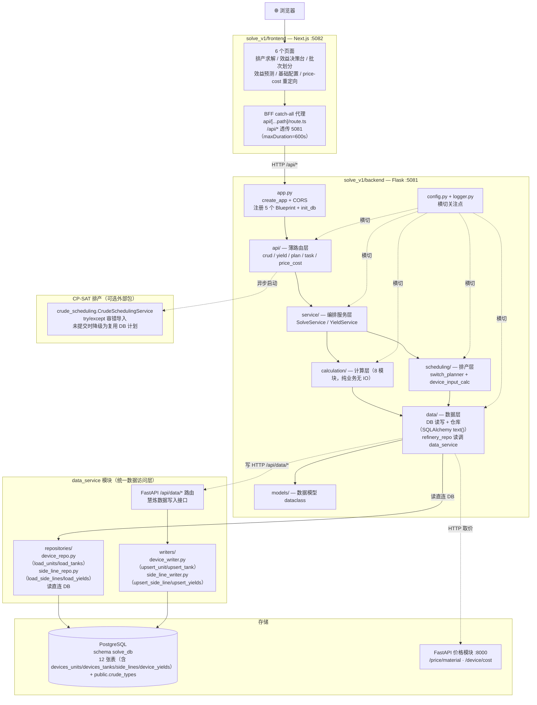
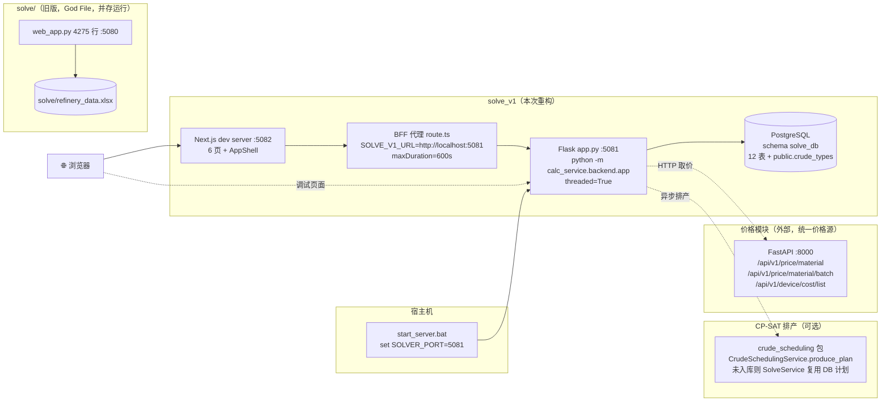
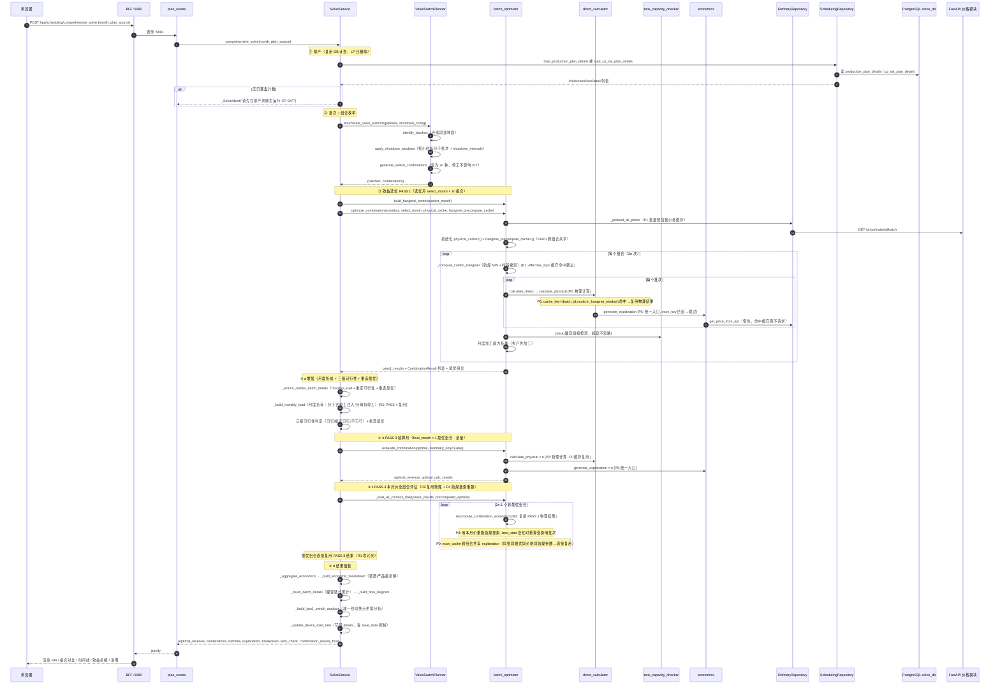
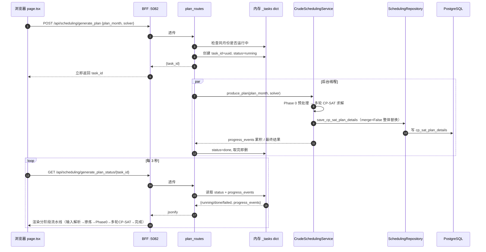

# solve_v1 架构设计

> 本文是架构设计参考（Mermaid 图表 + 层职责），面向"理解设计与依赖"。
> 项目说明、运行方式、API/页面清单见 [README.md](./README.md)。
>
> 用 [mermaid.live](https://mermaid.live) / VS Code Mermaid 插件 / GitHub 渲染以下图。
> 依赖方向恒为单向：`api → service → {calculation, scheduling} → data → models`，无环。

---

## 与旧版的关键差异（先读这）

| 变更 | 旧版（README_v1_backup.md / 旧 ARCHITECTURE.md） | 当前实现 |
|------|--------------------------------------------------|----------|
| 排产引擎 | LP（`planner.py` / `plan_generator.py`） | **LP 已删除**；排产走 CP-SAT（外部 `crude_scheduling` 包，未入库则降级为复用 DB 已落盘计划） |
| Blueprint 数 | 4（crud / yield / plan / task） | **5**（新增 `price_cost`） |
| 价格数据 | 本地 `price_cost` 表 | **表已移除**；产品价格通过 HTTP 代理到 FastAPI 价格模块（`:8000`）；原油成本仍在本地表 |
| 物料拓扑 | `connections` 表 + 硬编码 `DEVICE_CYJQ/LYJQ` | 归一化 `material_flows` 表 + 数据驱动拓扑推断 |
| calculation 模块 | 5 个（direct/batch/econ/yield_resolver/hangmei） | **8 个**（新增 `cost_calculator` / `revenue_calculator` / `tank_capacity_checker`） |
| 排产结果存储 | `production_plan_details` 单表 | 新增 `cp_sat_plan_details` 独立表（与客户实际排产隔离） |
| 前端页面 | 单页 `page.tsx` | **6 页**（排产求解 / 效益决策台 / 批次划分 / 效益预测 / 基础配置 / price-cost 重定向） |
| 效益核算 | 单价格月 | **双价格月**（上月价选方案、本月价核算效益） |
| 数据库表结构 | devices（装置+储罐混合）、products（侧线+收率混合）、product_material_mapping（产品→物料映射） | **装置/储罐分表**（devices_units/devices_tanks）、**侧线/收率拆分**（side_lines/device_yields，material_id 直接挂载）；废弃 devices/products/product_material_mapping；新增 data_service 模块统一数据访问（C 混合模式：读直连 DB，写走 /api/data/* API） |

---

## 图 1 · 应用分层架构图（整体，含前后端）

`solve_v1` 是自包含的前后端分离项目：浏览器 → Next.js 前端(:5082) BFF 代理 → Flask 后端(:5081) 五层架构 → PostgreSQL（schema solve_db）+ FastAPI 价格模块(:8000)。

---

## 图 2 · 后端分层依赖图（模块级，核心）

把每一层展开到具体文件。注意：① `service` 同时依赖 `calculation` 与 `scheduling`，是业务编排核心；② `data` 依赖 `models`，经 `data_service` 访问 PostgreSQL（读直连 DB，写走 /api/data/* API）；③ LP `planner.py`/`plan_generator.py` **已不存在**，排产改走 CP-SAT 或复用 DB 计划。

```mermaid
flowchart TB
    subgraph API["api/ 薄路由层（5 Blueprint）"]
        CRUD["crud_routes.py<br/>装置/产品/物流/能耗/油种 CRUD<br/>_build_crud 工厂消灭 16x 重复<br/>+ /api/material_flows /api/tanks /api/units<br/>+ /api/md_devices /api/tank_monthly_initial"]
        YIELD_R["yield_routes.py<br/>/product_yields + /scheduling/data"]
        PLAN_R["plan_routes.py<br/>generate_plan(异步CP-SAT) / comprehensive_solve<br/>/ optimize_valve / enumerate_switches<br/>/ plans / hangmei_target / build_inputs"]
        TASK_R["task_routes.py<br/>任务 CRUD + lock/unlock"]
        PRICE_R["price_cost_routes.py<br/>产品价格代理 FastAPI<br/>+ 产品-物料映射 + 原油成本"]
    end

    subgraph SVC["service/ 编排服务层"]
        SOLVE_S["solve_service.py<br/>SolveService<br/>三流程编排：①排产 ②批次+组合 ③效益选优<br/>+ 双价格月 + 罐容段级检测 + 效益拆解"]
        YIELD_S["yield_service.py<br/>YieldService<br/>收率层级 + 排厂基础数据（兼容旧前端形状）"]
    end

    subgraph CALC["calculation/ 计算层（8 模块，纯业务无 IO）"]
        DIRECT["direct_calculator.py<br/>calculate_physical（P2 纯物理）<br/>calculate_direct（P2 兼容包装）<br/>物理/经济分离 + BFS 拓扑缓存"]
        BATCH["batch_optimizer.py<br/>evaluate_combination / optimize_combinations<br/>recompute_combination_economics（R2+P4）<br/>+ HangmeiContext / CombinationResult<br/>P0 physical_cache + P1 hangmei_precompute_cache"]
        ECON["economics.py<br/>generate_explanation（P5 统一入口）<br/>+ classify_cdu_products（数据驱动侧线分组）<br/>generate_summary 已删除合并"]
        YRES["yield_resolver.py<br/>resolve_yield_rate<br/>统一 2 套 yield 实现（拓扑推断角色）"]
        HANG["hangmei.py<br/>calculate_hangmei_mn<br/>航煤工况 M/N 天数分配<br/>（batch_optimizer 内 _compute_combo_hangmei<br/>含多装置+停工折减+两层修正）"]
        COST["cost_calculator.py<br/>compute_costs / CostBreakdown<br/>进料+加工成本（加工成本取 FastAPI）"]
        REV["revenue_calculator.py<br/>compute_revenue<br/>收入侧（价格惰性查询+缓存）"]
        TANK["tank_capacity_checker.py<br/>TankCapacityChecker<br/>罐容段级检测 + 停工边界切分<br/>+ 三级可行性输入"]
    end

    subgraph SCHED["scheduling/ 排产层（2 文件）"]
        SWITCH["switch_planner.py<br/>ValveSwitchPlanner<br/>批次识别+停工拆分(小时精度)+组合枚举(2n恒定)<br/>+ build_device_split_roles"]
        DEVIN["device_input_calc.py<br/>build_flow_topology / load_yield_tables<br/>/ compute_device_inputs_by_mode<br/>（数据驱动，给慧炼收率预测用）"]
    end

    subgraph DATA["data/ 数据层（经 data_service 访问 DB）"]
        DBMOD["db.py<br/>engine/SessionLocal/get_session/init_db<br/>SQLAlchemy 2.x + search_path=solve_db,public"]
        REF_REPO["refinery_repo.py<br/>RefineryRepository<br/>devices_units/devices_tanks/side_lines/<br/>device_yields/material_flows/energy<br/>+ 油种CRUD + 价格API惰性查询<br/>读调 data_service.repositories"]
        SCH_REPO["scheduling_repo.py<br/>SchedulingRepository<br/>plans_input/details/cp_sat_details/tasks<br/>+ device_capacity 投影"]
        REF_REPO --> DBMOD
        SCH_REPO --> DBMOD
    end

    subgraph DSVC["data_service/ 统一数据访问层"]
        DS_DEV["device_repo.py<br/>load_units / load_tanks（读直连 DB）"]
        DS_SL["side_line_repo.py<br/>load_side_lines / load_yields（读直连 DB）"]
        DS_DW["device_writer.py<br/>upsert_unit / upsert_tank"]
        DS_SW["side_line_writer.py<br/>upsert_side_line / upsert_yields"]
        DS_DEV --> DBMOD
        DS_SL --> DBMOD
        DS_DW --> DBMOD
        DS_SW --> DBMOD
    end

    subgraph MODELS["models/ 数据模型"]
        REF_M["refinery.py<br/>Device/Product/Connection/MaterialFlow<br/>EnergyConsumption/RefineryScenario"]
        SCH_M["scheduling.py<br/>ProductionPlansInput/Detail<br/>SchedulingTask/DeviceCapacity"]
    end

    CRUD --> REF_REPO
    YIELD_R --> YIELD_S
    PLAN_R --> SOLVE_S
    PLAN_R --> SCH_REPO
    TASK_R --> SCH_REPO
    PRICE_R --> REF_REPO
    PRICE_R --> SCH_REPO
    PRICE_R -. HTTP .-> PriceAPI2["FastAPI :8000"]

    REF_REPO --> DS_DEV
    REF_REPO --> DS_SL
    REF_REPO -. "HTTP /api/data/*" .-> DS_DW
    REF_REPO -. "HTTP /api/data/*" .-> DS_SW

    YIELD_S --> REF_REPO
    YIELD_S --> SCH_REPO
    SOLVE_S --> SWITCH
    SOLVE_S --> DEVIN
    SOLVE_S --> BATCH
    SOLVE_S --> ECON

    SWITCH --> DEVIN
    BATCH --> DIRECT
    BATCH --> YRES
    BATCH --> HANG
    BATCH --> TANK
    DIRECT --> REV
    DIRECT --> COST
    DIRECT --> ECON

    REF_REPO --> REF_M
    SCH_REPO --> SCH_M
    SWITCH --> REF_M
    DEVIN --> REF_M
```

---

## 图 3 · 技术 / 部署架构图

强调端口隔离、BFF 代理、价格模块外置与 CP-SAT 可选包。`solve_v1` 与旧 `solve/` 通过端口（5081 vs 5080）并存，存储已切到 PostgreSQL（schema solve_db），产品价格与装置加工成本统一来自 FastAPI 价格模块。

---

## 图 4 · 数据架构图（DB 表 → 仓库 → 模型 → 上层）

`solve_v1` 用 PostgreSQL schema `solve_db` 作为存储。收率以 `NUMERIC(6,4)` 小数存储（迁移时 Excel 百分数 ÷100）；`save_*` 用 `ON CONFLICT DO UPDATE` + `DELETE ... NOT IN` 实现真正的全量替换，修复原版"CRUD 删除静默失效"。JSONB 列（arrival_plan/blend_detail/crude_stock_status）经 `CAST(:x AS jsonb)` 写、`::text` + `json.loads` 读。**价格数据不在本地**：产品价格通过 HTTP 取 FastAPI，原油成本与能耗系数仍在本地表。

```mermaid
flowchart TB
    subgraph PG["PostgreSQL"]
        direction TB
        subgraph SOLVE["schema solve_db（12 表）"]
            T_DU["devices_units<br/>装置"]
            T_DT["devices_tanks<br/>储罐（含 material_id）"]
            T_SL["side_lines<br/>侧线（含 material_id）"]
            T_DY["device_yields<br/>收率"]
            T_FLOW["material_flows<br/>归一化物流边（替代 connections）"]
            T_CONN["connections<br/>（保留兼容，运行时不走）"]
            T_ENERGY["energy"]
            T_TMI["tank_monthly_initial<br/>（仅 db.py DDL，init.sql 无）"]
            T_PPI["production_plans_input<br/>arrival_plan JSONB + cost"]
            T_PPD["production_plan_details<br/>客户实际排产"]
            T_CPSAT["cp_sat_plan_details<br/>CP-SAT 求解结果（隔离）"]
            T_TASK["scheduling_tasks<br/>TIMESTAMPTZ"]
        end
        subgraph PUB["public"]
            T_CRUDE["crude_types<br/>油种主数据（11 行种子）"]
            T_MD["md_device<br/>慧炼主数据装置"]
            T_PP["plan_product<br/>航煤目标产量来源"]
        end
    end

    subgraph REPO["data/ 仓库层（经 data_service 访问 DB）"]
        DBM["db.py<br/>engine + init_db 幂等建表<br/>+ search_path=solve_db,public"]
        RR["RefineryRepository<br/>ON CONFLICT + DELETE NOT IN<br/>+ get_price_from_api / preload_prices<br/>读调 data_service.repositories"]
        SR["SchedulingRepository<br/>JSONB + TIMESTAMPTZ<br/>+ 单行 upsert（原 RMW 改写）"]
        RR --> DBM
        SR --> DBM
    end

    subgraph DSVC4["data_service.repositories（读直连 DB）"]
        DS_R_DEV["device_repo.py<br/>load_units / load_tanks"]
        DS_R_SL["side_line_repo.py<br/>load_side_lines / load_yields"]
        DS_R_DEV --> DBM
        DS_R_SL --> DBM
    end

    subgraph MODEL["models/ 领域模型"]
        M_DEV["Device"]
        M_PROD["Product"]
        M_FLOW["MaterialFlow"]
        M_CONN["Connection（从 flows 派生）"]
        M_ENERGY["EnergyConsumption"]
        M_SCEN["RefineryScenario（聚合根）"]
        M_PPI["ProductionPlansInput"]
        M_PPD["ProductionPlanDetail"]
        M_TASK["SchedulingTask"]
        M_CAP["DeviceCapacity"]
    end

    subgraph UP["上层消费者"]
        SVC2["service / calculation / scheduling"]
    end

    T_DU & T_DT & T_SL & T_DY & T_FLOW & T_ENERGY & T_TMI --> RR
    T_CONN -. 保留 .-> RR
    RR --> DS_R_DEV
    RR --> DS_R_SL
    T_PPI & T_PPD & T_CPSAT & T_TASK --> SR
    T_CRUDE --> RR
    T_MD --> CRUD2["crud_routes /api/md_devices"]
    T_PP --> PLAN2["plan_routes /hangmei_target"]

    RR --> M_DEV & M_PROD & M_FLOW & M_ENERGY
    RR --> M_SCEN
    SR --> M_PPI & M_PPD & M_TASK & M_CAP
    SVC2 --> MODEL
```

---

## 图 5 · comprehensive_solve 业务编排时序图

最核心的求解流程，体现 `SolveService` 的「① 排产 → ② 批次+组合 → ③ 效益选优 → ④ 增强」四步编排。双价格月口径：`select_month`（上月价）选方案，`final_month`（本月价）核算效益。P0-P5 性能优化：P0 物理缓存+经济缓存跨组合共享、P1 航煤预计算缓存+价格预加载、P2 物理/经济接口分离、P4 航煤搜索本月价重跑、P5 generate_summary 统一为 generate_explanation。

---

## 图 6 · CP-SAT 排产异步任务时序图

`POST /api/scheduling/generate_plan` 启动 CP-SAT 排产（1-7 分钟），立即返回 `task_id`，前端 3 秒轮询状态接口取累积事件。任务管理为内存级（`_tasks` dict + `_tasks_lock`），同月份运行中拒绝新任务。

---

## 附 · 层职责速查

| 层 | 职责 | 关键约束 |
|----|------|---------|
| `api/` | 参数解析 + 响应封装，5 个 Blueprint | 不写业务逻辑；`price_cost` 仅做 HTTP 代理 |
| `service/` | 业务编排，承接原 api 的 helper | 不持有 Flask 对象，返回普通 dict；三流程各产出一个阶段 dataclass |
| `calculation/` | 纯业务计算（8 模块） | **无 IO**，可单测；价格/加工成本通过 scenario 缓存惰性查询；P2 物理/经济分离（calculate_physical + generate_explanation）；P0/P1 跨组合缓存 |
| `scheduling/` | 阀门组合枚举 + 装置进料计算 | `switch_planner` 只枚举不优化；`device_input_calc` 数据驱动拓扑 |
| `data/` | DB 读写 + 仓库（SQLAlchemy text()） | 经 data_service 访问 DB；`ON CONFLICT + DELETE NOT IN` 修删除失效；JSONB 显式 CAST |
| `data_service/` | 统一数据访问层（repositories 读 + writers 写） | 读直连 DB（device_repo/side_line_repo）；写经 FastAPI /api/data/* 路由（device_writer/side_line_writer）；C 混合模式 |
| `models/` | dataclass 领域模型 | 统一 v1/v2，淘汰 `virtual_tank_`；`RefineryScenario` 为聚合根，`connections` 从 `material_flows` 派生 |
| `config` / `logger` | 横切常量与日志 | 原油系数表已废弃，改用 `refinery_repo.get_feed_ratio()` 从 products 表查 |

## 附 · 关键设计决策

1. **LP 删除、CP-SAT 外置**：业务上减一线只在 JIAN1_TO_WAX/JIAN1_TO_DIESEL 边界工况间切换，不做按比例分流，LP 价值有限；CP-SAT 排产由独立 `crude_scheduling` 包承担，`SolveService` 以 try/except 容错导入，未提交时退化为复用 DB 已落盘计划。CP-SAT 结果存独立表 `cp_sat_plan_details`，与客户实际排产 `production_plan_details` 隔离。
2. **价格数据外移**：`price_cost` 表移除，产品价格与装置加工成本统一来自 FastAPI 价格模块（`:8000`），避免多源不一致；`RefineryRepository` 用 `preload_prices` 批量预加载 + `get_price_from_api` 惰性查询两级缓存。
3. **数据驱动拓扑**：CDU 侧线分组（`classify_cdu_products`）、装置 XY 角色（`build_device_split_roles`）、物料流拓扑（`build_flow_topology`）均从 `material_flows` 动态推导，替代旧硬编码 `DEVICE_CYJQ/LYJQ/CHANG_NAMES`，配置页改装置/收率无需改代码。
4. **双价格月口径**：`select_month`（上月价）选方案、`final_month`（本月价）核算效益，`scenario_cache` 按月分桶共存；`optimize_combinations` 内 `summary_only=True` 选优、`summary_only=False` 核算两轮评估。
5. **罐容段级检测 + 三级可行性**：`TankCapacityChecker` 检测优先，逐段推演罐库存并检测超上限/低于下限违规；可行性判定从二分类升级为三级——可行（罐容无违规 AND 月负荷≤100%）、接近可行 near_feasible（罐容无违规 BUT 月负荷超容，按满负荷折减后效益仍可参考）、不可行（罐容有违规）。选优优先级 可行>接近可行>不可行，全不可行时按超容最轻选临时可行 fallback。
6. **停工约束小时精度**：停工配置从 `{unit, start_day, end_day}` 改为 `{unit, start_time, end_time}`（ISO 时间），`_parse_shutdown_intervals` 转为月内绝对小时索引（正确处理跨月）；`apply_shutdown_windows` 按停工边界（小时精度）拆分 batch 并标记 `shutdown_intervals`，SegmentBuilder 再按停工边界切分段；停工不再触发 X/Y 强制改道（`forced_mode` 已移除），组合数恒为 2n。段推演精确计算 seg 与 shutdown_intervals 重叠，outflow 按非停工占比折算；停工期装置不取料，CDU 仍全量注入原料到罐。
7. **月负荷折减**：月负荷分子用罐全月 inflow 折算总主料（含停工期 CDU 注入，反映"全月应加工原料"），分母用 `safety_stock_thrd × effective_days`（扣停工）。月负荷超容时按满负荷折减收入：`batch_optimizer._apply_monthly_capacity_reduction` 按批次顺序累计原料量，超出能力的批次收入折减（先产先加工）。
8. **CRUD 全量替换语义**：`save_*` 用 `ON CONFLICT DO UPDATE` + `DELETE ... NOT IN` 实现真正的全量替换，修复原版"CRUD 删除静默失效"（原 `ExcelStore.upsert_rows` 只增不删）。
9. **航煤工况多装置 + 两层修正**：航煤工况支持多装置（主动/被动分类由 `yield_rate_3/4 > 0` 动态判定，不硬编码装置 ID），5 阶段流程：①构建批次时间轴（含停工折减 `keep_ratio`）②计算 H_default ③时段寻优（批次左边界候选 + 逐批次累加增量）④边际贡献 ⑤实际产出修正。两层修正机制：停工折减（根因修复，航煤寻优与 `calculate_direct` 同口径 `keep_ratio = 1 - shutdown_hours/batch_hours`，确保 M 天数补偿停工损失）+ 负荷折减（后修正层，从 `calc_results` 提取真实航煤产量 × `batch_ratios` 加权 → `effective_H`）。可行性判定：`effective_H >= target` 为可行，`actual_H >= target` 但 `effective_H < target` 为折减后不足，`actual_H < target` 为全月仍不足。
10. **P0-P5 计算性能优化**：双价格月口径原需 4 趟全量评估（4n+2 次 evaluate_combination），经 P0-P5 优化降至 2n+1 次 + 2n-1 次 recompute。①**P0 物理缓存**：`physical_cache` 按 `(batch_id, yield_mode, in_hangmei_window)` 跨组合共享物理计算结果，航煤禁用时 2n²→2n（省 80%+）；同时 `econ_cache` 跨组合共享 `generate_explanation` 结果（同批同模式同价格同航煤参数→直接复用）。②**P1 航煤预计算缓存**：`hangmei_precompute_cache` 按 `(batch_id, yield_mode)` 缓存 effective_input，2n×D→2×D（↓80%）；`_preload_all_prices` 批量预加载价格。③**P2 物理/经济分离**：`calculate_physical`（纯物理，无价格参数）从 `calculate_direct` 拆出，缓存仅存物理字段不含 explanation；`calculate_direct` 退化为兼容包装（内调 calculate_physical + generate_explanation）。④**P4 航煤搜索重跑**：`recompute_combination_economics` 中用本月价重跑航煤搜索（best_start 依赖价格，不同价格月可能选出不同航煤窗口），修复口径混用风险。⑤**P5 统一入口**：`generate_summary` 已删除合并为 `generate_explanation`，消除维护负担。⑥**R1-R3 编排优化**：R1 删除 Stage2 冗余全量重算；R2 PASS 4 通过 `recompute_combination_economics` 复用 PASS 1 物理计算，最优组合直接复用 PASS 3 结果（零冗余）；R3 monthly_load 与价格无关，PASS 4 直接复用 PASS 1 结果。
11. **数据库重构 + data_service 模块独立**：装置/储罐分表（devices_units/devices_tanks 替代混合 devices）、侧线/收率拆分（side_lines/device_yields 替代混合 products）、material_id 直接挂载到储罐/侧线表（废弃 product_material_mapping 反查表）；新增 `data_service` 模块作为统一数据访问层（repositories 读直连 DB + writers 写经 /api/data/* API），solve_v1 的 refinery_repo 改为调用 data_service.repositories；采用 C 混合模式（读直连 DB，写走 HTTP API）。
