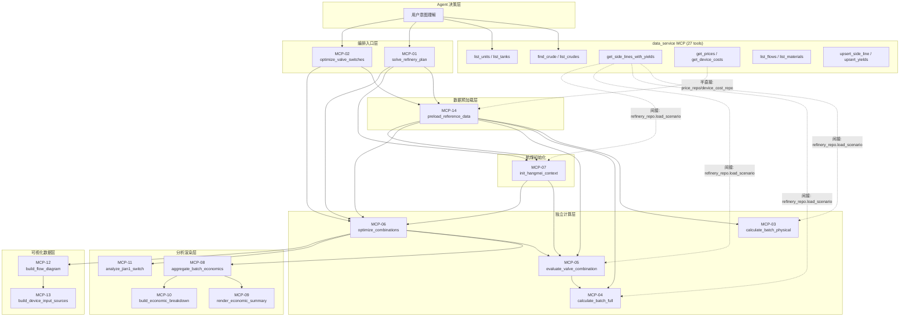

# MCP 服务封装架构设计

> **版本**: v2.0 · 2026-08
> **基准代码**: 第三轮重构 + DB→Scenario 穿透优化（Phase A/B/C/D）完成后
> **设计原则**: 一个 MCP 服务 = 一个 Agent 可独立决策调用的业务能力
> **v2.0 变更**: 新增 data_service MCP 语义对接层、Scenario 语义解析适配、MCP 就绪度基于最新代码重新评估

---

## 一、当前求解器函数清单与 MCP 候选识别

### 1.1 全量函数分类

第三轮重构 + DB→Scenario 穿透优化后，calculation 层 + service 层共有 **31 个公开函数/类**，按 MCP 封装适宜性分为 5 类：

| 分类 | 数量 | MCP 封装 | 说明 |
|------|------|----------|------|
| **A. 编排入口** | 3 | ✓ 封装 | Agent 直接调用的业务级入口 |
| **B. 独立计算** | 5 | ✓ 封装 | 给定输入→确定输出，无隐藏依赖 |
| **C. 分析渲染** | 4 | ✓ 封装 | 纯数据变换，输入/输出均为 JSON |
| **D. 可视化数据** | 2 | ✓ 封装 | 构建前端展示用结构化数据 |
| **E. 内部子函数** | 17 | ✗ 不封装 | 计算链内部步骤，不具备独立业务语义 |

### 1.2 不封装的内部子函数（17 个）

以下函数是计算链的内部步骤，**不具备独立业务语义**：

```
direct_calculator.py:  _build_topology / _init_special_vars / _resolve_eff_input /
                       _forward_traverse / _fix_cross_edges / _apply_shutdown_scaling /
                       _build_device_utilization

economics.py:          _find_start_device_input / _build_cjy_outputs / _calc_ton_metrics

combination_evaluator: _precompute_hangmei_batch_data / _apply_monthly_capacity_reduction /
                       _apply_hangmei_output_correction / _build_batch_details_with_overload

hangmei_optimizer.py:  _compute_combo_hangmei / _find_optimal_hangmei_start /
                       _compute_device_effective_input / _resolve_hangmei_yield

revenue_calculator:    get_product_price
yield_resolver.py:     resolve_yield_rate
batch_builder.py:      merge_intervals / build_batch_details_list / build_monthly_load
```

### 1.3 v2.0 重构后的变化

相比 v1.0（第二轮重构后），v2.0 基准代码有以下影响 MCP 封装的变化：

| 重构项 | 对 MCP 封装的影响 |
|--------|------------------|
| **Phase A: Scenario 精简** | `cdu_device_id` 合并到 `start_device_id`，`price_costs` 移到 Service 层，`energy_consumptions` 停止加载 — MCP-03/04 输入更简洁 |
| **Phase B: Connection 消除** | `connections` 属性删除，`get_upstream_flows`/`get_downstream_flows` 直接遍历 `material_flows` — 场景加载更快，scenario_id 适配层更简单 |
| **Phase C: Device 拆分** | `Device` → `DeviceBase` + `ProcessingUnit` + `Tank`，Tank 直接持有 `material_id`/`material_name` — 数据语义更清晰 |
| **Phase D: Product 补全** | Product 加 `material_id`/`material_name`，删除 `product_material_map`/`material_name_map`/模块级 `get_feed_ratio` — 每次 solve 消除 ~25 次冗余 DB 查询，`get_feed_ratio` 改为 Scenario 内存方法 |
| **第三轮重构** | `load_scenario_fn: Callable` 移入适配层、`scenario_cache`/`physical_cache` 改为内部管理、dead `repo` 参数删除 — 5 个函数从"阻塞"升级为 A 级 |

---

## 二、MCP 服务清单（14 个计算层 + 数据层对接）

### 2.1 编排入口层（2 个）

#### MCP-01: `solve_refinery_plan` — 综合求解

| 维度 | 内容 |
|------|------|
| **源函数** | `SolveService.comprehensive_solve()` |
| **语义描述** | 给定计划月份和排产输入，执行完整的"排产→批次划分→阀门组合枚举→逐组合效益评估→选优"流水线，返回最优方案 |
| **Agent 调用时机** | "帮我优化 2026 年 7 月的炼油生产计划" |

**输入参数**:

```json
{
  "plan_month": "2026-07",           // 计划月份
  "production_plans_input": [...],    // 排产计划输入（原油品种+加工量）
  "monthly_crude_input": 120000,      // 月度原油加工总量（吨）
  "blend_mode": false,                // 是否混炼
  "save_data": true,                  // 是否持久化排产结果
  "hangmei_target": 5000,             // 航煤目标产出（吨），null=不启用
  "shutdown_config": [                // 停工声明
    {"unit": "cyjq_01", "start_time": 1, "end_time": 48}
  ],
  "plan_source": "lp",               // 排产来源（注：LP 已删除，统一走 CP-SAT，保留参数兼容）
  "simplified": true                  // 简化模式（裁剪组合列表大对象）
}
```

**输出结构**:

```json
{
  "success": true,
  "optimal_combination": {
    "combination_id": 3,
    "switches": {"batch_1": "JIAN1_TO_WAX", "batch_2": "JIAN1_TO_DIESEL"},
    "total_revenue": 12500000,
    "feasible": true
  },
  "batches": [...],
  "economic_summary": {
    "total_revenue": 12500000,
    "total_cost": 9800000,
    "total_profit": 2700000,
    "profit_per_ton": 22.5
  },
  "economic_breakdown": {...},
  "flow_diagram": {"nodes": [...], "edges": [...]},
  "hangmei_summary": {...},
  "all_combinations": [...]
}
```

**语义合理性分析**:

| 评估项 | 结论 | 说明 |
|--------|------|------|
| 输入自包含 | ✓ | 全部为业务参数，无技术对象 |
| 输出可解释 | ✓ | 包含数值结果 + 文本说明 + 可视化数据 |
| 隐藏依赖 | ⚠ | 内部依赖 DB（排产数据/价格/装置成本），MCP 封装需注入 DB 连接 |
| 粒度合理性 | ✓ | 一个完整业务流程，Agent 可独立决策调用 |
| 幂等性 | ⚠ | `save_data=true` 时有副作用（写入 DB），需标注 |

---

#### MCP-02: `optimize_valve_switches` — 阀门切换优化

| 维度 | 内容 |
|------|------|
| **源函数** | `SolveService.optimize_valve()` |
| **语义描述** | 对已存在的排产计划，重新优化阀门切换组合（不重新排产） |
| **Agent 调用时机** | "这个计划方案不变，只重新优化阀门切换" |

**输入参数**:

```json
{
  "plan_id": "PLAN-202607"   // 已有排产计划 ID
}
```

**输出结构**: 与 `solve_refinery_plan` 相同（复用结果组装逻辑）

---

### 2.2 独立计算层（5 个）

#### MCP-03: `calculate_batch_physical` — 批次物理计算

| 维度 | 内容 |
|------|------|
| **源函数** | `calculate_physical()` in `direct_calculator.py` |
| **语义描述** | 给定炼油场景和批次参数，计算 BFS 拓扑遍历后的装置进出料流量、连接流量、装置利用率 |
| **Agent 调用时机** | "算一下这个批次在 JIAN1_TO_WAX 模式下的物料平衡" |
| **场景依赖声明** | `devices`, `material_flows`, `products`, `start_device_id`, `get_main_feeds()`, `get_feed_ratio()` |

**输入参数**:

```json
{
  "scenario_id": "BZ",                // 原油品种标识（MCP 内部按此加载场景）
  "input_amount": 4000,                // 批次输入量（吨/天）
  "yield_mode": "JIAN1_TO_WAX",        // 收率模式: "JIAN1_TO_WAX" 减一线去蜡油加氢 / "JIAN1_TO_DIESEL" 减一线去柴油加氢
  "days": 5,                           // 批次天数
  "hangmei_mode": false,               // 是否航煤工况
  "hangmei_m_days": 0,                 // 航煤工况天数（M 值）
  "day_index": 0,                      // 当前天数索引（月内位置）
  "shutdown_intervals": {},            // 停工区间 {device_id: [(start_h, end_h)]}
  "feed_ratios": {                     // 进料配比（由 preload_reference_data 预加载）
    "BZ": {"cyjq_01": 0.35, "lyjq_01": 0.15}
  }
}
```

**语义合理性分析**:

| 评估项 | 结论 | 说明 |
|--------|------|------|
| 输入自包含 | ✓ | 全部为标量/简单 dict，无 RefineryScenario 对象 |
| 输出可解释 | ✓ | 装置级进出料 + 利用率，数值明确 |
| 隐藏依赖 | ⚠ | `scenario_id` 内部需从 DB 加载场景（一次 JOIN 查询） |
| 粒度合理性 | ✓ | 一个批次的物理计算是最小有意义计算单元 |
| 纯函数性 | ✓ | 重构后无 calc_ctx、无 DB 直连、无缓存读写 |
| 幂等性 | ✓ | 相同输入→相同输出，无副作用 |

**v2.0 改进**: `get_feed_ratio` 已从模块级 DB 函数改为 Scenario 内存方法（Phase D），`feed_ratios` 参数变为可选（场景内部可直接回答），减少了对 MCP-14 预加载的硬依赖。

---

#### MCP-04: `calculate_batch_full` — 批次完整计算（物理+经济）

| 维度 | 内容 |
|------|------|
| **源函数** | `calculate_direct()` in `direct_calculator.py` |
| **语义描述** | 在物理计算基础上叠加经济效益计算，返回含 explanation 的完整结果 |
| **Agent 调用时机** | "算一下这个批次的物料平衡和经济效益" |
| **场景依赖声明** | 继承 MCP-03 + `processing_device_ids`, `start_device_id` |

**输入参数**: 在 MCP-03 基础上增加:

```json
{
  "crude_oil_price": 3500,            // 原油价格（元/吨）
  "plan_month": "2026-07",            // 计划月份（用于价格查表）
  "prices": {"cyjq_01_diesel": 8500}, // 预加载价格表
  "device_costs": {"cyjq_01": 50},    // 预加载装置加工成本
  "capacity_only": false,             // 仅算能力（不含经济）
  "summary_only": false               // 简化模式（只算利润数字）
}
```

**评级**: **S** — prices/device_costs 由调用方传入，无隐藏 DB 依赖

---

#### MCP-05: `evaluate_valve_combination` — 阀门组合评估

| 维度 | 内容 |
|------|------|
| **源函数** | `evaluate_combination()` in `combination_evaluator.py` |
| **语义描述** | 评估单个阀门切换组合在所有批次中的可行性和经济效益 |
| **场景依赖声明** | `products`（直接访问），`intermediate_tank_ids`（直接访问） |

**v2.0 改进**: `load_scenario_fn: Callable` 和 `scenario_cache` 参数已移入适配层（第三轮重构），函数签名不再包含不可序列化参数。Agent 只需传 `batches`（其中含 `crude_type` 字段），适配层按 crude_type 自动加载场景。

---

#### MCP-06: `optimize_combinations` — 组合寻优

| 维度 | 内容 |
|------|------|
| **源函数** | `optimize_combinations()` in `combination_optimizer.py` |
| **语义描述** | 遍历所有阀门切换组合，挑出经济效益最优方案 |
| **场景依赖声明** | 继承 `evaluate_combination` 全部依赖（透传） |

**输入参数**:

```json
{
  "batches": [...],                    // 批次列表
  "combinations": [...],               // 阀门切换组合列表
  "custom_crude_costs": {...},
  "hangmei_ctx": null,
  "select_month": "2026-06",          // 选优月份（上月价）
  "final_month": "2026-07",           // 核算月份（本月价）
  "prices": {...},
  "device_costs": {...},
  "feed_ratios": {...}
}
```

**v2.0 改进**: `scenario_cache`/`physical_cache` 已改为函数内局部变量（第三轮重构），不暴露给调用方。

---

#### MCP-07: `init_hangmei_context` — 航煤工况初始化

| 维度 | 内容 |
|------|------|
| **源函数** | `build_hangmei_context()` in `hangmei_optimizer.py` |
| **语义描述** | 根据航煤目标产出，初始化航煤工况上下文 |
| **场景依赖声明** | `products`（航煤产品查找通过 `material_name` 过滤），`get_products_by_material()` |

**v2.0 改进**: Phase D 删除了 `material_name_map` 间接寻址，`get_products_by_material` 改为直接过滤 `Product.material_name`。`load_scenario_fn` 已移入适配层。

---

### 2.3 分析渲染层（4 个）

#### MCP-08: `aggregate_batch_economics` — 批次经济聚合

| 维度 | 内容 |
|------|------|
| **源函数** | `aggregate_economics()` in `economic_reporter.py` |
| **评级** | **S** — 纯数据变换，零外部依赖 |

**v2.0 改进**: 输入参数 `cdu_device_id` 已改名为 `start_device_id`（Phase A 合并）。

---

#### MCP-09: `render_economic_summary` — 经济效益文本说明

| 维度 | 内容 |
|------|------|
| **源函数** | `build_economic_explanation()` in `economic_reporter.py` |
| **评级** | **S** — 纯数据→文本渲染 |

---

#### MCP-10: `build_economic_breakdown` — 效益拆解

| 维度 | 内容 |
|------|------|
| **源函数** | `build_economic_breakdown()` in `economic_reporter.py` |
| **评级** | **S** — 纯数据变换 |

---

#### MCP-11: `analyze_jian1_switch` — 减一线切换点分析

| 维度 | 内容 |
|------|------|
| **源函数** | `build_jian1_switch_analysis()` in `switch_analysis.py` |
| **场景依赖声明** | `start_device_id`, `material_flows`（物流拓扑） |

---

### 2.4 可视化数据层（2 个）

#### MCP-12: `build_flow_diagram` — 流程图数据

| 维度 | 内容 |
|------|------|
| **源函数** | `build_flow_diagram()` in `flow_diagram_builder.py` |
| **语义描述** | 构建全装置流程图数据（节点+边），供前端数字孪生视图渲染 |

---

#### MCP-13: `build_device_input_sources` — 装置进料来源拆解

| 维度 | 内容 |
|------|------|
| **源函数** | `build_device_input_sources()` in `flow_diagram_builder.py` |
| **场景依赖声明** | `get_upstream_flows()`, `devices`, `products` |

---

### 2.5 数据预加载层（1 个）

#### MCP-14: `preload_reference_data` — 引用数据预加载

| 维度 | 内容 |
|------|------|
| **源函数** | `SolveService._preload_reference_data()` |
| **语义描述** | 从 DB 预加载价格表、装置加工成本、进料配比，供后续计算函数使用 |

**输入参数**:

```json
{
  "batches": [...],                    // 批次列表（确定原油品种范围）
  "plan_month": "2026-07",            // 计划月份
  "custom_crude_costs": {...}          // 自定义原油成本
}
```

**输出结构**:

```json
{
  "prices": {"cyjq_01_diesel": 8500, "lyjq_01_hangmei": 12000, ...},
  "device_costs": {"cyjq_01": 50, "lyjq_01": 80, ...},
  "feed_ratios": {"BZ": {"cyjq_01": 0.35, "lyjq_01": 0.15}}
}
```

**v2.0 改进**: `preload_prices` 改用 `Product.material_id` 直接查价格（Phase D），不再通过 `product_material_map` 间接寻址。`feed_ratios` 现在调用 `scenario.get_feed_ratio()`（内存方法），不再开 DB session。

---

## 三、data_service MCP 与计算层 MCP 语义对接

### 3.1 两层 MCP 架构

系统存在两层 MCP 服务，各自面向不同的 Agent 场景：

```
┌─────────────────────────────────────────────────────────────────────┐
│                     Agent 决策层                                      │
│  （理解用户意图，选择调用哪些 MCP，编排多步推理链）                       │
└──────────┬──────────────────────────────────┬──────────────────────┘
           │                                  │
    数据 CRUD/查询                           业务计算/编排
           │                                  │
           ▼                                  ▼
┌──────────────────────────┐    ┌────────────────────────────────────┐
│  data_service MCP (27)    │    │  计算层 MCP (14)                     │
│  —— 数据基础设施层          │    │  —— 业务能力层                        │
│                           │    │                                      │
│  装置/罐/侧线/收率/物料     │    │  编排入口(2) + 独立计算(5)            │
│  物流/价格/成本/油种       │    │  + 分析渲染(4) + 可视化(2)            │
│                           │    │  + 数据预加载(1)                      │
│  查询(13) + 写入(8)       │    │                                      │
│  + 删除(6)                │    │  输入: scenario_id + 业务参数          │
│                           │    │  输出: 计算结果 JSON                   │
│  输入: 实体 ID / 月份      │    │                                      │
│  输出: 实体数据 JSON        │    │                                      │
└────────────┬─────────────┘    └──────────────┬─────────────────────┘
             │                                 │
             └────────────┬────────────────────┘
                          │
                          ▼
              ┌────────────────────┐
              │   DB (PostgreSQL)   │
              │                     │
              │  devices_units      │
              │  devices_tanks      │
              │  side_lines         │
              │  device_yields      │
              │  material_flows     │
              │  md_material        │
              │  prices             │
              │  device_costs       │
              │  crude_types        │
              └────────────────────┘
```

### 3.2 语义对接矩阵

data_service MCP 的 27 个工具与计算层 MCP 的 14 个服务存在数据消费关系。下表列出关键对接点：

| data_service MCP 工具 | 产出数据 | 计算层 MCP 消费方 | 对接方式 |
|---|---|---|---|
| `get_side_lines_with_yields` | 侧线+收率 JOIN 结果（含 material_id, material_name） | MCP-03/04/05/06/07（通过 scenario 内部加载） | **间接**：refinery_repo.load_products() 调用此查询，构造 Product 对象注入 Scenario |
| `list_units` | 装置主数据（max_capacity, safety_stock_thrd 等） | MCP-03/04/05/06/12（通过 scenario.devices） | **间接**：refinery_repo.load_devices() 调用 |
| `list_tanks` | 储罐主数据（含 material_id, tank_category） | MCP-03/04/05/06/12（通过 scenario.devices） | **间接**：refinery_repo.load_devices() 调用 |
| `list_flows` | 物流边数据（source/target/product/special_var） | MCP-03/04/05/11/12/13（通过 scenario.material_flows） | **间接**：refinery_repo.load_material_flows() 调用 |
| `get_prices` | 物料价格（含计算规则回退） | MCP-14 preload_reference_data → MCP-04/05/06 | **半直接**：MCP-14 调用 price_repo.resolve_prices_batch，底层即此查询 |
| `get_device_costs` | 装置加工成本 | MCP-14 preload_reference_data → MCP-04/05/06 | **半直接**：MCP-14 调用 device_cost_repo |
| `get_feed_ratio` | 装置进料配比 | ~~MCP-14 preload_reference_data~~ → **已改为 Scenario 内存方法** | **v2.0 变更**：Phase D 后 `get_feed_ratio` 改为 `scenario.get_feed_ratio()`，直接从 products 过滤，不再调用 data_service |
| `get_material_mapping` | 侧线→物料映射 | ~~MCP-14 preload_prices~~ → **已删除** | **v2.0 变更**：Phase D 后 Product 直接持有 material_id，不再需要此映射 |
| `list_crudes` | 油种列表 | MCP-01 comprehensive_solve（确定 scenario 加载范围） | **间接**：SolveService._load_scenarios 遍历激活油种 |
| `list_materials` | 物料主数据 | data_service 内部 JOIN（side_lines.material_id → md_material） | **基础设施**：被 get_side_lines_with_yields 等工具内部使用 |
| `find_crude` | 按名称/别名查油种 | Agent 决策层（理解"渤海油"→"BZ"映射） | **直接**：Agent 调用此工具将用户自然语言映射到 scenario_id |

### 3.3 对接模式分类

**模式 1: 间接对接**（data_service → refinery_repo → Scenario → 计算层 MCP）

计算层 MCP 不直接调用 data_service 工具。数据加载由 `refinery_repo.load_scenario()` 统一完成，构建 `RefineryScenario` 内存对象后注入计算函数。Agent 透明——只需传 `scenario_id`。

**模式 2: 半直接对接**（data_service → 计算层 MCP 内部调用）

MCP-14 `preload_reference_data` 内部调用 `price_repo`/`device_cost_repo`，这些 repo 的底层查询与 data_service MCP 的 `get_prices`/`get_device_costs` 工具指向相同的 DB 表。两条路径产出等价数据，但 MCP-14 聚合为 `{prices, device_costs, feed_ratios}` 三元组直接供计算层使用。

**模式 3: 直接对接**（Agent → data_service MCP）

Agent 在理解用户意图阶段直接调用 `find_crude`（"渤海油"→"BZ"）、`list_crudes`（查看可用油种）、`list_units`（查看装置清单）等工具，获取决策所需的基础数据，然后构造计算层 MCP 的调用参数。

### 3.4 语义对接的关键设计原则

1. **data_service MCP 管数据 CRUD，计算层 MCP 管业务逻辑** — 两层不重叠
2. **计算层 MCP 的 `scenario_id` 对应 data_service 的 `crude_type`** — 语义统一
3. **data_service 的 `upsert_side_line`/`upsert_yields` 拆分与计算层的 Product 合并体不矛盾** — 数据层管存储拆分，计算层管联合访问，各自最优
4. **Agent 可跨层编排** — 典型链路：`find_crude` → `list_crudes` → `solve_refinery_plan` → `aggregate_batch_economics` → `render_economic_summary`

---

## 四、Scenario 字段语义解析适配

### 4.1 当前 Scenario 字段（Phase D 后，6 个公开字段）

| 字段 | 类型 | 语义 | 数据来源 | MCP 可见性 |
|------|------|------|----------|------------|
| `devices` | Dict[str, DeviceBase] | 装置字典（ProcessingUnit + Tank 混合） | DB: devices_units + devices_tanks 两表 | 不可见（内部加载） |
| `products` | Dict[str, Product] | 产品字典（侧线属性 + 收率 + 物料关联） | DB: side_lines JOIN device_yields JOIN md_material | 不可见（内部加载） |
| `material_flows` | Dict[str, MaterialFlow] | 物流边字典（归一化有向边） | DB: material_flows 表 | 不可见（内部加载） |
| `start_device_id` | Optional[str] | 常减压（起始装置）ID | 从 devices 推断（type='start' 的装置） | 不可见（内部推断） |
| `crude_type` | str | 当前原油品种 | 调用方传入 | **间接可见**（通过 `scenario_id` 参数） |
| `crude_costs` | Dict[str, float] | 原油品种→成本（元/吨） | 调用方传入或从 DB 加载 | **间接可见**（通过 `custom_crude_costs` 参数） |

### 4.2 语义解析适配方案

Scenario 对象不直接暴露给 Agent，而是通过 **`scenario_id` 适配层** 解析：

```
Agent 传入 scenario_id="BZ"
    │
    ▼
┌─────────────────────────────────────┐
│  MCP 适配层 (scenario_id → Scenario) │
│                                     │
│  1. scenario_id = "BZ"              │
│     → repo.load_scenario(crude_type="BZ")  │
│     → 返回 RefineryScenario 对象      │
│                                     │
│  2. Scenario 内部 6 个字段全部就绪:    │
│     - devices (20+ DeviceBase)      │
│     - products (100+ Product)       │
│     - material_flows (30+ Flow)     │
│     - start_device_id ("cyjq_01")   │
│     - crude_type ("BZ")             │
│     - crude_costs ({BZ: 3500})      │
│                                     │
│  3. 注入计算函数:                     │
│     calculate_physical(scenario, ...)│
│     evaluate_combination(..., scenarios)│
│                                     │
│  4. 计算结果序列化为 JSON 返回 Agent   │
│     （Scenario 不出现在输出中）        │
└─────────────────────────────────────┘
```

### 4.3 Scenario 方法在 MCP 语义中的角色

Scenario 的方法/属性不暴露为独立 MCP 工具，但它们在场景依赖声明中为 Agent 提供了**透明度**：

| Scenario 方法/属性 | 语义 | 消费方（计算层函数） | 对 Agent 的意义 |
|---|---|---|---|
| `get_upstream_flows(device_id)` | 查上游物流边（过滤停用装置） | direct_calculator, flow_diagram_builder | Agent 知道"计算时会自动跳过停用装置" |
| `get_downstream_flows(device_id)` | 查下游物流边（过滤停用装置） | direct_calculator | 同上 |
| `get_main_feeds(device_id)` | 查装置主料产品 | direct_calculator, cost_calculator | Agent 知道"进料配比从产品收率自动推导" |
| `get_feed_ratio(device_id, crude_type)` | 查进料配比（内存方法） | ~~solve_service~~ → **已内嵌到 Scenario** | Agent 不需要单独调用，scenario 内部自动回答 |
| `get_products_by_material(name)` | 按物料名查产品 | hangmei_optimizer | Agent 知道"航煤产品通过 material_name 过滤" |
| `hangmei_active_device_ids` | 航煤主动装置集合 | hangmei_optimizer | Agent 知道"航煤装置自动识别" |
| `processing_device_ids` | 加工装置集合 | direct_calculator, economics | Agent 知道"加工装置自动从 devices 过滤" |
| `tank_device_ids` | 储罐集合 | tank_capacity_checker | Agent 知道"储罐自动从 devices 过滤" |
| `start_device_id` | 起始装置 ID | direct_calculator, economics | Agent 知道"常减压自动识别" |

### 4.4 适配层处理的技术差异

| 原函数签名中的技术参数 | MCP 适配层处理方式 | Agent 视角 |
|---|---|---|
| `scenario: RefineryScenario` | 适配层从 `scenario_id` 加载 | Agent 只传 `scenario_id` 字符串 |
| `load_scenario_fn: Callable` | 适配层内部持有（第三轮重构已移入） | Agent 不可见 |
| `scenario_cache: Dict` | 适配层 per-session 管理 | Agent 不可见 |
| `physical_cache: Dict` | 改为函数内局部变量 | Agent 不可见 |
| `logger` | 适配层内部创建 | Agent 不可见 |
| `repo: RefineryRepository` | 已删除（第三轮重构） | 不存在 |

---

## 五、MCP 服务调用关系图（v2.0）



**图例**:
- **实线箭头**: 上游 MCP 的输出自然作为下游 MCP 的输入
- **虚线箭头**: data_service MCP 间接对接（通过 refinery_repo 内部调用）
- **Agent 直连**: Agent 可直接调用任意层级的 MCP

---

## 六、语义输入输出合理性总评（v2.0）

### 6.1 评分矩阵

| MCP ID | 服务名 | 输入自包含 | 输出可解释 | 隐藏依赖 | 粒度合理 | 幂等性 | 总评 | v1.0→v2.0 变化 |
|--------|--------|-----------|-----------|---------|---------|--------|------|----------------|
| 01 | solve_refinery_plan | ✓ | ✓ | ⚠ DB | ✓ | ⚠ save | A | 不变 |
| 02 | optimize_valve_switches | ✓ | ✓ | ⚠ DB | ✓ | ✓ | A | 不变 |
| 03 | calculate_batch_physical | ✓ | ✓ | ⚠ DB | ✓ | ✓ | A+ | 不变 |
| 04 | calculate_batch_full | ✓ | ✓ | ✅ 无 | ✓ | ✓ | S | 不变 |
| 05 | evaluate_valve_combination | ✓ | ✓ | ⚠ DB | ✓ | ✓ | A | **↑ 从 ⚠→✓** load_scenario_fn 已移入适配层 |
| 06 | optimize_combinations | ✓ | ✓ | ✅ 无 | ✓ | ✓ | A+ | **↑ 从 ⚠→✓** scenario_cache 改为内部 |
| 07 | init_hangmei_context | ✓ | ✓ | ⚠ DB | ✓ | ✓ | A | **↑** load_scenario_fn 已移入适配层 |
| 08 | aggregate_batch_economics | ✓ | ✓ | ✅ 无 | ✓ | ✓ | S | **↑** cdu_device_id→start_device_id |
| 09 | render_economic_summary | ✓ | ✓ | ✅ 无 | ✓ | ✓ | S | 不变 |
| 10 | build_economic_breakdown | ✓ | ✓ | ✅ 无 | ✓ | ✓ | S | 不变 |
| 11 | analyze_jian1_switch | ✓ | ✓ | ⚠ DB | ✓ | ✓ | A | **↑** repo 参数已删除 |
| 12 | build_flow_diagram | ⚠ | ✓ | ⚠ DB | ✓ | ✓ | A | 不变 |
| 13 | build_device_input_sources | ⚠ | ✓ | ⚠ DB | ✓ | ✓ | A | 不变 |
| 14 | preload_reference_data | ✓ | ✓ | ⚠ DB | ✓ | ✓ | A | **↑** feed_ratio 改为内存方法 |

**评级标准**:
- **S**: 纯函数，零隐藏依赖，输入完全自包含
- **A+**: 近似纯函数，仅需 scenario_id 间接加载场景
- **A**: 有 DB 依赖但语义清晰，MCP 封装需注入 DB 连接

### 6.2 v2.0 核心改进

#### 改进 1: load_scenario_fn 阻塞已消除

v1.0 中 5 个函数（evaluate_combination、optimize_combinations、build_hangmei_context、recompute_combination_economics、_precompute_hangmei_batch_data）接收 `load_scenario_fn: Callable` 参数，被标记为"阻塞 MCP 封装"。

v2.0 中第三轮重构已将 `load_scenario_fn` 移入适配层，这 5 个函数的签名不再包含不可序列化参数。**MCP-05/06/07 从"需重构"升级为"可直接封装"**。

#### 改进 2: Scenario 精简降低序列化开销

| 指标 | v1.0 | v2.0 | 变化 |
|------|------|------|------|
| Scenario 公开字段数 | 14 | 6 | -57% |
| 冗余 DB 查询/solve | ~25 | 0 | -100% |
| Connection 中间层 | 有 | 无（直接遍历 material_flows） | 消除 |
| product_material_map | 有 | 无（Product.material_id） | 消除 |
| material_name_map | 有 | 无（Product.material_name） | 消除 |
| get_feed_ratio | DB 查询 | 内存方法 | 零 DB 查询 |

Scenario 更轻量 = scenario_id 适配层加载更快 = MCP 响应延迟更低。

#### 改进 3: data_service MCP 语义对接明确化

v1.0 未覆盖 data_service MCP 层。v2.0 明确了两层 MCP 的分工与对接方式（见第三章），Agent 可以跨层编排数据查询和业务计算。

#### 改进 4: 场景依赖声明提供 Agent 透明度

v2.0 新增 Scenario 语义解析适配（见第四章），7 个计算层函数标注了"场景依赖声明"docstring，Agent 可通过声明理解每个函数"读的是 Scenario 的哪个维度"，不需要理解 Scenario 内部结构。

### 6.3 场景依赖声明覆盖度

| 文件 | 函数 | 有声明 | 补齐优先级 |
|------|------|--------|-----------|
| direct_calculator.py | calculate_physical | ✓ | — |
| direct_calculator.py | calculate_direct | ✓ | — |
| combination_evaluator.py | evaluate_combination | ✓ | — |
| combination_evaluator.py | recompute_combination_economics | ✗ | 中 |
| combination_optimizer.py | optimize_combinations | ✓ | — |
| hangmei_optimizer.py | build_hangmei_context | ✓ | — |
| hangmei_optimizer.py | _compute_effective_input | ✗ | 低（私有函数） |
| hangmei_optimizer.py | _compute_device_effective_input | ✗ | 低（私有函数） |
| economics.py | classify_cdu_products | ✗ | 中 |
| economics.py | generate_explanation | ✓ | ~~高~~ **已补齐** |
| economics.py | _build_cjy_outputs | ✗ | 低（私有函数） |
| cost_calculator.py | compute_costs | ✓ | ~~高~~ **已补齐** |
| cost_calculator.py | _get_device_cost_for_id | ✗ | 低（私有函数） |
| revenue_calculator.py | compute_revenue | ✓ | ~~高~~ **已补齐** |
| flow_diagram_builder.py | build_flow_diagram | ✓ | ~~高~~ **已补齐** |
| flow_diagram_builder.py | build_device_input_sources | ✓ | — |
| switch_analysis.py | build_jian1_switch_analysis | ✓ | — |

**已补齐**: 4 个高优先级公开函数（generate_explanation / compute_costs / compute_revenue / build_flow_diagram）的场景依赖声明已全部补齐（2026-08）。剩余 `recompute_combination_economics`/`classify_cdu_products` 为中优先级，可随 MCP-05 封装时一并补齐。

---

## 七、MCP 服务封装架构

### 7.1 分层架构

```
┌─────────────────────────────────────────────────────────────────────┐
│                     Agent 决策层                                      │
│  （理解用户意图，选择调用哪些 MCP，编排多步推理链）                       │
└──────────┬──────────────────────────────────┬──────────────────────┘
           │                                  │
    数据 CRUD/查询                           业务计算/编排
           │                                  │
           ▼                                  ▼
┌──────────────────────────┐    ┌────────────────────────────────────┐
│  data_service MCP (27)    │    │  计算层 MCP (14)                     │
│  数据基础设施层             │    │  业务能力层                           │
│                           │    │                                      │
│  查询: list_units/tanks/  │    │  ┌─ 编排入口层 (2) ──────────────┐   │
│  side_lines/yields/flows/ │    │  │ MCP-01 综合求解               │   │
│  prices/costs/crudes      │    │  │ MCP-02 阀门优化               │   │
│                           │    │  └──────────────────────────────┘   │
│  写入: upsert_unit/tank/  │    │  ┌─ 数据预加载 (1) ─────────────┐   │
│  side_line/yields/crude/  │    │  │ MCP-14 preload_reference_data│   │
│  material/price           │    │  │ → prices/costs/feed_ratios   │   │
│                           │    │  └──────────────────────────────┘   │
│  删除: delete_device/     │    │  ┌─ 独立计算层 (5) ─────────────┐   │
│  side_line/crude/material │    │  │ MCP-03 物理计算               │   │
│                           │    │  │ MCP-04 完整计算               │   │
│  状态: toggle_crude_active│    │  │ MCP-05 组合评估               │   │
│  绑定: bind_material      │    │  │ MCP-06 组合寻优               │   │
│                           │    │  │ MCP-07 航煤初始化             │   │
│  ─────────────────────    │    │  │  内部: scenario_id 适配层     │   │
│  底层: DB CRUD            │    │  │  scenario_id → load_scenario  │   │
│  ↑ refinery_repo 也调     │    │  │  → RefineryScenario 注入      │   │
│    用相同 DB 表           │    │  └──────────────────────────────┘   │
│                           │    │  ┌─ 分析渲染层 (4) ─────────────┐   │
│                           │    │  │ MCP-08 聚合 → MCP-09 文本    │   │
│                           │    │  │ MCP-10 拆解 / MCP-11 切换分析│   │
│                           │    │  └──────────────────────────────┘   │
│                           │    │  ┌─ 可视化层 (2) ───────────────┐   │
│                           │    │  │ MCP-12 流程图 / MCP-13 拆解  │   │
│                           │    │  └──────────────────────────────┘   │
└────────────┬─────────────┘    └──────────────┬─────────────────────┘
             │                                 │
             └────────────┬────────────────────┘
                          │
                          ▼
              ┌────────────────────┐
              │   DB (PostgreSQL)   │
              └────────────────────┘
```

### 7.2 scenario_id 适配层设计

```python
# mcp_server/adapters.py

class ScenarioAdapter:
    """scenario_id → RefineryScenario 适配层"""

    def __init__(self, repo: RefineryRepository):
        self._repo = repo
        self._cache: Dict[str, RefineryScenario] = {}  # per-session

    def load(self, scenario_id: str) -> RefineryScenario:
        """从 scenario_id（crude_type）加载场景，带 session 级缓存。"""
        if scenario_id not in self._cache:
            self._cache[scenario_id] = self._repo.load_scenario(
                crude_type=scenario_id)
        return self._cache[scenario_id]


class CalculatePhysicalAdapter:
    """MCP-03: calculate_batch_physical 适配层"""

    def __init__(self, scenario_adapter: ScenarioAdapter):
        self._scenario = scenario_adapter

    async def handle(self, params: dict) -> dict:
        # 1. 从 scenario_id 加载场景（内部缓存）
        scenario = self._scenario.load(params["scenario_id"])

        # 2. 调用纯函数（无 load_scenario_fn / scenario_cache 参数）
        feasible, result = calculate_physical(
            scenario=scenario,
            input_amount=params["input_amount"],
            yield_mode=params["yield_mode"],
            days=params.get("days", 1),
            hangmei_mode=params.get("hangmei_mode", False),
            hangmei_m_days=params.get("hangmei_m_days", 0),
            day_index=params.get("day_index", 0),
            shutdown_intervals=params.get("shutdown_intervals"),
            feed_ratios=params.get("feed_ratios"),
        )

        # 3. 序列化输出（RefineryScenario 不出现在输出中）
        return {
            "feasible": feasible,
            "device_inputs": result.get("device_inputs", {}),
            "connection_flows": result.get("connection_flows", {}),
            "device_utilization": result.get("device_utilization", {}),
        }
```

### 7.3 两层 MCP 协作示例

```
用户: "渤海油的 7 月计划，航煤目标 5000 吨"

Agent 推理链:
  1. find_crude(name="渤海油") → {crude_type_id: "BZ"}    // data_service MCP
  2. list_crudes(active_only=true) → [{BZ}, {QL}, ...]    // data_service MCP
  3. solve_refinery_plan({                                   // 计算层 MCP
       plan_month: "2026-07",
       production_plans_input: [{crude_type: "BZ", ...}],
       hangmei_target: 5000,
       ...
     })
  4. aggregate_batch_economics({...}) → {total_profit: ...} // 计算层 MCP
  5. render_economic_summary({agg}) → {text: "..."}         // 计算层 MCP
```

---

## 八、Agent 调用场景示例

### 场景 1: 一键求解（最简路径）

```
用户: "帮我优化 2026 年 7 月的炼油计划，原油 12 万吨，航煤目标 5000 吨"

Agent:
  → 调用 MCP-01: solve_refinery_plan({
      plan_month: "2026-07",
      monthly_crude_input: 120000,
      hangmei_target: 5000,
      production_plans_input: [...],
      save_data: true
    })
  ← 返回: { optimal_combination, economic_summary, flow_diagram, ... }

Agent: "最优方案预计利润 270 万元，利润 22.5 元/吨，流程图已生成"
```

### 场景 2: 跨层编排（data_service + 计算层）

```
用户: "渤海油 7 月能产多少航煤？先看看装置和侧线情况"

Agent:
  → 调用 find_crude(name="渤海油")
  ← 返回: {crude_type_id: "BZ"}

  → 调用 list_units()
  ← 返回: [{device_id: "cyjq_01", name: "柴加装置", max_capacity: 5000}, ...]

  → 调用 get_side_lines_with_yields(crude_type="BZ")
  ← 返回: [{side_line_id: "cyjq_01_hangmei", material_name: "航煤", yield_rate_3: 0.1524}, ...]

  → 调用 MCP-01: solve_refinery_plan({plan_month: "2026-07", hangmei_target: 26000, ...})
  ← 返回: {hangmei_summary: {feasible: true, net_benefit: 11282112, m_days: 5.42}}

Agent: "渤海油 7 月航煤可产 26000 吨，净收益 1128 万元，需 5.42 天航煤工况"
```

### 场景 3: 分步编排（Agent 介入决策）

```
用户: "先排产，看看批次划分结果，再决定要不要启用航煤"

Agent:
  → 调用 MCP-02: optimize_valve_switches({ plan_id: "PLAN-202607" })
  ← 返回: { batches, combinations, ... }

Agent: "排产完成，共 4 个批次，8 种阀门组合。是否启用航煤优化？"

用户: "启用，目标 5000 吨"

Agent:
  → 调用 MCP-14: preload_reference_data({ batches, plan_month: "2026-07" })
  ← 返回: { prices, device_costs, feed_ratios }

  → 调用 MCP-07: init_hangmei_context({ batches, hangmei_target: 5000, prices })
  ← 返回: { hangmei_ctx }

  → 调用 MCP-06: optimize_combinations({ batches, combinations, hangmei_ctx, prices, ... })
  ← 返回: { optimal_combination, optimal_revenue, ... }

  → 调用 MCP-08: aggregate_batch_economics({ optimal_explanations })
  → 调用 MCP-09: render_economic_summary({ agg })

Agent: "最优方案已找到，预计利润 270 万元。需要查看效益拆解吗？"
```

### 场景 4: 数据编辑 + 重新求解

```
用户: "把柴加装置的航煤收率从 0.15 调到 0.18，重新求解"

Agent:
  → 调用 get_yields(side_line_id="cyjq_01_hangmei")       // data_service
  ← 返回: [{crude_type: "BZ", yield_rate: 0.15, yield_rate_3: 0.1524}]

  → 调用 upsert_yields(data='{"items":[{side_line_id:"cyjq_01_hangmei",crude_type:"BZ",yield_rate:0.18}]}')

  → 调用 MCP-01: solve_refinery_plan({plan_month: "2026-07", hangmei_target: 26000, ...})
  ← 返回: {hangmei_summary: {feasible: true, net_benefit: 12500000, m_days: 4.8}}

Agent: "收率调整后，航煤工况天数从 5.42 降至 4.8 天，净收益增至 125 万元"
```

---

## 九、实施路线图（v2.0）

### Phase 1: 分析渲染层（4 MCP，S 级，零依赖）

**优先实施**，4 个 MCP 是纯数据变换，封装成本最低：

| MCP | 源函数 | 封装工作量 | v2.0 变化 |
|-----|--------|-----------|-----------|
| MCP-08 | aggregate_economics | 极低：直接暴露 | cdu_device_id→start_device_id |
| MCP-09 | build_economic_explanation | 极低：直接暴露 | 不变 |
| MCP-10 | build_economic_breakdown | 极低：直接暴露 | 不变 |
| MCP-11 | build_jian1_switch_analysis | 极低：repo 参数已删除 | **工作量降低** |

### Phase 2: 数据预加载 + 可视化（3 MCP）

| MCP | 源函数 | 封装工作量 | v2.0 变化 |
|-----|--------|-----------|-----------|
| MCP-14 | _preload_reference_data | 低：改为独立函数，注入 DB | **feed_ratio 改为内存方法** |
| MCP-12 | build_flow_diagram | 低：需 scenario_id 适配 | 补齐场景依赖声明 |
| MCP-13 | build_device_input_sources | 低：已有场景依赖声明 | 不变 |

### Phase 3: 独立计算层（5 MCP）

| MCP | 源函数 | 封装工作量 | v2.0 变化 |
|-----|--------|-----------|-----------|
| MCP-03 | calculate_physical | 中：scenario_id 适配 | 不变 |
| MCP-04 | calculate_direct | 中：scenario_id 适配 | 不变 |
| MCP-05 | evaluate_combination | **低**：load_scenario_fn 已移入适配层 | **工作量降低** |
| MCP-06 | optimize_combinations | **低**：cache 已改为内部 | **工作量降低** |
| MCP-07 | build_hangmei_context | **低**：load_scenario_fn 已移入适配层 | **工作量降低** |

### Phase 4: 编排入口层（2 MCP）

| MCP | 源函数 | 封装工作量 |
|-----|--------|-----------|
| MCP-01 | comprehensive_solve | 高：全链路编排 |
| MCP-02 | optimize_valve | 中：半链路编排 |

### Phase 5: 补齐场景依赖声明（文档债务）✅ 已完成

4 个高优先级公开函数的场景依赖声明已全部补齐（2026-08）：

| 函数 | 文件 | 补齐内容 | 状态 |
|------|------|---------|------|
| `generate_explanation` | economics.py | `products`, `processing_device_ids`, `start_device_id`, `hangmei_active_device_ids`, `yield_switch_device_ids`, `material_flows`, `get_main_feeds()` | ✅ |
| `compute_costs` | cost_calculator.py | `devices`, `products`, `material_flows` | ✅ |
| `compute_revenue` | revenue_calculator.py | `products`, `devices`, `hangmei_active_device_ids`, `yield_switch_device_ids`, `processing_device_ids` | ✅ |
| `build_flow_diagram` | flow_diagram_builder.py | `devices`, `material_flows`, `products` | ✅ |

### Phase 6: scenario_id 适配层落地 ✅ 已完成

`mcp_server/adapters.py` 已实现，包含：

| 组件 | 职责 | 状态 |
|------|------|------|
| `ScenarioAdapter` | 单场景加载 + per-session 缓存 + invalidate | ✅ |
| `MultiScenarioAdapter` | 多场景批量加载（按 batches crude_type） | ✅ |
| `handle_calculate_physical` | MCP-03 适配函数 | ✅ |
| `handle_calculate_direct` | MCP-04 适配函数 | ✅ |
| `handle_build_flow_diagram` | MCP-12 适配函数 | ✅ |
| `handle_build_device_input_sources` | MCP-13 适配函数 | ✅ |
| `handle_analyze_jian1_switch` | MCP-11 适配函数 | ✅ |

MCP-05/06/07（evaluate_combination / optimize_combinations / build_hangmei_context）接收 `Dict[str, RefineryScenario]`，由 `MultiScenarioAdapter.load_by_batches()` 统一加载，适配函数在 Phase 4 编排层封装时实现。

---

## 十、风险与对策

| 风险 | 影响 | 对策 |
|------|------|------|
| scenario_id 到场景的加载延迟 | Agent 等待时间长 | scenario_cache per-session 缓存 + Phase D 已消除 25 次冗余查询 |
| 编排层 MCP 黑盒度过高 | Agent 无法定位错误 | 返回值含 `stage` 字段 + `error_detail` |
| MCP 参数过多（MCP-01 有 9 个参数） | Agent 构造困难 | 提供 `preset` 模式（仅必填参数） |
| 双价格月口径被误用 | 选优/核算用同月导致偏差 | MCP 描述中明确标注 + 参数校验 |
| data_service 与计算层 MCP 数据不一致 | upsert 后场景缓存未失效 | scenario_cache 在 upsert_side_line/yields 后主动清除 |
| 场景依赖声明未覆盖全部函数 | Agent 透明度不足 | Phase 5 补齐 4 个高优先级函数 |
| 并发调用时的 scenario_cache 冲突 | 多 Agent 会话串扰 | scenario_cache 改为 per-session 隔离 |

---

## 十一、部署架构（v2.0 已落地）

### 11.1 端口规划

| 组件 | 框架 | 端口 | 用途 |
|------|------|------|------|
| 慧炼主后端 | FastAPI (uvicorn) | 8000 | 前端 BFF / 业务 API |
| 求解器后端 | Flask | 5081 | 前端交互 / 调试页面 |
| data_service MCP | FastMCP | 8765 | 数据 CRUD（27 工具） |
| **calc_service MCP** | **FastMCP** | **8766** | **业务计算（14 工具）** |
| 本体 MCP | — | 7488 | 知识图谱搜索 |

### 11.2 Transport 模式

calc_service MCP 支持三种 transport，与 data_service 完全对齐：

| 模式 | 启动命令 | 端点 | 适用场景 |
|------|---------|------|---------|
| **stdio**（默认） | `python -m calc_service.backend.mcp_server.server` | — | 本地 IDE（Trae / Claude Desktop） |
| **streamable-http** | `... -t streamable-http --host 0.0.0.0 --port 8766` | `http://host:8766/mcp` | 远程 Agent 平台（推荐） |
| **sse** | `... -t sse --host 0.0.0.0 --port 8766` | `http://host:8766/sse` | 长任务流式推送 |
| **stateless+json** | `... -t streamable-http --stateless --json-response` | `http://host:8766/mcp` | 低配 Agent 平台（无 session） |

### 11.3 部署形态

```
本地开发 (Trae IDE):
  Agent → stdio → calc_service_server (子进程, 14 工具)
  Agent → stdio → data_service_server (子进程, 27 工具)

远端部署 (Agent 平台):
  Agent → HTTP :8766/mcp → calc_service_server (常驻)
  Agent → HTTP :8765/mcp → data_service_server (常驻)
  前端 → HTTP :5081     → 求解器 Flask API
  前端 → HTTP :8000     → 慧炼主后端
```

### 11.4 MCP 配置文件

`.mcp.json`（项目级，已更新）:
```json
{
  "mcpServers": {
    "data_service": { "command": "python", "args": ["-m", "backend.data_service.mcp.server"], ... },
    "calc_service": { "command": "python", "args": ["-m", "calc_service.backend.mcp_server.server"], ... }
  }
}
```

`RUN_MCP_TIMEOUT_MS`: calc_service 设为 60000（比 data_service 的 30000 更长），因为综合求解计算耗时较高。

### 11.5 目录结构

```
solve_v1/backend/mcp_server/
├── __init__.py            # 包入口，统一导出 14 个 handle_* + 适配层类
├── server.py              # FastMCP 进程入口（stdio/streamable-http/sse 三模式）
├── tool_registry.py       # @mcp.tool() 注册（14 个工具的 name/description/参数）
├── adapters.py            # ScenarioAdapter + MultiScenarioAdapter
├── serializer.py          # to_jsonable + serialize_hangmei_context + serialize_combination_result
├── handlers_analysis.py   # MCP-08/09/10/11 适配函数
├── handlers_data.py       # MCP-14/12/13 适配函数
├── handlers_calc.py       # MCP-03/04/05/06/07 适配函数
└── handlers_orchestrate.py # MCP-01/02 适配函数
```

---

## 十二、总结

第三轮重构 + DB→Scenario 穿透优化后的计算层已具备良好的 MCP 封装基础：

1. **纯函数化**: 14 个候选函数中 4 个达到 S 级（零隐藏依赖），10 个达到 A/A+ 级（仅需 scenario_id 适配）
2. **语义清晰**: 每个函数的输入参数都是业务概念（月份/批次/收率模式/价格），不是技术对象
3. **链式调用**: MCP-08→09→10 形成天然分析链，MCP-14→03→04 形成天然计算链
4. **两层 MCP**: data_service（27 工具）管数据 CRUD，calc_service（14 工具）管业务能力，语义对接明确
5. **场景透明**: scenario_id 适配层 + 场景依赖声明让 Agent 无需理解 Scenario 内部结构
6. **三模式部署**: stdio（本地 IDE）+ streamable-http（远程平台）+ sse（流式推送），与 data_service 完全对齐

**核心设计决策**:
- `scenario_id` 替代 `RefineryScenario` 对象 — 解决 MCP 输入复杂度问题（v2.0 已完成，`mcp_server/adapters.py`）
- `load_scenario_fn` 移入适配层 — 解决闭包依赖不可序列化问题（v2.0 已完成）
- `scenario_cache`/`physical_cache` 改为内部管理 — 解决跨调用状态泄漏问题（v2.0 已完成）
- Product 补全 `material_id`/`material_name` — 消除 3 处冗余，preload_prices 直接使用（v2.0 已完成）
- data_service MCP 与计算层 MCP 分层 — 数据 CRUD 与业务逻辑各自最优（v2.0 新增）
- 场景依赖声明全覆盖 — 4 个高优先级公开函数已补齐，Agent 透明度提升（v2.0 已完成）
